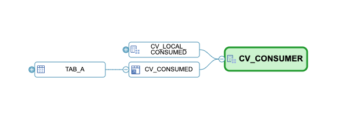

# Object lineage and impact analysis across HDI containers

With 2022 QRC3 it is now possible to investigate dependencies between objects also across HDI containers.
To allow easier tracking of the dependencies, synonyms are now also marked by an icon in the graphical display of lineage analysis. See the example below

Lineage and impact analysis only display objects for which your application user has privileges. If you want to ensure that all objects are visible, you can grant system privilege CATALOG READ to your application user.
CATALOG READ will allow your application user to retrieve metadata of all objects.
