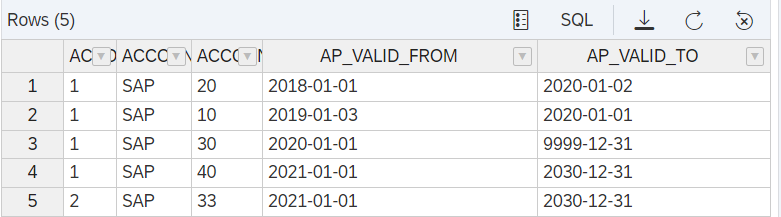
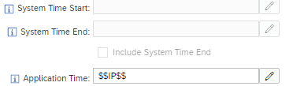
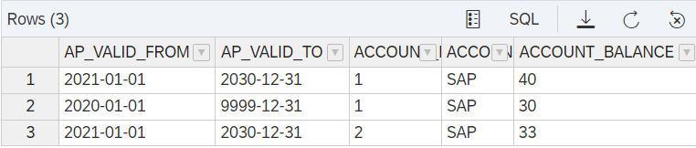
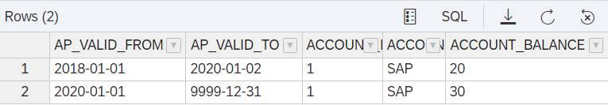

# Example Application-Time Table

## Prepare Data

- Ensure that table is empty

    ```SQL
    truncate table "applicationTime";
    ```

- Insert data

    ```SQL
    insert INTO "applicationTime" VALUES(1,'SAP',20,'2018/01/01','2020/01/02');
    insert INTO "applicationTime" VALUES(1,'SAP',10,'2019/01/03','2020/01/01');
    insert INTO "applicationTime" VALUES(1,'SAP',30,'2020/01/01','9999/12/31');
    insert INTO "applicationTime" VALUES(1,'SAP',40,'2021/01/01','2030/12/31');
    insert INTO "applicationTime" VALUES(2,'SAP',33,'2021/01/01','2030/12/31');
    ```

## Check Valid Dates

```SQL
select * from  "applicationTime";
```



## Query Data

Settings of calculation view [applicationTimeIP](./applicationTimeIP.hdbcalculationview):



Application Time is determined by the value of input parameter IP which has the expression current_date as a default value.

*If Application Time is not filled, all data is returned*

> **Do not put single quotes around expressions or input parameters**

### Query Data Valid for Today

```SQL
SELECT 
	"AP_VALID_FROM",
	"AP_VALID_TO",
	"ACCOUNT_ID",
	"ACCOUNT_OWNER_ID",
	SUM("ACCOUNT_BALANCE") AS "ACCOUNT_BALANCE"
FROM "AT_IP"
GROUP BY 
	"ACCOUNT_ID",
	"ACCOUNT_OWNER_ID",
	"AP_VALID_FROM",
	"AP_VALID_TO"
```



If no input parameter is provided in the query the default value of the input parameter (current_date) will be taken

### Query Data Valid for a Certain Date

```SQL
SELECT 
	"AP_VALID_FROM",
	"AP_VALID_TO",
	"ACCOUNT_ID",
	"ACCOUNT_OWNER_ID",
	SUM("ACCOUNT_BALANCE") AS "ACCOUNT_BALANCE"
FROM "AT_IP"
	(placeholder."$$IP$$"=>'2020-01-01')
GROUP BY 
	"ACCOUNT_ID",
	"ACCOUNT_OWNER_ID",
	"AP_VALID_FROM",
	"AP_VALID_TO"
```

