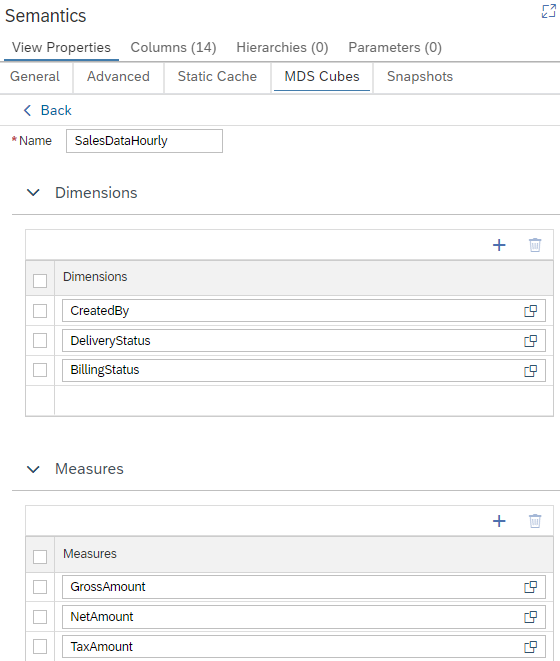

# MDS Cubes

## What are MDS Cubes
[MDS Cubes](https://help.sap.com/docs/hana-cloud-database/sap-hana-cloud-sap-hana-database-modeling-guide-for-sap-business-application-studio/define-mds-cube-based-on-elements-in-calculation-view?) represent submodels of calculation views. MDS Cubes are explicitly loaded via an [API](https://help.sap.com/docs/hana-cloud-database/sap-hana-cloud-sap-hana-database-administration-guide/api-commands?) so that materialized data can be queried. Data in MDS Cubes are stored in a highly-optimized way. This optimized data structure can be leveraged in analytical reporting that is based on MDS metadata, such as SAP Analytics Cloud. Using MDS Cubes is an option to speed up analytical queries.

## Data in MDS Cubes
Data in MDS Cubes reflect the state at the time the MDS Cube was loaded. Only data that were visible to the user who loaded the MDS Cube are included. Loaded data is not automatically updated. This can lead to differences when comparing reporting based on MDS Cubes and based on online calculation views. To reflect data changes in reporting, it is necessary to manually re-load the MDS Cube.

## Current Limitations
Not all calculation view features are supported by MDS Cubes. If a calculation view feature is not supported by MDS Cubes, the tab MDS Cubes is inactive, and a list of feature(s) is displayed that prevents the usage of MDS Cubes. Removing these feature(s) from the calculation view activates the MDS Cubes tab.

If an MDS Cube is already defined in a calculation view, features of the calculation view that are not supported by MDS Cubes are deactivated. When hovering over the feature you will be informed that it is inactive due to the existence of an MDS Cube definition. If the MDS Cube definition is deleted, the feature will become available again.

See [API documentation](https://help.sap.com/docs/hana-cloud-database/sap-hana-cloud-sap-hana-database-administration-guide/api-commands?) how to load a MDS Cube.
