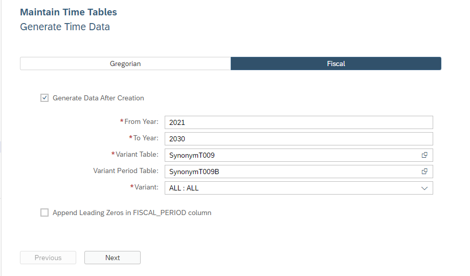

# Flexible Specification of T009 and T009B data during generation of fiscal calendar data

When generating fiscal calendar data, it is now possible to specify tables or synonyms that point to tables to read the data that are expected in tables T009 and T009B. The structure of the target tables have to match the structure of the T009 and T009B tables.

This increases flexibility and makes re-use of table data easier.