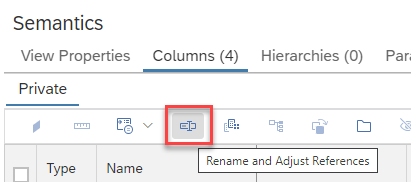
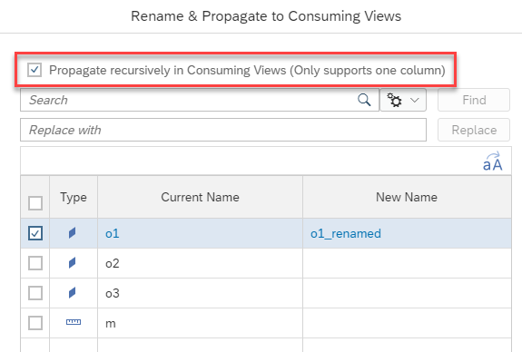
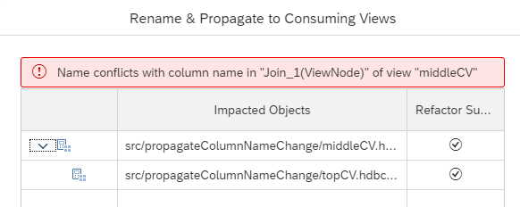
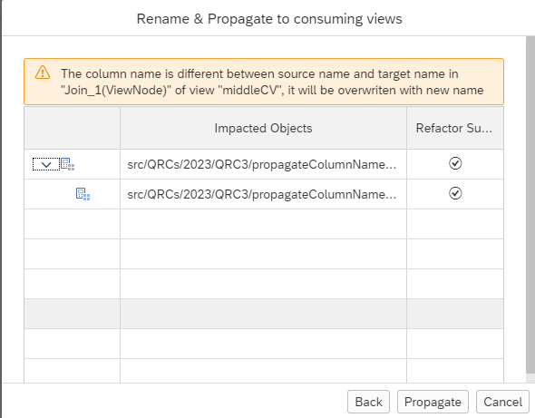

# Propagate Column Name Changes Recursively

If a column name should be changed throughout the design time calculation view stack within the current HDI container the option "Propagate recursively in Consuming Views" of the "Rename and Adjust References" dialog 

can be used.

If the option is checked 

the column will be renamed recursively throughout the calculation view stack. Recursive renaming is only active if a single column is selected.

In case of conflicts, e.g., renaming would lead to non-unique column names, the conflicts are listed in the dialog and renaming is aborted:

If a to-be-renamed column is mapped to a different name the mapping will be overwritten and a warning displayed:

If option *Propagate recursively in Consuming Views* is unchecked only the input columns of directly dependent calculation views are renamed.

