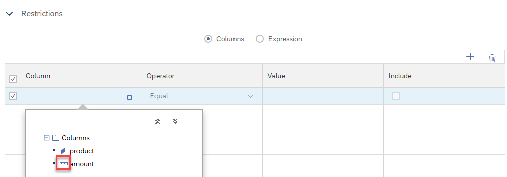
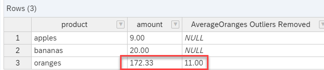

# Restrictions on measures in restricted columns

Restrictions can be defined on measures when defining restricted columns. 



This way e.g., outlier values can be filtered out before aggregating them.

In the example below, without filtering outliers, the average for oranges would be:

172.33

When outlier values are excluded the average becomes

11


```SQL
SELECT
	"product",
	AVG("amount") AS "amount",
	SUM("AverageOrangesOutliersRemoved") AS "AverageOranges Outliers Removed"
FROM 
	"restrictedMeasuresWithMeasureRestriction"
GROUP BY 
	"product"
```




