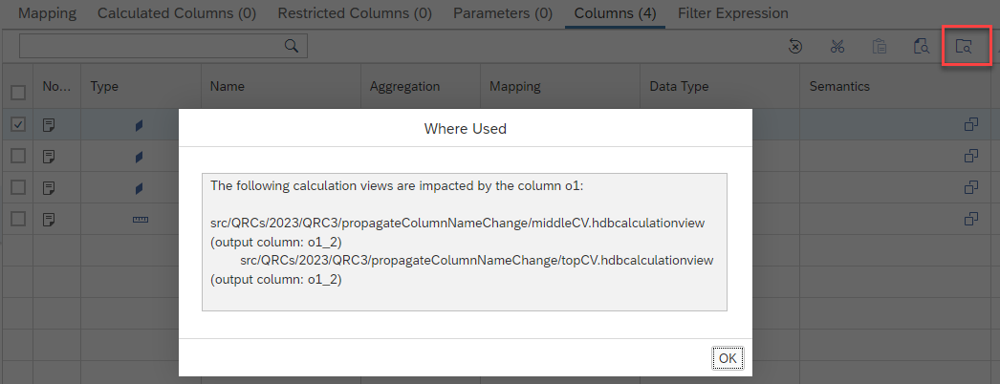

# Where-Used functionality across views

With a new button it is now possible to retrieve the usage of a column or input parameter or variable recursively across calculation views that are deployed in the same HDI container:

The output lists the dependent views and in brackets the respective output column to which the column in question is mapped
