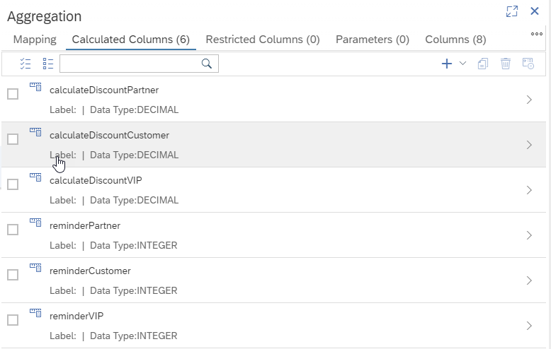

# Filter Elements

You can filter elements like calculated columns or input parameters and thus more easily find elements that are related to a certain topic

#### without filter:

#### with filter:

