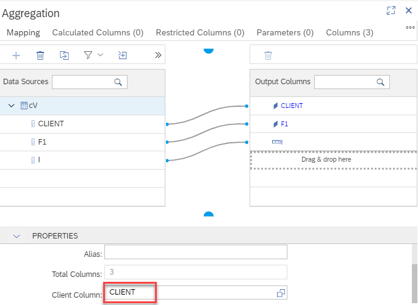

# Preview data with different database user

Calculation view "bottomCV" has column "CLIENT" defined as the client value column:

Depending on the client value that is defined in the session context of a database user different values are returned. The session context can be seen by running e.g.:

`select * from m_session_context where connection_id=current_connection`

## Example

In Database Explorer: create two database connections with different client values. To set a client value enter under Advanced Options when adding a database connection e.g.,
client=200

Right-Click on the aggregation node of calculationv view "bottomCV" and choose option "Data Preview With Other Database User"

Depending on the client value of the user that you choose to use during the data preview different data is returned.

In this way you can simulate different client values during data preview. Similarly, you can test the impact of e.g., analytic privileges that are assigned to the individual database users.