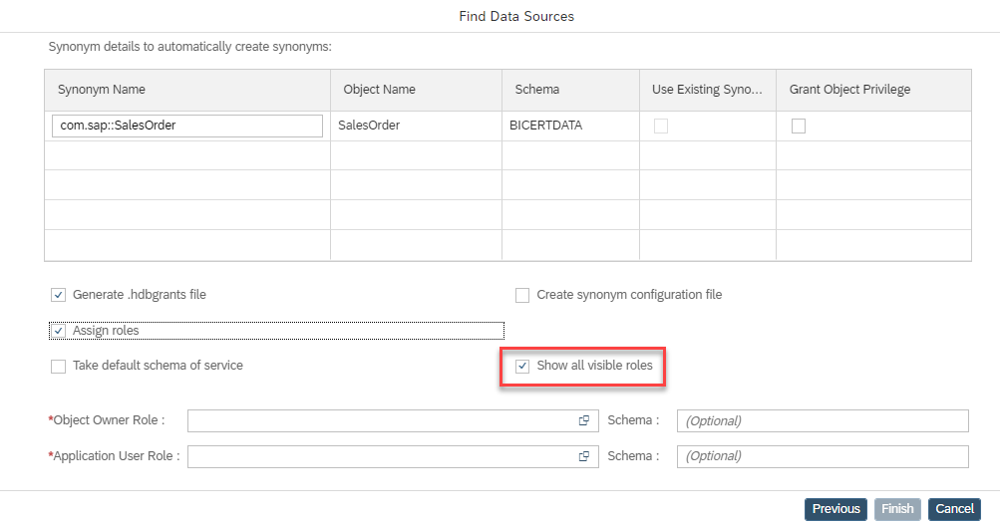
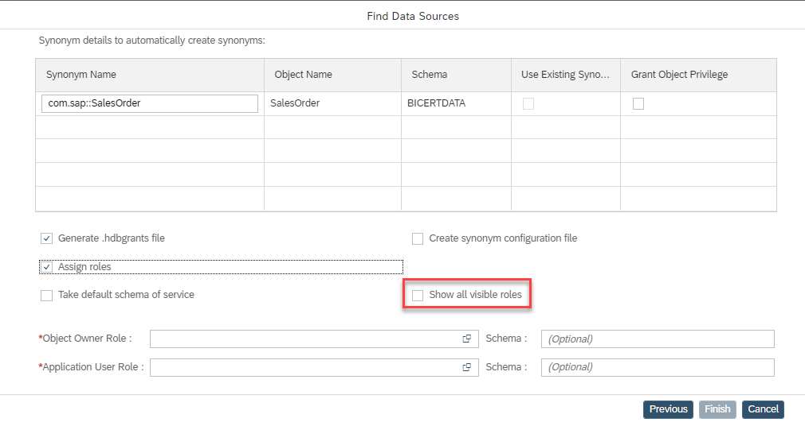

# Use Value Help for Roles in Add data source dialog

When creating a .hdbgrants file during the add data source dialog (e.g., https://help.sap.com/viewer/d625b46ef0b445abb2c2fd9ba008c265/2021_4_QRC/en-US/5aeb56cba39e4df4ae62b43a0dc2fad4.html) roles can be granted. Value help is now available to display:

- all roles that can be seen by the user of the granting service:

- all roles that are explicitly granted to the user of the granting service (in the view EFFECTIVE_ROLES, the column IS_GRANTABLE is TRUE):

