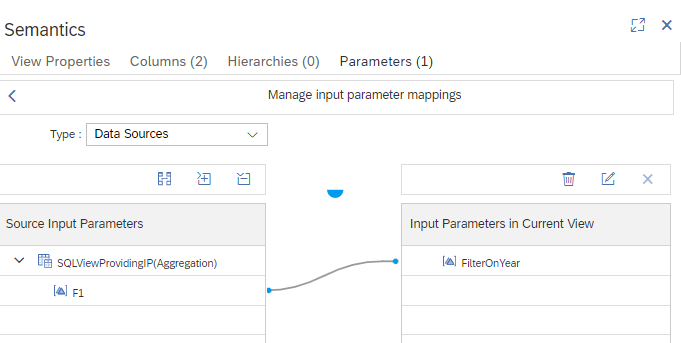

# Map input parameters of calculation views to parameters of SQL views

Input parameter "FilterOnYear" in calculation view "mapToSQLView" is mapped to input parameter F1 in SQL view "SQLViewWithIP":



Queries will filter for years that are entered for the input parameter "FilterOnYear":

```SQL
SELECT TOP 1000
	"year",
	COUNT("amount") AS "amount"
FROM "mapToSQLView"
	(placeholder."$$FilterOnYear$$"=>'2021')
GROUP BY "year"
```

