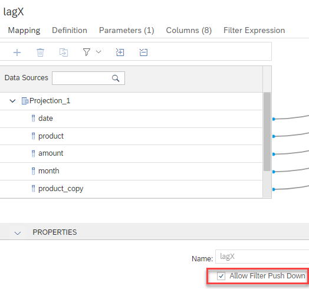

# Window Functions

## Purpose
With [Window Functions](https://help.sap.com/viewer/c1d3f60099654ecfb3fe36ac93c121bb/latest/en-US/20a353327519101495dfd0a87060a0d3.html) records can be evaluated based on neighbouring records that fall within the evaluation window. The order of the records can be determined using column values which influences which records fall within the evaluation window. In addition it is possible to partition the data based on column values and by this further control the evaluation window. Several evaluation functions can be used on these (ordered) partitions. This provides a flexible way to analyze records with respect to other records in their neighbourhood.

## Examples
A very simple example (["windowLagX_NoDynamic"](./windowLagX_NoDynamic.hdbcalculationview)) is used for illustrative purposes below. This example is subsequently modified to compare the effects of different Window Function options. The used Window Function is ["lag"](https://help.sap.com/viewer/c1d3f60099654ecfb3fe36ac93c121bb/latest/en-US/e7ef7cc478f14a408e1af27fc1a78624.html) which returns the value of a record relative to the current record.

### Base Example
In the simple base example ["windowLagX_NoDynamic"](./windowLagX_NoDynamic.hdbcalculationview), columns are copied before being used for partitioning and ordering. This is done for illustrative purposes because requesting a column can change the behavior of the Window Function. By displaying the copied columns instead, the values of the orignial columns can be displayed without affecting the Window Function evaluation which would happen if the original columns were requested. This is particularly important when illustrating the concept of dynamic partitioning and ordering. Dynamic partitioning partitions only based on columns that are requested in the query. Non-requested columns are ignored for partitioning. Similarly, non-requested columns are ignored for ordering if the dynamic ordering flag is set. 

#### Base Query
This is the base query to illustrate the effects below:

```SQL
SELECT TOP 10000
	"product_copy", -- partition by "product"
	"month_copy",   -- partition by "month"
	"date_copy",    -- order by "date" desc
	SUM("amount") AS "amount", -- order by "amount" asc
	SUM("lagAmount") AS "lagAmount"
FROM "windowLagX_NoDynamic"
	(placeholder."$$lagIP$$"=>1) --lag of 1 day
GROUP BY 
	"product_copy", 
	"date_copy", 
	"month_copy"
```

#### Base Result


*Without dynamic option partitioning and ordering is done on the columns as defined in the model, even though the columns are not requested themselves. Individual partitions can be identified e.g., by the entry of "NULL" in column "lagAmount" in the first record of a partition. This is a consequence of the used lag-function without specifying a default-expression. As can be seen by comparing "lagAmount" to "amount" the values of "lagAmount" are shifted by one record.*

### Example with Dynamic Partitioning
Example ["windowLagX_DynamicPartitioning"](./windowLagX_DynamicPartitioning.hdbcalculationview) is created from ["windowLagX_NoDynamic"](./windowLagX_NoDynamic.hdbcalculationview) and the dynamic partitioning flag is set:


#### Query
The same query is used

```SQL
SELECT TOP 10000
	"product_copy", -- partition by "product"
	"month_copy",   -- partition by "month"
	"date_copy",    -- order by "date" desc
	SUM("amount") AS "amount", -- order by "amount" asc
	SUM("lagAmount") AS "lagAmount"
FROM "windowLagX_DynamicPartitioning"
	(placeholder."$$lagIP$$"=>1) --lag of 1 day
GROUP BY 
	"product_copy", 
	"date_copy", 
	"month_copy"
```
#### Result
With the dynamic partitioning flag set, the same query produces a different result now.


*This time no partitioning happens because no partitioning columns are requested and the dynamic flag is set.*

#### Query
In the next query partitioning column "product" is requested additionally:

```SQL
SELECT TOP 10000
	"product_copy", -- partition by "product"
    "product",
	"month_copy",   -- partition by "month"
	"date_copy",    -- order by "date" desc
	SUM("amount") AS "amount", -- order by "amount" asc
	SUM("lagAmount") AS "lagAmount"
FROM "windowLagX_DynamicPartitioning"
	(placeholder."$$lagIP$$"=>1) --lag of 1 day
GROUP BY 
	"product_copy", 
    "product",
	"date_copy", 
	"month_copy"
```

#### Result


*"product" is requested and defined as a potential partitioning column. Thus the result is partitioned by "product"*

### Example with Dynamic Ordering
In example ["windowLagX_DynamicPartitioningDynamicOrdering"](./windowLagX_DynamicPartitioningDynamicOrdering.hdbcalculationview) the dynamic ordering flag is set:


#### Query
The same query is used as previously


```SQL
SELECT TOP 10000
	"product_copy", -- partition by "product"
    "product",
	"month_copy",   -- partition by "month"
	"date_copy",    -- order by "date" desc
	SUM("amount") AS "amount", -- order by "amount" asc
	SUM("lagAmount") AS "lagAmount"
FROM "windowLagX_DynamicPartitioningDynamicOrdering"
	(placeholder."$$lagIP$$"=>1) --lag of 1 day
GROUP BY 
	"product_copy", 
    "product",
	"date_copy", 
	"month_copy"
```

#### Result


*"product" is requested and defined as a potential partitioning column. Thus the result is partitioned by "product". "date" is not requested and therefore ignored for the ordering. The data look partially ordered on "date" which is an artifact of the data in which "amount" increases with increasing dates for some intervals.*

In contrast, if potential ordering column "date" is requested in addition, the data is ordered with "date" descending:


```SQL
SELECT TOP 10000
	"product_copy", -- partition by "product"
    "product",
	"month_copy",   -- partition by "month"
	"date_copy",    -- order by "date" desc
    "date",
	SUM("amount") AS "amount", -- order by "amount" asc
	SUM("lagAmount") AS "lagAmount"
FROM "windowLagX_DynamicPartitioningDynamicOrdering"
	(placeholder."$$lagIP$$"=>1) --lag of 1 day
GROUP BY 
	"product_copy", 
    "product",
	"date_copy", 
    "date",
	"month_copy"
```

"date" is used for ordering:


*Given that potential ordering column "date" is requested, the partition is orderd by "date" in descending order.*


### Examples Illustrating Effect of Filter Push-Down

When the filter push-down flag is selected, filters are pushed through the Window Function node. Given that this can change the results, this option has to be explicilty selected. The following examples demonstrate the results with and without selection of the option to push-down filters.


#### Example with Filter Push-Down
The filter push-down flag will be set in model ["windowLagX_DynamicPartitioningFilterPushDown"](./windowLagX_DynamicPartitioningFilterPushDown.hdbcalculationview) which is a copy of ["windowLagX_DynamicPartitioning"](./windowLagX_DynamicPartitioning.hdbcalculationview) 




#### Query
Let's have a look at the unfiltered data first:

```SQL
SELECT TOP 10000
	"product_copy", -- partition by "product"
	"month_copy",   -- partition by "month"
	"date_copy",    -- order by "date" desc
	SUM("amount") AS "amount", -- order by "amount" asc
	SUM("lagAmount") AS "lagAmount"
FROM "windowLagX_DynamicPartitioningFilterPushDown"
	(placeholder."$$lagIP$$"=>1) --lag of 1 day
--WHERE "month_copy"!=2
GROUP BY 
	"product_copy",
	"date_copy", 
	"month_copy"
```

#### Result


*Without a filter on "month" the last record for "month"="2" is "15.1" which is refered to by the first record of "month"="1".*


#### Query
In the next query the filter for month!=2 is used 

```SQL
SELECT TOP 10000
	"product_copy", -- partition by "product"
	"month_copy",   -- partition by "month"
	"date_copy",    -- order by "date" desc
	SUM("amount") AS "amount", -- order by "amount" asc
	SUM("lagAmount") AS "lagAmount"
FROM "windowLagX_DynamicPartitioningFilterPushDown"
	(placeholder."$$lagIP$$"=>1) --lag of 1 day
WHERE "month_copy"!=2
GROUP BY 
	"product_copy",
	"date_copy", 
	"month_copy"
```

#### Explain Plan

The explain plan for the query shows that the filter is indeed pushed below the Window Function:


#### Result


*Given that the filter for "month" is pushed-down below the Window Function node, the records of "month"="2" are removed before the Window Function is evaluated. As a consequence, the first record for "month"="1" refers to the last record of "month"="3".*


#### Example Without Filter Push-Down
In example ["windowLagX_DynamicPartitioningNoFilterPushDown"](./windowLagX_DynamicPartitioningNoFilterPushDown.hdbcalculationview) the flag for filter push-down is not selected:


#### Query
The same query with the filter is used

```SQL
SELECT TOP 10000
	"product_copy", -- partition by "product"
	"month_copy",   -- partition by "month"
	"date_copy",    -- order by "date" desc
	SUM("amount") AS "amount", -- order by "amount" asc
	SUM("lagAmount") AS "lagAmount"
FROM "windowLagX_DynamicPartitioningNoFilterPushDown"
	(placeholder."$$lagIP$$"=>1) --lag of 1 day
WHERE "month_copy"!=2
GROUP BY 
	"product_copy",
	"date_copy", 
	"month_copy"
```

#### Explain Plan

The explain plan for the query shows that the filter is evaluated after the Window Function:


#### Result


*Given that the Window Function is calculated before the filter is applied, the first record for "month"="1" refers to the last record of "month"="2". The application of the filter afterwards removes the records with "month"="2" so that the first record for "month"="1" refers to a record that is not included in the result set anymore.*

This shows how filters can be pushed-down and evaluated before the Window Function is evaluated. It should also give an idea on the impact the decision about the filter push-down has on the results.
