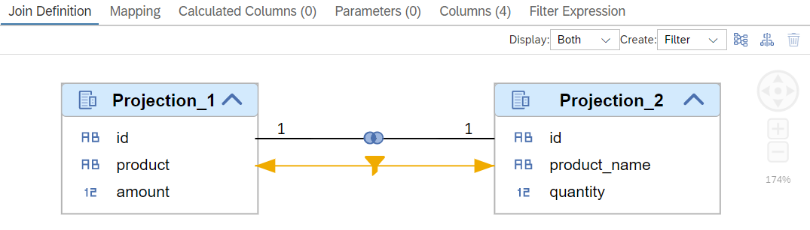
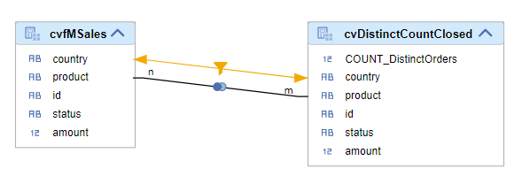
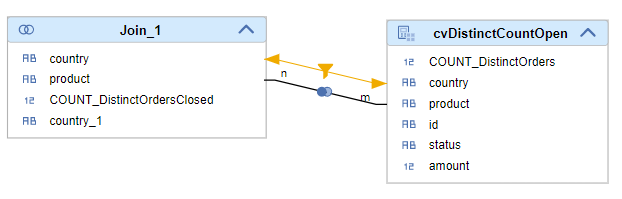
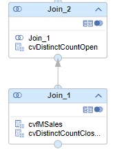

# Apply filters to both partners of a join

If the option "Filter Mapping" is used, filters that are applied to one join partner are also applied to mapped columns of the other join partner.
For example, filters on column "product" are additionally applied on column "product_name". Filter Mapping can be defined in each join node.

The main purpose of Filter Mapping is to improve performance by applying filters as early as possible on both join partners. However, in certain situations it can also help to ensure data consistency.

Both use-cases are illustrated with an example below. More details how to specify filter mapping can be found in the [Database Modeling Guide](https://help.sap.com/docs/HANA_CLOUD_DATABASE/d625b46ef0b445abb2c2fd9ba008c265/997ec7b767794160a373894ee96a365f.html). The performance aspect is discussed in the [Developer Performance Guide](https://help.sap.com/docs/HANA_CLOUD_DATABASE/4466fb5b5e3f4388a00b44aad5a4bffa/45ab3ac57ae449d9846b2f632e189a23.html).

> Support in the graphical modeler will be delivered with the SAP Business Application Studio release end of January 2023.

## Use-case Performance

In join node "enrichedSalesOrders" of calculation view [mapFilter](./performance/mapFilter.hdbcalculationview), filters for column "product" are mapped to column "product_name":



Queries that filter on column "product" will therefore automatically also filter on column "product_name". This reduces the number of records from the right join partner that are processed in the join node. This reduced intermediate data set will be illustrated using Explain Plans on a query with and without Filter Mapping.

### Data 
The following two tables are used in the model:

#### Table fML
**"id"**|**"product"**|**"amount"**
:-----|:-----|:-----
1|orange|10.70
2|orange|17.20
3|apple|29
4|apple|31.14


#### Table fMR
**"id"**|**"product\_name"**|**"quantity"**
:-----|:-----|:-----
1|orange|10
2|orange|15
3|apple|30
4|apple|27

### Query without Filter Mapping

```SQL
SELECT 
	"id",
	"product",
	SUM("amount") AS "amount",
	SUM("quantity") AS "quantity"
FROM 
    "noMapFilter"
WHERE 
    "product"='orange'
GROUP BY 
    "id", 
    "product"
```

### Explain Plan for Query without Filter Mapping

**OPERATOR\_NAME**|**OPERATOR\_DETAILS**|**TABLE\_NAME**|**OUTPUT\_SIZE**
:-----:|:-----:|:-----:|:-----:
PROJECT|fML.id,'orange',amount,quantity |NULL|2
AGGREGATION|GROUPING: fML.id, AGGREGATION: SUM(fML.amount), SUM(fMR.quantity)|NULL|2
HASH JOIN|HASH CONDITION: fMR.id = fML.id, HASH SIZE: 2|NULL|2 
TABLE SCAN| |fMR|**4**
TABLE SCAN|FILTER CONDITION: fML.product = 'orange' (DETAIL: ([SCAN] fML.product = 'orange'))|fML|2


Given that no Filter Mapping is defined, even though "product" is filtered for "orange" no filter is applied to "product_name". As a consequence, the table scan on table "fMR" returns all 4 values.


### Query with Filter Mapping

```SQL
SELECT 
	"id",
	"product",
	SUM("amount") AS "amount",
	SUM("quantity") AS "quantity"
FROM 
    "mapFilter"
WHERE 
    "product"='orange'
GROUP BY 
    "id", 
    "product"
```

### Explain Plan for Query with Filter Mapping

**OPERATOR\_NAME**|**OPERATOR\_DETAILS**|**TABLE\_NAME**|**OUTPUT\_SIZE**
:-----:|:-----:|:-----:|:-----:
PROJECT|fML.id, 'orange', amount, quantity
AGGREGATION|GROUPING: fML.id, AGGREGATION: SUM(fML.amount), SUM(fMR.quantity)|NULL|2
HASH JOIN|HASH CONDITION: fML.id = fMR.id, HASH SIZE: 2|NULL|2
TABLE SCAN|FILTER CONDITION: fML.product = 'orange' (DETAIL: ([SCAN] fML.product = 'orange'))|fML|2
TABLE SCAN|FILTER CONDITION: fMR.product\_name = 'orange' (DETAIL: ([SCAN] fMR.product\_name = 'orange'))|fMR|**2**

With Filter Mapping the filter for "orange" is also applied to column "product_name" of the right join partner. Therefore, only 2 records are retrieved from table "fMR".

This mapping of filters is currently bi-directional so that filtering on column "product_name" would also lead to a filter on column "product". It is planned to provide with QRC1 2023 an option to additionally choose the direction(s) in which the filter should be mapped.

This reduction of intermediate records can have significant impact on memory consumption and performance with large data. Therefore, Filter Mapping should be used whenever it is logically correct to apply filters on both partners of a join.

# Use-case Data consistency
In example [analyzeSalesMapped](./consistency/analyzeSalesMapped.hdbcalculationview), the general idea is to enrich a transactional table with calculations that are calculated at an aggregation granularity that differs from the aggregration granularity of the transactional data. In the following these calculations are called "Exception Aggregrations". 

One option to calculate the Exception Aggregations on a different aggregation granularity than the aggregation granularity used for the transactional data is the following: The Exception Aggregation is calculated in a separate calculation view and the result joined to the transactional data. While doing so you want to ensure for consistency reasons that filters that are applied to the transactional data are also applied on the views that calculate the Exception Aggregations.

In this concrete example, the transactional data contain a column "status" with the values "open" and "closed". The Exception Aggregation in this example is a Count Distinct on the column "id", separately for records in status "open" ([calculation view Count Distinct open](./consistency/cvDistinctCountOpen.hdbcalculationview)) and "closed" ([calculation view Count Distinct closed](./consistency/cvDistinctCountClosed.hdbcalculationview)). Importantly, column "status" should not be used in the aggregation of the transactional data because of its impact on other values, such as measures or calculated columns. This excludes the calculation of the Exception Aggregations on the transactional data while including column "status". As one solution, the Count Distincts are calculated in separate calculation views in which column "status" can be evaluated. Speaking more generally, by calculating the count distincts in separate views you are not restricted by the granularity of the transactional data and can flexibility decide about the aggregation granularity. In these kind of situations you want to ensure that the same data basis is used for the calculation and the same filters are applied to the transactional data and the views which calculated the Exception Aggregation. This purpose is achieved with Filter Mapping in example [analyzeSalesMapped](./consistency/analyzeSalesMapped.hdbcalculationview) .

In example [analyzeSalesMapped](./consistency/analyzeSalesMapped.hdbcalculationview) the Count Distinct of "id"s in status "open" and "closed" is calculated by dedicated Count Distinct views while the filter for "country" is automatically mapped. Without Filter Mapping the view would return unexpected data which will be illustrated with example [analyzeSalesNotMapped](./consistency/analyzeSalesNotMapped.hdbcalculationview) afterwards. 

## Model with Filter Mapping
In example [analyzeSalesMapped](./consistency/analyzeSalesMapped.hdbcalculationview), Filter Mapping is defined between column "country" of the transactional data and column "country" of the views which calculate the Count Distinct. This ensures that the Count Distinct operates on the same countries:






## Data 

The view uses the following data:

**"id"**|**"country"**|**"product"**|**"status"**|**"amount"**
-----|-----|-----|-----|-----
1|Germany|Banana|O|10
2|Germany|Banana|O|11
1|Germany|Banana|C|10
2|Germany|Banana|C|11
4|Germany|Banana|C|10
10|US|Banana|O|10
11|US|Banana|C|11
12|US|Banana|C|9
13|US|Banana|C|10

## Query
```SQL
SELECT 
	"country",
	"product",
	SUM("COUNT_DistinctOrdersClosed") AS "COUNT_DistinctOrdersClosed",
	SUM("COUNT_DistinctOrdersOpen") AS "COUNT_DistinctOrdersOpen"
FROM "analyzeSalesMapped"
	(placeholder."$$IP_Country$$"=>'Germany')
GROUP BY 
	"country", 
	"product"
```
## Result


**country**|**product**|**COUNT_DistinctOrdersClosed**|**COUNT_DistinctOrdersOpen**
:-----:|:-----:|:-----:|:-----:|
Germany|Banana|*3*|**2**

The output reflects the Count Distinct when a filter is applied for "Germany". The following table shows the complete data of the table with the respective records marked in bold (status "open") and italic (status "closed"). The "id" of records that have been filtered out are striked through. As can be verified with this table, records with country "US" are ignored when calculating the Count Distinct.

### Table Data

**"id"**|**"country"**|**"product"**|**"status"**|**"amount"**
-----|-----|-----|-----|-----
**1**|**Germany**|**Banana**|**O**|**10**
**2**|**Germany**|**Banana**|**O**|**11**
*1*|*Germany*|*Banana*|*C*|*10*
*2*|*Germany*|*Banana*|*C*|*11*
*4*|*Germany*|*Banana*|*C*|*10*
~~10~~|US|Banana|O|10
~~11~~|US|Banana|C|11
~~12~~|US|Banana|C|9
~~13~~|US|Banana|C|10


## Model without filter mapping

In model [analyzeSalesNotMapped](./consistency/analyzeSalesNotMapped.hdbcalculationview) no Filter Mapping exists:



## Query

The same query is used on this model:

```SQL
SELECT 
	"country",
	"product",
	SUM("COUNT_DistinctOrdersClosed") AS "COUNT_DistinctOrdersClosed",
	SUM("COUNT_DistinctOrdersOpen") AS "COUNT_DistinctOrdersOpen"
FROM "analyzeSalesNotMapped"
	(placeholder."$$IP_Country$$"=>'Germany')
GROUP BY 
	"country", 
	"product"
```


## Result

**country**|**product**|**COUNT\_DistinctOrdersClosed**|**COUNT\_DistinctOrdersOpen**
:-----:|:-----:|:-----:|:-----:|
Germany|Banana|*6*|**3**

Without Filter Mapping the filter on "country" is not transfered to the views which calculate the Count Distinct. As a consequence, the results include the "id"s of other countries in addition:

**"id"**|**"country"**|**"product"**|**"status"**|**"amount"**
-----|-----|-----|-----|-----
**1**|**Germany**|**Banana**|**O**|**10**
**2**|**Germany**|**Banana**|**O**|**11**
*1*|*Germany*|*Banana*|*C*|*10*
*2*|*Germany*|*Banana*|*C*|*11*
*4*|*Germany*|*Banana*|*C*|*10*
**10**|**US**|**Banana**|**O**|**10**
*11*|*US*|*Banana*|*C*|*11*
*12*|*US*|*Banana*|*C*|*9*
*13*|*US*|*Banana*|*C*|*10*

This illustrates the importance of Filter Mapping in scenarios in which corresponding data should be analyzed in joined views. 

**Use Filter Mapping to ensure that corresponding data are analyzed if the use-case requires a common data foundation**