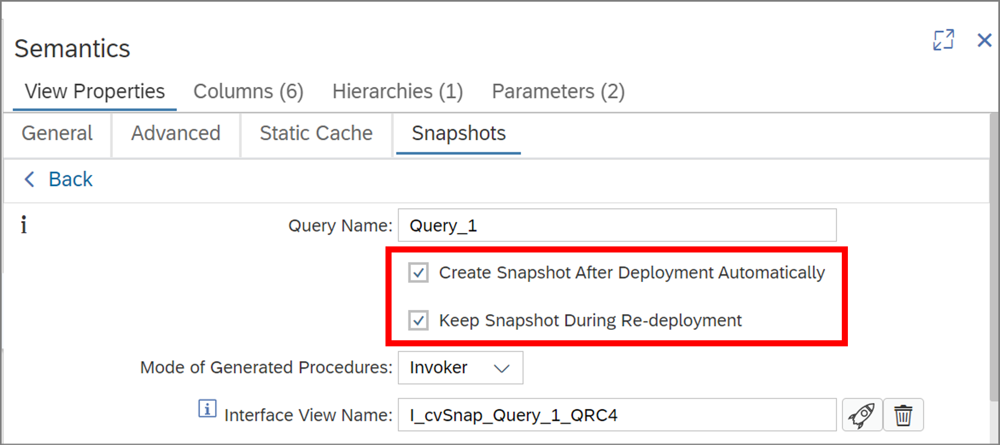

## Retain snapshot data across deployments

Per default snapshot data is deleted from snapshot tables during re-deployment of the respective calculation view. You can now explicitly choose to keep existing data in snapshot tables by selecting the flag "Keep Snapshot During Re-deployment":

>If only an undeployment without a coupled re-deployment is triggered the snapshot tables will be removed completely. For more details see the [documentation](https://help.sap.com/docs/HANA_CLOUD_DATABASE/d625b46ef0b445abb2c2fd9ba008c265/d35f768ce50145d2ad0e5916898f004d.html).

**Keeping snapshot data can be useful when testing/working with a fixed set of data or if snapshot data should be stored cumulatively**

