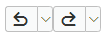
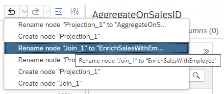

# Undo/Redo buttons with list of selected events

With the new Undo/Redo buttons it is now easier to undo and redo actions:

>It is not possible to undo or redo operations that were performed before the calculation view was opened

In addition, a drop-down menu is offered that lists selected events to simplify navigation to a certain point in time:

See the [Modeling Guide](https://help.sap.com/docs/HANA_CLOUD_DATABASE/d625b46ef0b445abb2c2fd9ba008c265/74d4fa8d18724f3e9ffb09b82c7553b5.html) for more information.

**Using Undo and Redo can help to easily preserve work at a fine granularity in addition to more coarse-grained Git commits**