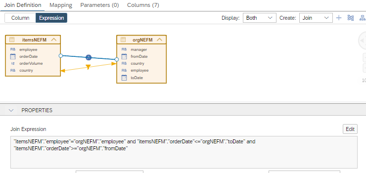

# [Filter Mapping in Non Equi Join Nodes](https://help.sap.com/docs/hana-cloud-database/sap-hana-cloud-sap-hana-database-modeling-guide-for-sap-business-application-studio/map-filters-between-join-partners)

With QRC4 of 2023, filters can also be mapped in Non Equi Join nodes. For details on filter mapping see e.g., [Developer Performance Guide](https://help.sap.com/docs/HANA_CLOUD_DATABASE/4466fb5b5e3f4388a00b44aad5a4bffa/45ab3ac57ae449d9846b2f632e189a23.html) and [Modeling Guide](https://help.sap.com/docs/HANA_CLOUD_DATABASE/d625b46ef0b445abb2c2fd9ba008c265/997ec7b767794160a373894ee96a365f.html).

For example, in calculation view [filterMapping_NE_cv](./filterMapping_NE_cv.hdbcalculationview) column "country" of table "itemsNEFM" is mapped to column "country" of table "orgNEFM":



Filters on column "country" of one table are thus also applied explicitly to the other table. This can be seen in the Explain plan of the following query:

## Query

```SQL
SELECT 
	"employee",
	"orderDate",
	"manager",
	"country",
	SUM("orderVolume") AS "orderVolume"
FROM 
	"filterMapping_NE_cv"
where 
	"country"!='Germany'
GROUP BY 
	"employee", 
	"orderDate", 
	"manager",
	"country"
```

## Explain Plan


**OPERATOR\_NAME**|**OPERATOR\_DETAILS**|**TABLE\_NAME**
:-----|:-----|:-----
PROJECT|itemsNEFM.employee, itemsNEFM.orderDate, orgNEFM.manager, itemsNEFM.country, orderVolume|
AGGREGATION|GROUPING: itemsNEFM.employee, itemsNEFM.orderDate, orgNEFM.manager, itemsNEFM.country, AGGREGATION: SUM(itemsNEFM.orderVolume)|
HASH JOIN (LEFT OUTER)|HASH CONDITION: itemsNEFM.employee = orgNEFM.employee, REST CONDITION: itemsNEFM.orderDate <= orgNEFM.toDate AND itemsNEFM.orderDate >= orgNEFM.fromDate, HASH SIZE: 2, RIGHT SIDE HASH|
TABLE SCAN|FILTER CONDITION: itemsNEFM.country <> 'Germany' (DETAIL: ([POST-FILTER] itemsNEFM.country <> 'Germany'))|itemsNEFM
TABLE SCAN|FILTER CONDITION: **orgNEFM.country <> 'Germany'** (DETAIL: ([POST-FILTER] orgNEFM.country <> 'Germany'))|**orgNEFM**

Without filter mapping the filter would not be transferred. This is illustrated with the Explain Plan of the same query on an analogous view in which filter mapping is not defined:

## Query
```SQL
SELECT
	"employee",
	"orderDate",
	"manager",
	"country",
	SUM("orderVolume") AS "orderVolume"
FROM 
	"noFilterMapping_NE_cv"
where 
	"country"!='Germany'
GROUP BY 
	"employee", 
	"orderDate", 
	"manager",
	"country"
```

## Explain Plan

**OPERATOR\_NAME**|**OPERATOR\_DETAILS**|**TABLE\_NAME**
:-----|:-----|:-----
PROJECT|itemsNEFM.employee, itemsNEFM.orderDate, orgNEFM.manager, itemsNEFM.country,orderVolume
AGGREGATION|GROUPING: itemsNEFM.employee, itemsNEFM.orderDate, orgNEFM.manager, itemsNEFM.country, AGGREGATION: SUM(itemsNEFM.orderVolume)|
HASH JOIN (LEFT OUTER)|HASH CONDITION: itemsNEFM.employee = orgNEFM.employee, REST CONDITION: itemsNEFM.orderDate <= orgNEFM.toDate AND itemsNEFM.orderDate >= orgNEFM.fromDate, HASH SIZE: 3, RIGHT SIDE HASH
TABLE SCAN|FILTER CONDITION: itemsNEFM.country <> 'Germany' (DETAIL: ([POST-FILTER] itemsNEFM.country <> 'Germany'))|itemsNEFM
TABLE SCAN| |orgNEFM

>Using filter mapping in non equi joins can improve performance by filtering prior to the join.