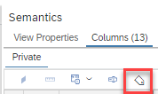
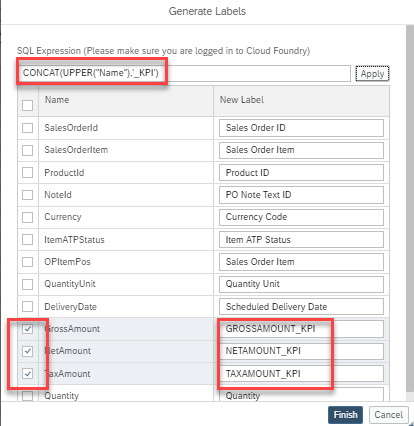

# [Flexibly Generate Labels for Columns](https://help.sap.com/docs/hana-cloud-database/sap-hana-cloud-sap-hana-database-modeling-guide-for-sap-business-application-studio/assign-labels-to-columns)

Expressions can now be used to generate labels for columns. The dialog is started by pressing the "Generate Labels" icon under tab "Columns":

It is possible to only generate labels for a subset of columns:

The last used expression is stored and can be re-used if columns are added later and the expression should be applied to the new columns.

The deployed labels can be retrieved from view ["_SYS_BI.BIMC_DIMENSION_VIEW"](https://help.sap.com/docs/hana-cloud-database/sap-hana-cloud-sap-hana-analytics-catalog-bimc-views-reference/view-bimc-dimension-view) in column "COLUMN_CAPTION".

The labels are reset if columns are unmapped and remapped into node "Semantics".

> Generating labels based on expressions can be used to increase the consistency of labels and thus create an enhanced analytics experience.

