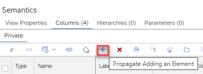
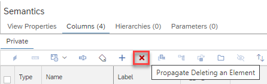

# [Propagate Adding or Deleting Columns to Consuming Calculation Views](https://help.sap.com/docs/hana-cloud-database/sap-hana-cloud-sap-hana-database-modeling-guide-for-sap-business-application-studio/propagate-addition-or-deletion-of-columns)

You can now propagate a column to all consuming calculation views within the same HDI container recursively. For example, an added column to table "pAD" can be propagated from view "pADBottom" to the consuming views "pADMiddle" and "pADTop":

Similarly, a column can be removed from all consuming calculation views:

If conflicts arise such as name-collisions in case of adding, or dependent expressions in case of deleting, notifications are shown and no propagation happens.

>Use this functionality to more easily adapt your existing calculation views after data source changes