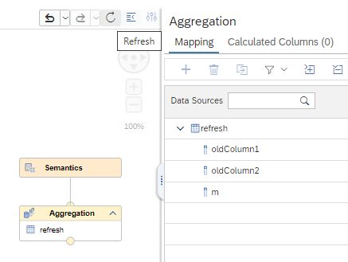
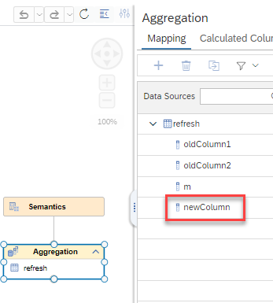

# [Refresh Metadata of Data Sources](https://help.sap.com/docs/hana-cloud-database/sap-hana-cloud-sap-hana-database-modeling-guide-for-sap-business-application-studio/refreshing-data-sources)

With the new refresh button 

metadata of data sources can be refreshed without having to re-open an already opened calculation view.

For example, 

1. open calculation view [refresh_cv](refresh_cv.hdbcalculationview)
2. in calculation view [refresh_cv](refresh_cv.hdbcalculationview), open tab "Mapping" of node  *Aggregation*
3. add a new column to table [refresh](refresh.hdbtable) e.g. by adding *"newColumn" NVARCHAR(20)* into the table definition of [refresh](refresh.hdbtable)
4. deploy table [refresh](refresh.hdbtable)

5. check that the new column is not visible in the opened Mapping tab:

    

6. press button "Refresh"

7. check that the new column is now visible and can be mapped:

    
