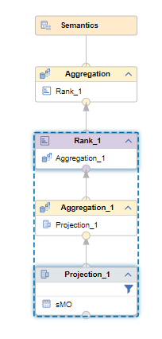
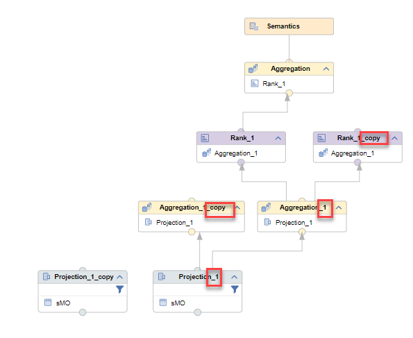
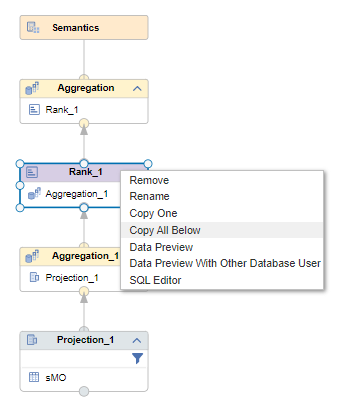
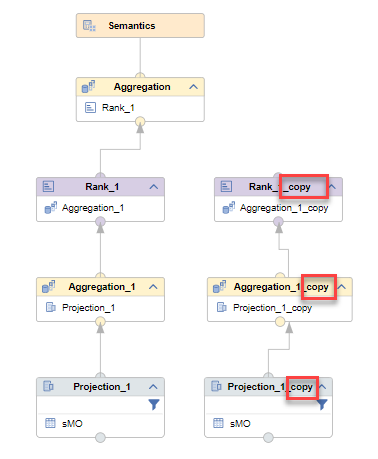

# [Duplicate/Remove Multiple Nodes](https://help.sap.com/docs/hana-cloud-database/sap-hana-cloud-sap-hana-database-modeling-guide-for-sap-business-application-studio/duplicate-copy-or-remove-nodes)

It is now possible to select multiple nodes and to duplicate or remove all selected nodes in one step.

To select multiple nodes press and hold CTRL and select the individual nodes:

To duplicate or remove the selected nodes choose the respective icon:

Duplicated nodes will keep their input nodes and will be made unique by adding "_COPY" to their  names. For example, using the Duplicate option on the selected nodes *Rank_1*, *Aggregation_1*, and *Projection_1* of calculation view [sSMO_cv](sSMO_cv.hdbcalculationview) will result in:

If you want to create a separate flow through the nodes instead, you can use option "Copy All Below" on node *Rank_1*:

This will result in a complete copy of the flow to the selected node:

