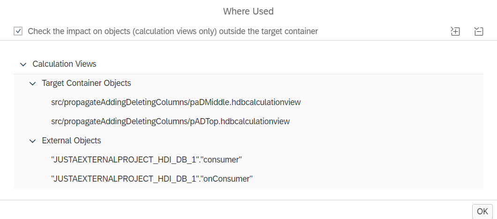

# [Where Used Option Across HDI Containers](https://help.sap.com/docs/hana-cloud-database/sap-hana-cloud-sap-hana-database-modeling-guide-for-sap-business-application-studio/where-used-functionality)

If you want to check whether an element is used in calculation views of other HDI containers, select option *Check the impact on objects (calculation views only) outside the target container* in the Where Used option:

With external dependencies the result could look like:

>Only calculation views are shown for which your application user has privileges, such as privileges SELECT, SELECT METADATA, or system privilege CATALOG READ

