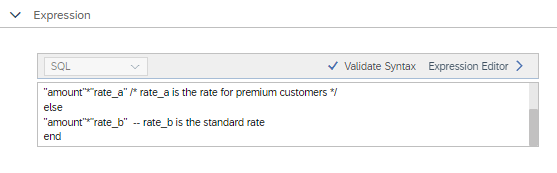
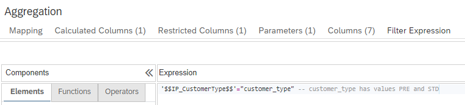
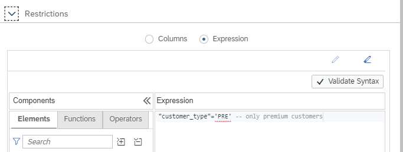

# Comments in expressions

Comments can now be included in expressions using the following syntax

- /* comment */
- -- comment

## Examples

### Calculated column

### Filter expression

### Restricted column

**Adding comments increases readability and helps during refactoring**