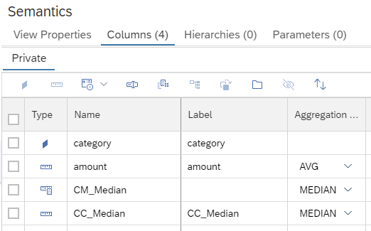
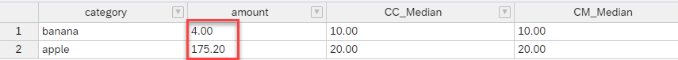

# New aggregation type **Median**

A new aggregation type "Median" is now available for (calculated) measures:



Median aggregation can be used to reduce the impact of individual outliers on summary statistics. Compare for example the results when using aggregation method "average" versus "median" on the following data (["mA.csv"](./mA.csv)):

**"category"**|**"amount"**
:-----:|:-----:
"apple"|21
"apple"|20
"apple"|18
"apple"|17
"apple"|**800**
"banana"|10
"banana"|10
"banana"|10
"banana"|10
"banana"|**-20**

The outliers of "800" and "-20" have a significant influence on the average statistic while the median statistic is only slightly affected:

```SQL
SELECT TOP 1000
	"category",
	AVG("amount") AS "amount",
	MEDIAN("CC_Median") AS "CC_Median",
	MEDIAN("CM_Median") AS "CM_Median"
FROM 
    "SPS07::medianCV"
GROUP BY 
    "category"
```




**Aggregation type "Median" is now available and can be used to model statistics that are robust against individual outliers.**

