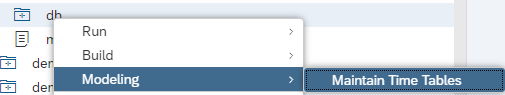
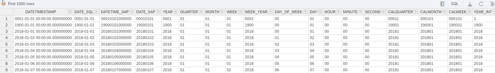

# Fill Time Tables by Procedure

Gregorian date and time information can be generated for a specific time period by invoking the "Maintain Time Tables" dialog:



These data can be used for example, to find out which week-day a certain date was, or to join to an interval of days, or to map between different date representations.

With procedure ["UPDATE_TIME_DIMENSION"](https://help.sap.com/docs/SAP_HANA_PLATFORM/e8e6c8142e60469bb401de5fdb6f7c00/806cc196b51e4e6cb6b955b0f9bce4ab.html) in schema "SYS" it is now also possible to generate these data using SQL

These are the parameters for the call:

```SQL
"IN GRANULARITY NVARCHAR(6),"  // mandatory, YEAR / MONTH / WEEK / DAY / HOUR / MINUTE / SECOND are allowed
"IN START_YEAR INT,"  // mandatory, Restrictions: 1900 <= START_YEAR <= 2200
"IN END_YEAR INT,"  // mandatory,  Restrictions: END_YEAR >= START_YEAR, END_YEAR – START_YEAR < 50
"IN FIRST_DAY_OK_WEEK INT DEFAULT -1,"  // 0-6, starting with Sunday
"IN TARGET_SCHEMA_NAME NVARCHAR(256) DEFAULT ''," // optional, if not specified: "_SYS_BI"
"IN TARGET_TABLE_NAME NVARCHAR(256) DEFAULT ''," // optional, if not specified: "M_TIME_DIMENSION" | "M_TIME_DIMENSION_WEEK" | "M_TIME_DIMENSION_MONTH" | "M_TIME_DIMENSION_YEAR"
"OUT RECORD_COUNT BIGINT"   // returns number of records written
```


For example, the following statements when executed with e.g., database user SYSTEM would create a table "DAY_GRANULARITY_2018_2025" in schema "TIMEDATA" that contains data between 2018 and 2025 at the granularity of days:
```SQL
CREATE SCHEMA TIMEDATA;
CALL SYS.UPDATE_TIME_DIMENSION('DAY',2018,2025,0,'TIMEDATA','DAY_GRANULARITY_2018_2025',?);
```




> Similiar procedure can be used to fill fiscal calendar: [SYS.UPDATE_FISCAL_CALENDAR](https://help.sap.com/docs/SAP_HANA_PLATFORM/e8e6c8142e60469bb401de5fdb6f7c00/dd56099edd66419e8ccd3f775d31808c.html)