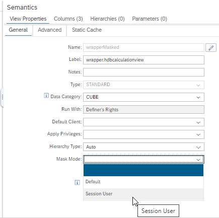
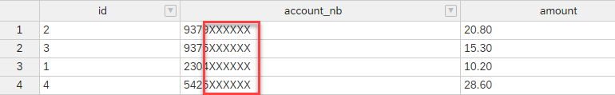
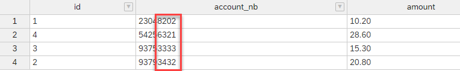

# Mask columns based on session user

Masking of columns can be done based on the user who is calling the calculation view with the mask definition or based on the session user which is running the SQL query.

In a stacked scenario, the calling user will be the owner of the including calculation view while the session user will be the user who runs the SQL query.

To switch between the different modes use the view-global setting Mask Mode 



## Example
-- create user who is only allowed to see data masked

```SQL
create user MASKED password "DnATBG!1" NO FORCE_FIRST_PASSWORD_CHANGE;
grant <HDI container schema>."SPS07::mask" to MASKED;
```

-- create user who is allowed to see data unmasked

```SQL
create user UNMASKED password "DnATBG!1" NO FORCE_FIRST_PASSWORD_CHANGE;
grant "<HDI container schema>"."SPS07::unmask" to UNMASKED;
```

```SQL
connect MASKED password "DnATBG!1";
select * from "<HDI container schema>"."SPS07::wrapperMasked";
```
with session user masking, data is masked:



```SQL
connect UNMASKED password "DnATBG!1";
select * from "<HDI container schema>"."SPS07::wrapperMasked";
```

with session user masking, data is unmasked:



