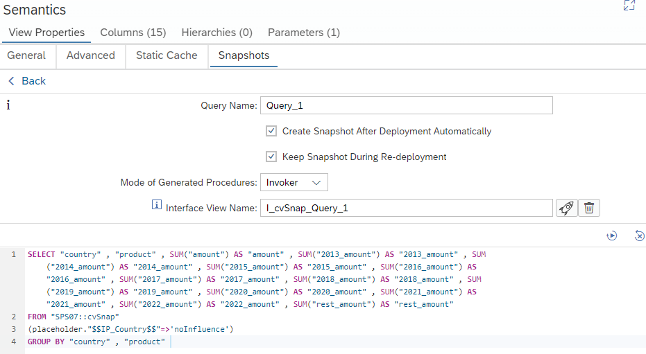

# Create Snapshots of queries on Calculation Views

It is now possible to define a *snapshot-query* in a model:



During deployment, procedures are generated that create, insert, and drop a *snapshot-table* that is filled by the *snapshot-query*. The naming of these procedures follow the naming convention 

`<calculation view name>/<queryname>/SNAP/SNAPSHOT/CREATE|DROP|INSERT`

e.g.

`cvSnap/keyFigureGermany/SNAP/SNAPSHOT/INSERT`

## Purpose
Snapshots can be used to speed up queries if queries do not need to be based on the most current data. 

## Lifecycle
The lifecycle of the procedures and tables is coupled to the respective calculation view in which the snapshot query is defined. Thus undeploying the calculation view will also delete the corresponding tables and procedures. 


## Authorizations

### Mode of Generated Procedures
Per default, the *Invoker* mode is used for the generated procedures. Invoker mode means that the authorizations of the caller are applied. Thus, snapshots will contain the data that are visible to the caller of e.g., the INSERT procedure. If the snapshot is generated during deployment of the calculation view, the object owner of the corresponding HDI-container will be used for inserting. 

If the procedures are generated in *Definer* mode, the privileges of the owner of the HDI-container will apply when executing the procedures. For example, data that is visible to the object owner will be inserted.

Several different snapshots can be generated based on an individual calculation view using the INSERT procedure. These snapshots can be generated by different database users. In this way data reflecting different privileges can be exposed.

Users who want to run SELECT statements directly on the snapshot tables need SELECT privileges for the respective snapshot tables.

## Inserting data

### Inserting large data sets
If a particularly large query leads to a huge set of records, it can be beneficial to schedule multiple inserts and to restrict each insert to an non-overlapping set of records by an input parameter. For example, an input parameter could be used to load individual years into the snapshot table. These individual loads could then be scheduled using e.g. the [job scheduler](https://help.sap.com/docs/SAP_HANA_PLATFORM/3823b0f33420468ba5f1cf7f59bd6bd9/f92e31d2a23f4470829ab300dcce850e.html).

If you want to avoid being prompted for the "technical" input parameter when the calculation view is not being used to fill the snapshot, you can do so by adding a default value to the input parameter in the calculation view and  checking against this default value in a filter expression.

For example, assuming that input parameter "IP_year" has the default value 'noInfluence' you could use the following filter:

```SQL
 $$IP_year$$='noInfluence' or "year"=$$IP_year$$
```

This would filter on column "year" if "IP_year" differs from its default value. Otherwise the filter would have no effect.

## Generated calculation view
As an additional option a calculation view can be generated that is based on the original view and the snapshot table:


This generated calculation view makes use of union pruning so that when a query is run on the generated calculation view, either the original calculation view or the snapshot table is accessed depending on the value specified for the input parameter I_SOURCE:


The generated calculation view acts like an interface view. Alternatively, the snapshot tables can be accessed directly or used in other models.

If a query is sent to this generated calculation view, per default input parameter "I_SOURCE" will be filled with "SNAPSHOT" and only the snapshot table will be accessed. If input parameter "I_SOURCE" is filled with "BASE" then the "original" calculation view will be accessed.


## Things to watch out

Data of snapshot tables should be used as they are and the result of the snapshot table only processed with caution. If you decide to place additional logic on top of the snapshot table, keep in mind:

The data in the snapshot table reflect the

a) status at the time the data was inserted ==> data might be outdated

b) visibility to user who executed the insert ==> privileges of user who selects from snapshot table might differ

c) aggregation granularity of the snapshot query, i.e. measures used in the snapshot query are calculated at the granularity of the snapshot query ==> additional aggregations might lead to surprising data if the granularity of the snapshot table is not taken into account

If you want to mimic the behavior of the snapshot query in the original calculation view: Set the [keep flag](https://blogs.sap.com/2017/08/30/usage-of-keep-flag/) for every attribute that is included in the snapshot query. Also attributes that are used in calculated measures in the snapshot query need the keep flag.

## More information
[Performance Guide for Developers](https://help.sap.com/docs/SAP_HANA_PLATFORM/9de0171a6027400bb3b9bee385222eff/d654d1a0105b4c5199c5aaf046d6b287.html)

[Modeling Guide](https://help.sap.com/docs/SAP_HANA_PLATFORM/e8e6c8142e60469bb401de5fdb6f7c00/96421d2dc8fd4b2d95d1966f6ffa147c.html)

**Use snapshots if queries do not need to be based on most current data to reduce resource consumption and to speed up queries**