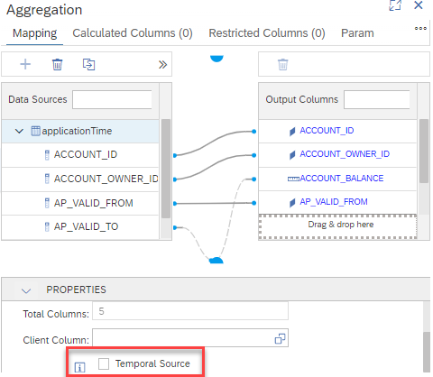
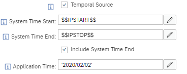
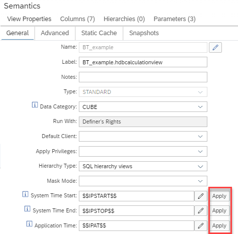

# System-Versioned and Application-Time Tables

## Overview Temporal Tables
System-Versioned tables record changes to their entries with a system timestamp. This timestamp is automatically inserted and no additional information is required during insert/update statements. 

Application-time tables offer columns with date information to check the validity of their entries at certain dates. The date values are explicitly included in the insert/update statements. 

Application-time tables thus offer an application point of view of the validity while system-versioned tables record the timestamps of the insert/update statements and thus offer rather a system view of the time-dependent validity of their entries.

Bi-temporal tables combine system-versioning with application-time information.

For details, see e.g., [documentation temporal tables](https://help.sap.com/docs/SAP_HANA_PLATFORM/6b94445c94ae495c83a19646e7c3fd56/cf3523ab01834f5e84a32164c1fd597a.html).

## Temporal Tables in Calculation Views
Calculation views support system-versioned, application-time, and bi-temporal tables. 

### Defining a Data Source as Temporal Source
In the Mapping tab of a data source the option "Temporal Source" can be selected, if the data source is a temporal table.



If a data source is marked as "Temporal Source", entry-fields become available for the respective timestamps and dates.



Input parameters, expressions, and constant values can be entered in these fields. While constant values **must** be included in single quotes, input parameters and expressions **must not** be included in single quotes.

### Setting View-Global Temporal Values 
The settings for individual data sources can be overwritten in the Semantics:



Pressing the Apply button here will set the displayed value for the matching entry fields of all temporal sources of the current calculation view.

### Temporal Session Variables
 Calculation views support the use of session variables such as: 
 
 ```SQL
SET 'TEMPORAL_SYSTEM_TIME_AS_OF' = '2018-01-01 13:00:00.111111';
```
 
 Values defined in calculation views overwrite values defined in the session context.


## Limitations
- Querying calculation views with SQL syntax `AS OF` is not supported