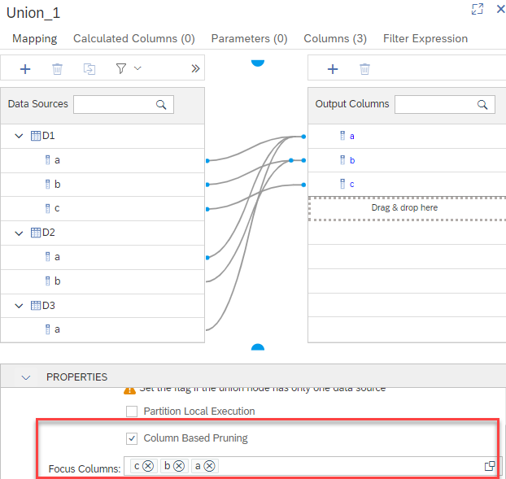
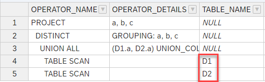

# [Column-Based Pruning](https://help.sap.com/docs/SAP_HANA_PLATFORM/e8e6c8142e60469bb401de5fdb6f7c00/04b541d4b9364e00b33575bbc390de66.html)

## Purpose of Column-Based Pruning
There are several [pruning techniques](https://help.sap.com/viewer/4466fb5b5e3f4388a00b44aad5a4bffa/latest/en-US/92f5022be9234ed19d91d16c70c3b4b5.html) that exclude data sources of Union nodes early during processing if these sources are not required to serve the current query. For example [constant pruning](https://help.sap.com/viewer/4466fb5b5e3f4388a00b44aad5a4bffa/latest/en-US/58e7262f313f49cb961ce13571c8e54f.html) or [configuration table based pruning](https://help.sap.com/viewer/4466fb5b5e3f4388a00b44aad5a4bffa/latest/en-US/e6ecf3e9ed9d4c4080dc8c99f1f47143.html) triggers pruning of data sources based on the *filter values* of the query. 

Column-Based Pruning offers an option to prune individual data sources of a Union based on whether a data source contributes *certain columns* or not. This can considerably speed up processing and reduce memory consumption if the interest of analysis is only on data sources that contribute data to certain columns - "irrelevant" data sources are excluded early from data processing.

Without Column-Based Pruning a data source is processed if it provides at least one requested column, independent of whether this column is a column of interest or not. Column-Based Pruning is a mechanism to specify some columns as *focus* columns and with this define that only data sources are of interest that contribute to at least one of these Focus Columns.

Column-Based Pruning and other pruning techniques, such as constant pruning, can be combined.

## Mechanism of Column-Based Pruning
 Only columns that are requested in the query have an influence on Column-Based Pruning. A data source is pruned if it provides none of the selected Focus Columns that are requested by the query. As soon as a data source contributes one of the Focus Columns and the column is requested, the data source will not be pruned.

## How to switch on Column-Based Pruning
Column-Based Pruning is switched on in the properties section of a Union node. 



A value help icon allows selecting a subset of columns as Focus Columns. This selection can be done on the basis of the role the columns play, whether they are attributes or measures. If no column is selected Column-Based Pruning has no effect. 


## Example
In the following example three data sources deliver columns to a union. The impact of selecting different columns as Focus Columns on Column-Based Pruning  is illustrated below.


### Structure of Union
An overview of the columns that are delivered by the individual data sources D1 to D3 is given below:

**Data Source**|**Delivered columns**| | |
:-----:|:-----:|:-----:|:-----:
D1|a|b|c
D2|a|b| 
D3|a| | 

Column "c" is not mapped from data source D2 and D3. "b" and "c" are not mapped from data source D3.

Here is a screenshot of the respective Union mapping:


### Query 

The following query is used:

```SQL
SELECT 
    "a",
    "b",
    "c"
FROM
    "columnBasedPruning"
GROUP by 
    "a",
    "b",
    "c"
```


#### 1. Focus Column "c"
Only column "c" is marked as Focus Column:


Given that only "c" is selected as Focus Column, all data sources that are not contributing to column "c" are pruned. This can be verified with an Explain Plan of the query that shows that only data source D1 is processed:


#### 2. Focus Columns "b" and "c"
"b" is now additionally marked as Focus Column.


Given that column "b" is also a Focus Column also data source D2 is processed.



#### 3. Focus Columns "a", "b" and "c"


When "a" also becomes a Focus Column, also data source D3 is processed because it provides at least one Focus Column:


This illustrates that is is not required that a data source delivers all Focus Columns to avoid being pruned.

#### 4. Only request column "c"
Now the query is changed to request only column "c" with columns "a", "b" and "c" configured as Focus Columns.

```SQL
SELECT 
    "c"
FROM
    "columnBasedPruning"
GROUP by 
    "c"
```
Even though data sources D2 and D3 provide columns that are selected as Focus Columns data sources D2 and D3 are not processed. The reason is that the query does not request any of the Focus Columns "b" and "c" which are the only Focus Columns provided by data source D2 and D3:


This illustrates that to avoid being pruned, data sources have to provide at least one Focus Column **and** the query has to request this Focus Column.

## Why does Column-Based Pruning not occur per default?
Activating Column-Based Pruning can have an influence on the results. Data sources that are not mapped to Focus Columns can potentially contribute Null values to the Focus Columns. Additionally, records with Null values in the Focus Column can contribute other values for the other columns of the record. Column-Based Pruning then leads to a different result by eliminating the records that have Null values in the Focus Columns. In the examples below you will see that when pruning occurs, records that would contribute  Null values in the Focus Columns are indeed eliminated during Column-Based Pruning. 
In the example, data source D2 contains 2 records and thus contributes two Null values, while data source D3 is empty and thus does not contribute a value.
This means if for example only column "c" is defined as Focus Column so that D2 and D3 are pruned with Column-Based Pruning, different results occur depending on whether or not Column-Based Pruning is selected:

### Result when Column-Based Pruning is switched on


Data source D2 and D3 are pruned because they provide no data for Focus Column "c". Therefore, no records are delivered by them. In this example that is chosen for simplicity, data source D1 contains no records thus the result is empty.

### Result when Column-Based Pruning is switched off


This time data source D2 and D3 are not pruned and D2 delivers records.

Given that Column-Based Pruning can change the result, it needs to be actively selected and is not active per default.


