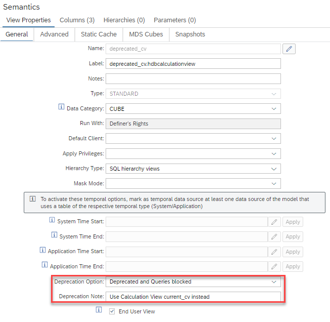
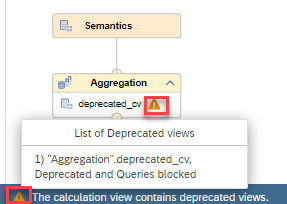

# [Deprecated views](https://help.sap.com/docs/SAP_HANA_PLATFORM/e8e6c8142e60469bb401de5fdb6f7c00/50207c1d832e46bc88fb9d5c8d1bdc40.html)

The already existing option to mark [deprecated views](https://help.sap.com/docs/SAP_HANA_PLATFORM/e8e6c8142e60469bb401de5fdb6f7c00/50207c1d832e46bc88fb9d5c8d1bdc40.html) has been enhanced with an option to deprecate and block the usage of the calculation view.

With the new option deprecated views are not only visible in the modeling tool as deprecated but queries on the view are also blocked and an individual information message can be defined to notify the end users:



Queries against views with status "Deprecated and Queries blocked" fail showing the text of the Deprecation Note field in the error message:

```SQL
SELECT
	"year",
	"month",
	"day",
	SUM("amount") AS "amount"
FROM "deprecated_cv"
GROUP BY "year", "month", "day"
```

*Could not execute 'SELECT "c1", "c2", SUM("m") AS "m" FROM "deprecated_cv" GROUP BY "c1", "c2"'
Error: (dberror) [2048]: column store error: search table error: [34023] Instantiation of calculation model failed;Model 'MDSCUBES_HDI_DB_1:deprecated_cv' is deprecated. Info:* ***Use calculation view current_cv instead***

Calculation views that directly consume deprecated calculation views show a warning icon. Details about which consumed views are deprecated are available when hovering over the icon at the bottom:



Information about the deprecation status of a view can be found in columns DEPRECATED and DEPRECATION_NOTE of view _SYS_BI.[BIMC_CUBES](https://help.sap.com/docs/SAP_HANA_PLATFORM/88fe5f56472e40cca6ef3c3dcab4855b/0ed2466f7d7d4c20964005f4b8fcc729.html).


