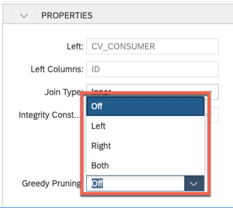
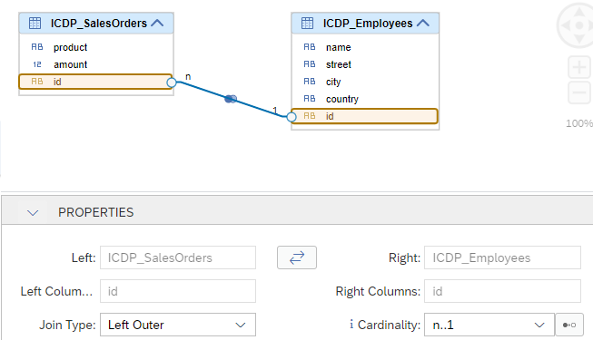
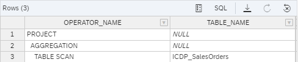
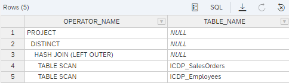
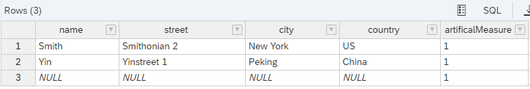
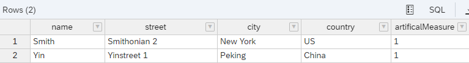

# [Greedy Join Pruning](https://help.sap.com/docs/SAP_HANA_PLATFORM/e8e6c8142e60469bb401de5fdb6f7c00/17af2dff9bbc479c9472c693c0ff85c0.html)

## Context
If large scenarios make use of multiple joins, performance improves if some of the joins can be pruned. Pruning in this context means that a join is not executed. Without the new option "Greedy Pruning", join pruning only occurs if pruning the join cannot have an influence on the results. This means that for pruning to occur, certain combinations of cardinality settings and join type have to be specified in the calculation view. For more details, see the respective sections in the  [developer performance guide](https://help.sap.com/docs/HANA_CLOUD_DATABASE/4466fb5b5e3f4388a00b44aad5a4bffa/ebb3cc9f142a4a8691718afa2f42af77.html). In contrast, Greedy Pruning triggers join pruning independent of the join type and cardinality setting. This can significantly speed up performance but also lead to unexpected results if the expected results depend on the execution of the join.

The graphical support of greedy pruning will become available with the release of SAP Business Application Studio around end of October 2022.

## Mechanism of Greedy Join Pruning
If "Greedy Pruning" is selected for an individual join, the cardinality information and join type is ignored when deciding whether a join should be pruned or not. In particular also inner joins are pruned if no columns are required from the to-be-pruned join partner. Irrespective of the Greedy Pruning setting, join pruning can only occur if no columns from the to-be-pruned join partner are required for processing the query. A column is required for processing, if for example, the column is directly requested in the user query, is used in a requested calculated column, or is used as a join column in a later join.

### Greedy Join Pruning Options
Greedy Pruning decisions can be requested for only one side of a join (Left/Right) or for both sides (Both). 



If "Both" is selected greedy join pruning can happen for the right or left join partner depending on which columns are requested. The impact of Greedy Pruning on join pruning and on the results of the queries is illustrated in the examples below. 


## Examples
In the following examples, the Greedy Pruning option is manipulated in the calculation view to show the effects of the different greedy pruning settings.

In the queries that are used throughout the examples, columns "product" and "amount" come from the left join partner while the other columns come from the right join partner. Based on these, the query determines which join partner is required for query processing.

Explain plans for the following queries are used throughout the examples to show the presence or absence of join pruning:


### Queries

#### Query Left: only columns from left join partner

```SQL
SELECT 
	"product",
	SUM("amount") AS "amount"
FROM "IgnoreCardinalityDuringPruning"
GROUP BY 
    "product"
```

#### Query Right: only columns from right join partner

```SQL
SELECT 
	"name",
	"street",
	"city",
	"country",
    sum(1) as "artificalMeasure"
FROM "IgnoreCardinalityDuringPruning"
GROUP BY 
    "name", 
    "street", 
    "city", 
    "country"
```

#### Query Both: columns from both join partners

```SQL
SELECT 
	"product",
	"name",
	"street",
	"city",
	"country",
	SUM("amount") AS "amount"
FROM "IgnoreCardinalityDuringPruning"
GROUP BY 
    "product", 
    "name", 
    "street", 
    "city", 
    "country"
```


### Model
Calculation view [IgnoreCardinalityDuringPruning](./IgnoreCardinalityDuringPruning.hdbcalculationview) will be used throughout the examples. In the calculation view, a left-outer join is defined with cardinality n..1 as shown below:




## Using Query Left

### Example 1: Greedy Pruning Off



### Example 2: Greedy Pruning Left


### Example 3: Greedy Pruning Right


### Example 4: Greedy Pruning Both


**&rarr; The explain plan shows that only one join partner is processed and thus join pruning occured. In these examples join pruning occurs based on join cardinality and join type. Therefore, join pruning is not influenced by the setting of Greedy Pruning**

## Using Query Right

### Example 5: Greedy Pruning Off



**&rarr; based on the join type and cardinality no pruning should occur and the explain plan shows that indeed both join partners are processed**
### Example 6: Greedy Pruning Left


**&rarr; based on join type and join cardinality no join pruning would occur. However, based on Greedy Pruning the left side can still be pruned**

### Example 7: Greedy Pruning Right


**&rarr; Greedy Pruning setting allows pruning of the right side only. However, columns from the right side are requested and therefore no join pruning occurs**


### Example 8: Greedy Pruning Both


**&rarr; Greedy Pruning option "Both" includes also Greedy Pruning "Left". Therefore, pruning occurs.**

## Using Query Both

### Example 9: Greedy Pruning Off


### Example 10: Greedy Pruning Left


### Example 11: Greedy Pruning Right


### Example 12: Greedy Pruning Both


**&rarr; Given that columns are requested from both sides, no join pruning occurs**


## Comparing Results With and Without Greedy Pruning

If greedy pruning is switched off the following results are returned for query Right:



The last row is returned because of the left-outer join which is executed.

With Greedy Pruning switched on for Left the left-outer join is pruned and therefore the last record is missing:



This illustrates that different results can occur whether or not greedy pruning is switched on. In the current example the results differ in that unmatched records from the left table are reported when Greedy Pruning is not used. The number of records in turn can influence the value of measures. In the current example the sum of "artificalMeasure" would be "3" versus "2". Whether this difference is acceptable depends on the exact use case. In the current example "2" might even be prefered. The creator of the calculation view needs to decide whether such kind of result changes are acceptable or not when deciding whether to use Greedy Pruning.

## Influence Greedy Pruning by Using Hints 
The join settings for Greedy Pruning in calculation views can be overruled by an execution hint. The execution hint influences Greedy Pruning for all calculation views that are processed in a given query. An execution hint for Greedy Pruning can be added to an SQL query like in the following example:

```SQL
SELECT <...> FROM <...> ('PLACEHOLDER' = ('ce_settings', '{"greedy_join_pruning": "<value>"}') GROUP BY <...>
```

e.g., 

```SQL
SELECT 
	"name",
	"street",
	"city",
	"country",
    sum(1) as "artificalMeasure"
FROM "IgnoreCardinalityDuringPruning" ('PLACEHOLDER'=('ce_settings', '{"greedy_join_pruning": "15"}'))
GROUP BY 
    "name", 
    "street", 
    "city", 
    "country" 
```


**=> use Greedy Join Pruning to speed up queries whenever the expected results do not depend on the execution of the join.**