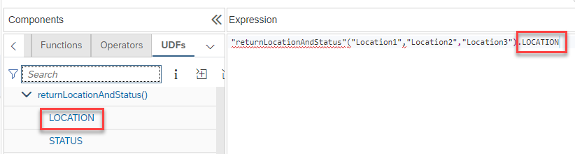

# Graphical support of user-defined functions with multiple return values

The expression editor now displays the parameters that are returned by a function if multiple values are returned. Use the graphical support to choose which parameter value should be used in the expression:

