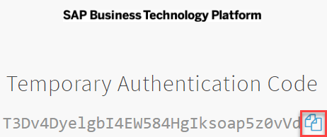
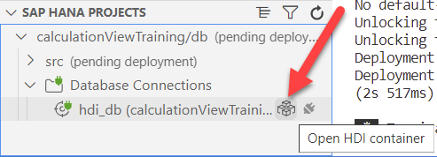
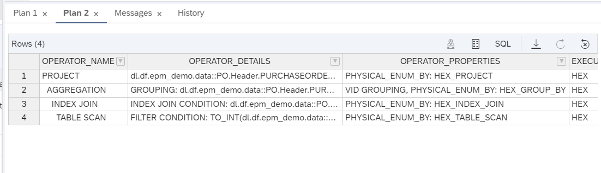

# HANA Cloud Modelling
HANA Cloud modelling - Best Practice for Input Parameters

## Important Links
- [SQLScript Reference for  - SAP HANA
Platform / Cloud version is in draft](https://help.sap.com/doc/6254b3bb439c4f409a979dc407b49c9b/2.0.07/en-US/SAP_HANA_SQL_Script_Reference_en.pdf)
- [HANA Cloud - SQL Reference Guide](https://help.sap.com/docs/HANA_CLOUD/c1d3f60099654ecfb3fe36ac93c121bb/b4b0eec1968f41a099c828a4a6c8ca0f.html?state=DRAFT&q=SAP%20HANA%20Cloud%20SQL)
- [HANA Cloud - Modelling guide for Business Application Studio](https://help.sap.com/docs/HANA_CLOUD/d625b46ef0b445abb2c2fd9ba008c265/9ed48614318a4831a8a6b3e3222a05f0.html?state=DRAFT&q=table%20functions%20input%20parameter&advAll=undefined&advAny=undefined&advPhr=undefined&advNot=undefined)
- [HANA Cloud - Performance Guide for Developers](https://help.sap.com/docs/HANA_CLOUD_DATABASE/4466fb5b5e3f4388a00b44aad5a4bffa/45b03e4d89634e289ce1fcee268bb100.html?locale=en-US)

## Hands-On Exercise
In this hands-on you will use existing calculation views and apply filters using input parameters in various ways, so that you learn the impact of good and bad input parameter implementations.

Here are a few demo examples showcasing the topics:

1. The simplest task is to map a input parameter to a discrete column of a table, how to handle empty parameters?
2. Another idea is to map a list of values to a filter of a table (IN comparison)
3. How do you call this view from inside a table function ? 
4. How do you map input parameters when re-using these views/tf inside another artifact?
5. How to allow for all sorts of combinations without losing performance / flexibility? 

```sql
-- simple table function calling a calculation view - no parameters
SELECT * FROM "EPM_DEMO_DATA_FOUNDATION"."dl.df.epm_demo.tf.solution::tf_products"();

-- 1. simple input parameters, no placeholder mapping, modelled as where constraint
SELECT * FROM "EPM_DEMO_DATA_FOUNDATION"."dl.df.epm_demo.tf.solution::tf_products_simple_ip"('0301090555');
SELECT * FROM "EPM_DEMO_DATA_FOUNDATION"."dl.df.epm_demo.tf.solution::tf_products_simple_ip"(null);

-- uses placeholder syntax to map calculation view parameters to table function, supports empty parameters, returns all rows
SELECT * FROM "EPM_DEMO_DATA_FOUNDATION"."dl.df.epm_demo.tf.solution::tf_products_ip_mapped"('0301090555','');
SELECT * FROM "EPM_DEMO_DATA_FOUNDATION"."dl.df.epm_demo.tf.solution::tf_products_ip_mapped"('','');

-- 5. uses apply filter function to map input string to dynamic filter, which can co-exist with unused input parameters
SELECT * FROM "EPM_DEMO_DATA_FOUNDATION"."dl.df.epm_demo.tf.solution::tf_products_mvip_apply_filter"('0301090555,0301012013,0301090557');

-- model calculation view with optional input parameter:
--> APPLY FILTER NODE ON CV_PRODUCT_DATA: "PURCHASEORDERID" = IFNULL(NULLIF('$$IP_PURCHASEORDERID$$', ''),"PURCHASEORDERID")


```
## Course Credentials
CF API Endpoint: https://api.cf.sap.hana.ondemand.com (canary) (can check from BTP)

SCHEMA in mta.yaml: EPM_DEMO_DATA_FOUNDATION_#USERID 

(e.g. with USERID -> D057818)

```yaml
  parameters:
    config:
      schema: EPM_DEMO_DATA_FOUNDATION_D057818
```

## Used Tables
- dl.df.epm_demo.data::PO.Header 
- dl.df.epm_demo.data::PO.Item

# Prerequisite

Make sure you are logged in to your development space in business application studio

<details>

1. open the main menu in business application studio & open a new terminal


2. type in 
```bash
cf login --sso
```
3. ctrl + click on the link




4. Copy & Paste it back into the terminal and confirm (hidden)


5. Select your Org and Space - done!


6. Close the terminal


</details>

#
# Step by Step guide


## Exercise 1 - apply a simple filter onto calculation view CV_PRODUCT_DATA

<details>

1. Open calculation view "CV_PRODUCT_DATA" in src/0_exercise/calcviews

    
 
    a) Double Click -> Semantics node and go to the "Parameters" tab

    

    b) Click the + sign and choose "Input Parameter" 

    

    c) Click the arrow on the right of IP_1

    

    d) Change the name of IP_1 to IP_PRODUCTID

    

    e) Double click on the "APPLY_FILTER" node in the modelling canvas and select the "FILTER EXPRESSION" tab

    

    f) Enter the following filter expression

    ```sql
    "PURCHASEORDERID" = '$$IP_PURCHASEORDERID$$'
    ```

    

    If you want you can validate if the expression is valid

    


    Lets execute a query on the view and test the input parameter.
    
</details>

## Exercise - view testing - use business application studio or database explorer to generate queries for you

<details>

From the CV_PRODUCT_DATA modelling canvas click the bug icon in the upper top-left corner

 

Double click on the Semantics Node


Here you will find a query proposal, instantiate the model by executing the debug query session
with the proposed query. 

As you'll notice the value for the filter is null which will yield zero rows when executed

 


```sql
(placeholder."$$IP_PURCHASEORDERID$$"=>null) 
```

the placeholder syntax is - [documented here](https://help.sap.com/docs/HANA_CLOUD_DATABASE/d625b46ef0b445abb2c2fd9ba008c265/d5c8230abb571014acc592c2c96d92bd.html?q=SAP%20HANA%20Cloud%20Modeling%20Guide%20for%20SAP%20Business%20Application%20Studio%20>%20Input%20Parameters&locale=en-US):

lets adjust the query to check for a specific PURCHASEORDERID and remove unnecessary fields which were proposed initially.

```sql
SELECT PURCHASEORDERID
FROM  "EPM_DEMO_DATA_FOUNDATION"."dl.df.epm_demo.modelling.exercise::CV_PRODUCT_DATA"
(placeholder."$$IP_PURCHASEORDERID$$"=>'0301090555')
```

Execute the query by clicking the following icon:


The result should look as follows:

 

To open Database Explorer from Business Application Studio you can click on the following icon next to your HDI container:
 

Which will add a privileged hdi container connection. (Continue with step 2.)

In case you manually added the connection as a database connection you have to

1. Add the database connection with a privileged user
    
2. expand the database / container catalog and select "column view"
    
 

3. Search for the view name in the search fields in the bottom left corner
    
 

4. Right-click the volumn view and select "Generate SELECT Statement"

 

5. A query will be generated in a newly connected sql console with the following FROM clause:

    *the fieldlist / group by is not interresting to us for this scenario as we just wanted to have the placeholder syntax generated*

```sql
SELECT TOP 5000 <fieldlist>
FROM "EPM_DEMO_DATA_FOUNDATION"."dl.df.epm_demo.modelling.exercise::CV_PRODUCT_DATA"
	(placeholder."$$IP_PURCHASEORDERID$$"=>'')
<group_by>
```
As can be seen the initial value for the input parameter `$$IP_PURCHASEORDERID$$` is *blank*.

The query should return 0 rows when executed

 

Change the `$$IP_PURCHASEORDERID$$` to '0301090555'

*for simplicity i only selected PURCHASEORDERID from the fieldist and removed everything else*

```sql
SELECT PURCHASEORDERID
FROM "EPM_DEMO_DATA_FOUNDATION"."dl.df.epm_demo.modelling.exercise::CV_PRODUCT_DATA"
	(placeholder."$$IP_PURCHASEORDERID$$"=>'0301090555')
```
Execution of the query should yield 1 row only as below:

 

</details>

## Exercise 2 - Enable usage of empty input parameters

<details>

Often times it is a requirement to have the input parameters only restrict the values when they are provided but not when they are omitted.

Please execute the following queries to see the behaviour:

```sql
-- will return all data*
SELECT PURCHASEORDERID
FROM "EPM_DEMO_DATA_FOUNDATION"."dl.df.epm_demo.modelling.solution::CV_PRODUCT_DATA_EMPTY_IP"
	(placeholder."$$IP_PURCHASEORDERID$$"=>'')
```
 


```sql
-- will return data only for PURCHASEORDERID = 0301090555
SELECT PURCHASEORDERID
FROM "EPM_DEMO_DATA_FOUNDATION"."dl.df.epm_demo.modelling.solution::CV_PRODUCT_DATA_EMPTY_IP"
	(placeholder."$$IP_PURCHASEORDERID$$"=>'0301090555')
```

 

1. Copy the view CV_PRODUCT_DATA under src/0_exercise/calcviews into the same folder
2. Rename it CV_PRODUCT_DATA_EMPTY_IP
3. Open CV_PRODUCT_DATA_EMPTY_IP
4. Double-click on the APPLY_FILTER node into the FILTER EXPRESSION tab


change the filter expression from 

```sql
"PURCHASEORDERID" = '$$IP_PURCHASEORDERID$$'
```

to 

```sql
"PURCHASEORDERID" = IFNULL(NULLIF('$$IP_PURCHASEORDERID$$', ''),"PURCHASEORDERID")
```
⚠️**_Apply the FILTER EXPRESSION changes by clicking on the top right button_**

the *new expression* will first check if the input parameter `$$IP_PURCHASEORDERID$$` is null and if that is the case then it will compare

"PURCHASEORDERID" = "PURCHASEORDERID" which always evaluates to *true* and thus is removed as a filter as it does not restrict anything.

Otherwise if the input parameter `$$IP_PURCHASEORDERID$$` is provided it will be used to filter.

Save and deploy your model and query it to test the filter behaviour:

```sql
-- will return all data*
SELECT PURCHASEORDERID
FROM "EPM_DEMO_DATA_FOUNDATION"."dl.df.epm_demo.modelling.exercise::CV_PRODUCT_DATA_EMPTY_IP"
	(placeholder."$$IP_PURCHASEORDERID$$"=>'');

-- will return data only for PURCHASEORDERID = 0301090555
SELECT PURCHASEORDERID
FROM "EPM_DEMO_DATA_FOUNDATION"."dl.df.epm_demo.modelling.exercise::CV_PRODUCT_DATA_EMPTY_IP"
	(placeholder."$$IP_PURCHASEORDERID$$"=>'0301090555');
```

</details>

## Exercise 3 - Re-use calculation views with input parameter mapping in table functions

<details>

Suppose we would like wrap the view CV_PRODUCT_DATA inside a table function, how would we take care of the mapping of the input parameters?

First execute the following table function to see the behaviour:

```sql
-- will return all data, input parameter exists but it's default is set to ''
SELECT * FROM "EPM_DEMO_DATA_FOUNDATION"."dl.df.epm_demo.tf.solution::TF_PRODUCT_DATA_IP_MAPPED"();
```
 

```sql
-- will return data only for PURCHASEORDERID = 0301090555
SELECT * FROM "EPM_DEMO_DATA_FOUNDATION"."dl.df.epm_demo.tf.solution::TF_PRODUCT_DATA_IP_MAPPED"('0301090555');
```

1. Start by opening the table function under src/0_exercise/tf/TF_PRODUCT_DATA_IP_MAPPED
2. There are two blocks commented out which enable the input parameter mapping

```sql
 RETURN SELECT
		"PURCHASEORDERID",
		"PARTNER_PARTNERID" as "PARTNER.PARTNERID",
		"CURRENCY",
		SUM("GROSSAMOUNT") as GROSSAMOUNT ,	SUM("NETAMOUNT") as NETAMOUNT, SUM("TAXAMOUNT") as TAXAMOUNT
		FROM "dl.df.epm_demo.modelling.solution::CV_PRODUCT_DATA_EMPTY_IP"
		-- #1 placeholder syntax here
		GROUP BY 
		"PURCHASEORDERID", "PARTNER_PARTNERID","CURRENCY";
```
1. Make the correct assignment from table function input parameters to calculation view input parameters using the placeolder syntax (you can generate the syntax if you want to from database explorer).
2. Set a DEFAULT value for the input parameter *ip_purchaseorderid* e.g. ''

```sql
FUNCTION "dl.df.epm_demo.tf.exercise::TF_PRODUCT_DATA_IP_MAPPED"(
	-- #2 set default value)	
	ip_purchaseorderid nvarchar(10) )
    RETURNS TABLE (
	-- #3 create result set structure)	
		<columnName> <type>(<length>)
		) 
    LANGUAGE SQLSCRIPT
    SQL SECURITY INVOKER AS
BEGIN
```

3. Create a return type table which has the structure of the RETURN resultset

The RETURNS TABLE (<column_name> <datatype>,[...]) maps the selected fieldlist and types from the previous select and as you can see the DEFAULT value for ip_purchaseorderid is set here, if you do not set this you'll receive a error message like below when executing the query as previously noted.

```sql
-- will throw error if DEFAULT value not set and called without parameter binding
SELECT * FROM "EPM_DEMO_DATA_FOUNDATION"."dl.df.epm_demo.tf.exercise::TF_PRODUCT_DATA_IP_MAPPED"();
```

 

</details>

## Exercise 4 - Providing a list of values as a filter

<details>

Let's assume we do not want to provide only a single filter value but a larger list of values.

```sql
-- will return data only for PURCHASEORDERID = 0301090555, as previously defined in CV_PRODUCT_DATA.
SELECT * FROM "EPM_DEMO_DATA_FOUNDATION"."dl.df.epm_demo.tf.solution::TF_PRODUCT_DATA_MVIP_MAPPED"('0301090555','0301012012','0301012013');
```

Filter Expression for multi-value input parameter

```sql
"PURCHASEORDERID" IN($$IP_PURCHASEORDERID$$)
```
This will cover the following scenarios:

1. Empty if not provided (default)
2. Returns result filtered for list of values

```sql
--1. Empty if not provided (default)
select * FROM "EPM_DEMO_DATA_FOUNDATION"."dl.df.epm_demo.modelling.solution::CV_PRODUCT_DATA_MVIP"
	(placeholder."$$IP_PURCHASEORDERID$$"=>'''''');
```


```sql
--2. Returns result filtered for list of values
select * FROM "EPM_DEMO_DATA_FOUNDATION"."dl.df.epm_demo.modelling.solution::CV_PRODUCT_DATA_MVIP"
	(placeholder."$$IP_PURCHASEORDERID$$"=>'''0301090555'',''0301012010''')
```


1. Copy view src/0_exercise/calcviews/CV_PRODUCT_DATA into the same folder and name it CV_PRODUCT_DATA_MVIP

*or if you have not finished exercise 2 yet, you can copy CV_PRODUCT_DATA from the src/1_solution/calcviews folder*

2. Open and go into the Semantics node
3. Open Parameters tab
4. Set checkmark for 


5. Double-click "APPLY_FILTER" node in modelling canvas


6. Change the filte expression to

```sql
"PURCHASEORDERID" IN($$IP_PURCHASEORDERID$$)
```

The IN()-clause needs the values to be provided as a comma-seperated list e.g. ('4711','4712').

7. Deploy the changes and execute the following query:

```sql
select * FROM "EPM_DEMO_DATA_FOUNDATION"."dl.df.epm_demo.modelling.exercise::CV_PRODUCT_DATA_MVIP"
	(placeholder."$$IP_PURCHASEORDERID$$"=>'''0301090555'',''0301012010''')
```
</details>

## Exercise 5 - Splitting a string into a table structure

<details>

If you want to map a string of delimiter-seperated values to a IN()-clause in sql you need to either:

-   split the string at the delimiter into it's values
-   build a dynamic WHERE CLAUSE where the string can be injected into

In this exercise we will first look at a simple solution to split a string at a delimiter and use that as a multi-value filter input.

Secondly we will look at the disadvantage of that approach (SQL unfolding blocker) and discuss the second approach to safely and dynamically inject sql constraints using the APPLY_FILTER functionality.

1. Open the table function src/1_solution/tf/TF_SPLIT_STRING.hdbfunction
2. Notice how we used a internal library to achieve the split functionality and applied it in line 10

*[official documentation here](https://help.sap.com/docs/SAP_HANA_PLATFORM/de2486ee947e43e684d39702027f8a94/0fd739184bc343dfae6190891965c383.html?q=SPLIT_TO_TABLE&locale=en-US)*

```sql
FUNCTION SPLIT_TO_TABLE(IN VALUE NVARCHAR(5000), IN SEPARATOR NVARCHAR(5000), IN MAXSPLIT INT DEFAULT -1) RETURNS TABLE(RESULT NVARCHAR(5000)); 
```

The SPLIT_TO_TABLE() function takes a input string, with max length 5000 as well as a seperator and returns a single column table with table type (WORD NVARCHAR(5000))

```sql
tv = LIB:SPLIT_TO_TABLE(:sentence,',');
```

Where :sentence is the input parameter we provide as a caller, see below e.g. ('4712,4711')

```sql
FUNCTION "dl.df.epm_demo.tf.solution::TF_SPLIT_STRING"(in sentence varchar(5000)) returns table (result nvarchar(200))
```

```sql
SELECT * FROM "EPM_DEMO_DATA_FOUNDATION"."dl.df.epm_demo.tf.solution::TF_SPLIT_STRING"('4712,4711');
```


We can now combine the previous exercise 4 with what we learned here and come up with the following ways to provide input parameter mappings to a calculation view:

1. Use the pre-defined multi-value input parameter inside the calculation view (does not return anything on empty values)
2. Use the SPLIT_TO_TABLE function to transform a given input string into a internal table structure which we can use as a filter directly

For Scenario #1 we dont need to adjust the table function a lot only two places:

```sql
	mvip_purchaseorderid nvarchar(5000) DEFAULT '')
```
Here we just increased the length of the input parameter and made clear via naming that it's supposed to be a multi-value input parameter. 

```sql
		(placeholder."$$IP_PURCHASEORDERID$$"=>:mvip_purchaseorderid)
```

Secondly to use the SPLIT_TO_TABLE() function.

Here in line 17 we use the library to extract the relevant PURCHASEORDERID's and store them in lt_poids

```sql
lt_poids = select "RESULT" as "PURCHASEORDERID" FROM "dl.df.epm_demo.tf.solution::TF_SPLIT_STRING"(:mvip_purchaseorderid);
```

Here in line 25 we re-use the internal structure with the relevant PURCHASEORDERID's as a subquery IN()-clause

```sql
    RETURN SELECT <fieldlist>
		FROM "dl.df.epm_demo.modelling.solution::CV_PRODUCT_DATA" 
        where "PURCHASEORDERID" IN (SELECT "PURCHASEORDERID" FROM :lt_poids)
		GROUP BY 
		<group_by>;

```


## Exercise Steps:

1. Open src/0_exercise/tf/TF_PRODUCT_DATA_MVIP_STT
2. Adjust the commented sections according to the description above
3. Save & Deploy
4. Execute the below query to test

```sql
SELECT * FROM "EPM_DEMO_DATA_FOUNDATION"."dl.df.epm_demo.tf.exercise::TF_PRODUCT_DATA_MVIP_STT"('0301090555,0301012010');
```

Done!


</details>


## Exercise 6 - APPLY_FILTER - injection of dynamic constraints

<details>

In case of dynamic filters and lists of strings to be tranformed, the operations necessary to complete them usually end up blocking the sql unfolding process. This is due to the usage of imperative logic (IF, FOR, WHILE, LOOP statements)

You can read more about this in the SQLScript Reference:
- [SQLScript Reference for  - SAP HANA
Platform / Cloud version is in draft](https://help.sap.com/doc/6254b3bb439c4f409a979dc407b49c9b/2.0.07/en-US/SAP_HANA_SQL_Script_Reference_en.pdf)


Blocked unfolding can degrade performance as the sql optimizer does not have the complete potential information available to make the best decisions.

One way around this is to use the APPLY_FILTER function.

To show you the difference between the two please execute the explain plan for the following queries:


```sql
-- last operator shows that the TUDF could not be unfolded
SELECT * FROM "EPM_DEMO_DATA_FOUNDATION"."dl.df.epm_demo.tf.solution::TF_PRODUCT_DATA_MVIP_STT"('0301090555,0301012010');
```


```sql
-- complete unfolding here, no blocker in explain plan
SELECT * FROM "EPM_DEMO_DATA_FOUNDATION"."dl.df.epm_demo.tf.solution::tf_products_mvip_apply_filter"('0301090555,0301012010')
```


> ⚠️**_NOTE:_**  *Please be aware that this approach using the APPLY_FILTER method and inject the values may lead to cache-flooding on fast changing parameter sets as it generates a concrete plan for every parameter combination, to circumvent this shortcoming please refer to the EXEC / USING clause in SQL Script reference guide*

## Exercise Steps:

1. Open table function "tf_products_mvip_apply_filter" in path src/0_exercise/tf/
2. Write down the where condition you want to express for a IN-List with column Purchaseorderid e.g. WHERE "BRAND" = '4711' 
3. In the following section replace the generic expression with your own filter expression


4. Create the actual APPLY_FILTER call AFTER the query to read the data


5. Execute a query & explain plan on your own table function

```sql
SELECT * FROM "EPM_DEMO_DATA_FOUNDATION"."dl.df.epm_demo.tf.exercise::tf_products_mvip_apply_filter"('0301090555,0301012010')
```

You are done.

# Congratulations!

</details>