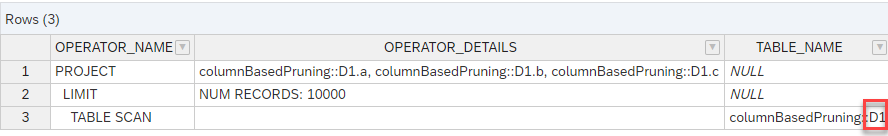

# Column-Based Pruning
There are several pruning techniques that exclude data sources of union nodes early on during processing if the sources are not required to serve the query. For example, constant pruning or configuration table-based pruning triggers data source pruning based on the filter values of the query.

Column-based pruning offers an option to prune individual data sources of a union node based on whether a data source contributes certain columns or not. This can considerably speed up processing and reduce memory consumption if the focus of the analysis is only on the data sources that contribute data to certain columns. This means that "irrelevant" data sources are excluded at an early stage of data processing.

Without Column-Based Pruning, a data source is processed if it provides at least one requested column, irrespective of whether this column is a column of interest or not. Column-based pruning is a mechanism to specify certain columns as focus columns and thus define that only those data sources are of interest that contribute to at least one of these focus columns.

Column-based pruning and other pruning techniques, such as constant pruning, can be combined.

## Column-Based Pruning Mechanism
Only columns that are requested in a query have an influence on Column-Based Pruning.

A data source is pruned if it provides none of the selected focus columns that are requested by the query. As soon as a data source contributes one of the focus columns and the column is requested, the data source will not be pruned.

## Enabling Column-Based Pruning
You can enable Column-Based Pruning in the Properties section of a union node.


You can use the provided value help button to select a subset of columns as focus columns. This selection can be done based on the role the columns play, for example, whether they are an attribute or measure. If no columns are selected, Column-Based Pruning has no effect.


# Hands-On Column-Based Pruning

### Used Objects
- table columnBasedPruning::D1
- table columnBasedPruning::D2
- table columnBasedPruning::D3

> To illustrate the concept the data have been reduced to a minimum. Please have a quick look at the content of table "columnBasedPruning::D2". You can find it in file D2.csv. Both other tables are empty. Here is an overview of which columns are provided in each table:

**table**|**columns**
:-----|-----
D1|"a","b","c"
D2|"a","b"
D3|"a"


### Creation of Calculation View

1. Create calculation view "columnBasedPruningExample"

    a) right-click on folder "columnBasedPruningExample" and select "New File...":
    
     

    b) enter "columnBasedPruningExample.hdbcalculationview" as name of the file. The extension ".hdbcalculationview" determines that the calculation view editor will open the file

    c) choose Data Category "Dimension" to create a view that does not require measures and choose "Create":

    

    *The calculation view editor will open*

2. Add an Union node to the modeling area by clicking on the Union node icon followed by a click on an empty area:

    

    >you can expand the nodes section to display the descriptions

</br>

3. Add all three tables D1, D2, and D3 to the Union node:

    a) click on the Union node so that the +-sign appears

    b) click on the +-sign to add a Data Source:

    
   
    c) search for tables in namespace "columnBasedPruning" that start with "D" (use e.g., search term columnBasedPruning::D\_)

    d) select all tables. All table are defined in the same HDI container. Therefore, no synonym is needed. Click on "Finish":
    
    
    
4. Connect the Union node to node "Projection"

    a) click on the Union node so that the arrow appears and drag and drop the arrow to the Projection node:

    

    *The Union node is now connected to the projection node. This means that the output of the Union node will feed into node "Projection"*

5. Map the columns

    a) double-click on node "Union_1" to open the details

    b) to map all columns to the output based on their names, click on button "Auto Map by Name"

    *all columns will be mapped to the output. Columns that have the same name are mapped to the same output column:*

    

6. Propagate all columns to the Semantics

    a) right-click on one output column and choose "Select All"

    b) right-click again and select "Propagate to Semantics":

    

7. Configure Column-Based Pruning

    a) ensure that no data source or column is selected in the Mapping tab so that the option "Column Based Pruning" becomes available under Properties:

    

    b) check option "Column Based Pruning" and select column "c" as focus column in the dialog that automatically opens
    
    *The model is now consistently defined and the corresponding database objects can be generated*


8. Deploy the model


    Deploying the model can be achieved in different ways:
    
    i) press the Deploy button of the calculation view:

    

    ii) use the default keyboard shortcut CTRL+d

    iii) use the deploy button under SAP HANA Projects:

    

    > under SAP HANA Projects you can also deploy at a higher level, e.g., a folder that contains the calculation view


## Check Influence of Column-Based Pruning

To check the influence of Column-Based Pruning we will re-iterate several steps:

- change Column Based Pruning setting
- deploy the view
- run Explain Plan on query

Given that the steps are reiterative, the steps are described in detail only once

### Focus column "c"

#### Change Column Based Pruning setting
1. double click on Node "Union_1" to open the Details
2. select tab "Mapping" but do not select any individual data source so that option "Column Pruning" appears under "Properties"
3. tick "Column Pruning" (if not already selected)
4. choose column "c" as only Focus Column (if not already chosen):

 


#### Deploy the view 
- press the rocket icon on the top right (or use keyboard CTRL+d) to deploy the calculation view

#### Run Explain Plan on Query

1. open an SQL console in Database Explorer:

    a) under SAP HANA PROJECTS choose "Open HDI Container":

    

2. click on category "Column Views" of the opened connection in Database Explorer and select "Generate SELECT Statement":

    

    *You don't have to run these steps again in the coming iterations. Instead you can switch back to the existing query*

3. execute Explain Plan

    a) from the drop-down menu of "Analyze" choose "Explain Plan":

    

    *The Explain Plan shows that only table D1 is accessed:*

    

    *table D1 is the only data source that contributes to the focus column "c" which is the reason why it is processed*

### Focus Columns "c" and "b"

1. change the Focus Columns to "c" and "b"

2. deploy the view

3. run the Explain Plan:

    

    *Given that column "b" is also a focus column, the data source D2 is also processed:*

### Focus Columns "c","b", and "a"

1. change the Focus Columns to "c","b", and "a"

2. deploy the view

3. run the Explain Plan:

    

    *Since "a" has also become a focus column, the data source D3 is also processed because it provides at least one focus column. This illustrates that it is not necessary for a data source to deliver all focus columns to avoid being pruned*

### Only request column "c"

1. keep the focus columns but change the query to 

    ```SQL
    SELECT 
        "c"
    FROM 
        "columnBasedPruning::columnBasedPruningExample"
    GROUP BY 
        "c";
    ```

    so that only focus column "c" is requested.

    2. deploy the view

    3. run the Explain Plan:

    

    *Even though the data sources D2 and D3 provide columns that are selected as focus columns, data sources D2 and D3 are not processed. The reason is that the query does not request either the focus column "b" or "a", which are the only focus columns provided by the data sources D2 and D3. As an result only the data source D1 is processed.*


### Compare Results when Column-Based Pruning is enabled or not

1. run with Column Based Pruning enabled

    a) only select focus column "c" 

    b) deploy the view

    
    c) change query back so that all columns are requested

    ```SQL
    SELECT 
        "a",
        "b",
        "c"
    FROM 
        "columnBasedPruning::columnBasedPruningExample"
    GROUP BY 
        "a",
        "b",
        "c";
    ```

    d) execute the query by pressing the green button on the top left:

    

    *The data sources D2 and D3 are pruned because they do not provide any data for focus column "c". Therefore, no records are delivered by them. The data source D1 does not contain any records, so the result is empty:*

    

2. run with Column-Based Pruning Disabled

    a) unselect option "Column Based Pruning":

    

    b) deploy the view

    c) execute the query

    

    *This time the data sources D2 and D3 are not pruned and D2 delivers the records shown. In this example, the data source D2 contains 2 records and thus contributes two NULL values to column "c" when Column-Based Pruning is disabled. Given that Column-Based Pruning can change the result, option Column-Based Pruning needs to be actively selected and is not enabled per default.*

