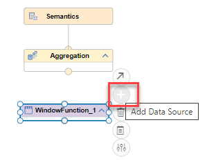
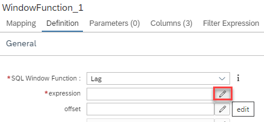

## Hands-on Allow Filter Push Down


### Used Objects
- table "enforcePushDownOfFilters::fPD"

### Steps

1. Create calculation view "filterPushDownExample"

    a) right-click on folder "allowFilterPushDown" and select "New File...":
    
     

    b) enter "filterPushDownExample.hdbcalculationview" as name of the file. The extension ".hdbcalculationview" determines that the calculation view editor will open the file

    c) Keep the default settings and press "Create":

    

    *The calculation view editor will open*

2. Add a Window Function node

    a) add a window node to the modeling area by clicking on the window node icon followed by a click on an empty area

    

    >you can expand the nodes section to display the descriptions

3. Add table "enforcePushDownOfFilters::fPD" to the window function node

    a) click on node "WindowFunction_1" so that the +-sign appears

    b) click on the +-sign to add a data source:

    
   
    c) search for table "filterPushDownExample::fPD" and select it:

    
    
    Click on "Finish":

    

   
4. Connect the Window Function node to the Aggregation node:

    a) click on node "WindowFunction_1" so that the arrow appears and drag and drop the arrow to the Aggregation node

    

    *The Window Function node is now connected to the Aggregation node. This means that the output of the Window Function node will feed into the Aggregation node*


5. Map columns to output

    a) double-click on node "WindowFunction_1" to open the details and choose tab "Mapping"

    b) click on the data source and choose option "Add to Output":

    

    d) select all output columns by right-clicking on one output column and choosing "Select All":

    

    c) propagate all columns up to node "Semantics" by right-clicking on the selection and choosing "Propagate to Semantics":

    


6. Define Window Function Properties

    a) select tab "Definition"

    b) from the drop-down choose SQL Window Function "Lag"

    c) as expression enter "amount" either by typing or using the edit option and choosing "amount":

    i) open the expression editor by using button "edit":

    

    ii) open the columns display (1.), select "amount" (2.) and close the expression editor with the "Back" button (3.):

    

    d) enter "amountLag1" for the Result Column

    e) add "product" as Partition Column by clicking at the + icon and selecting "product" from the drop-down menu:

    

    f) in section Order Column, click on the + icon and add column "date" from the drop-down menu:

    

7. Map the result column "amountLag1" to the output of the view

    a) double-click on node Aggregation to open the details

    b) select tab "Mapping"

    c) double-click on column "amountLag1" to add it to the output:

    


8. Deploy the model

    *The model is now consistently defined and the corresponding database objects can be generated*

    Deploying the model can be achieved in different ways:

    i) press the Deploy button of the calculation view:

    

    ii) use the default keyboard shortcut CTRL+d

    iii) use the deploy button under SAP HANA Projects:

    

    > under SAP HANA Projects you can also deploy at a higher level, e.g., a folder that contains the calculation view


9. Run a data preview with no filter push-down (default behavior)

    a) right-click on node "Aggregation" and choose "Data Preview":

    

    b) click on "Raw Data" and choose "Edit SQL Statement in SQL Console":

    

    c) add the following WHERE clause: "WHERE "date"!='2021/01/01'":

    ```SQL
    SELECT TOP 1000
        "date",
        "product",
        SUM("amount") AS "amount",
        SUM("amountLag1") AS "amountLag1"
    FROM "enforcePushDownOfFilters::filterPushDownExample"
    WHERE "date"!='2021/01/01'
    GROUP BY "date", "product"
    ```

    d) run the query by pressing the green arrow on the top left:

    

    *As you can see date "2021/01/01" is excluded from the result. However, "amountLag1" is filed for date "2021/01/02", even though it is based on the excluded date. This happens because the filter is per default only applied after the window function has been evaluated:*

    

10. Run data preview with filter push-down

    a) switch back to calculation view editor

    b) double-click on the window function node to open the details

    c) choose tab "Mapping"

    d) ensure that no data source is selected so that option "Allow Filter Push Down" appears under "Properties"

    e) tick "Allow Filter Push Down":

    

    f) deploy the view by pressing the rocket icon or using CTRL-d

    g) switch back to the results of the data preview

    h) re-run the query by pressing the green Run button on the top left

    *When the filter is evaluated prior to the window function, the data record of "2021/01/01" is removed before "amountLag1" is calculated for date "2021/01/02". Therefore, "amountLag1" is NULL:*

    

