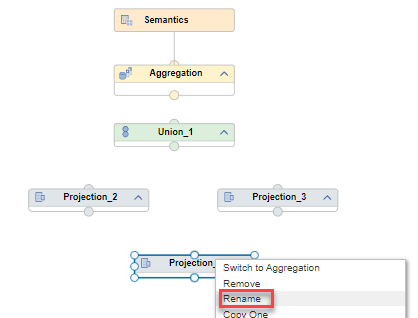
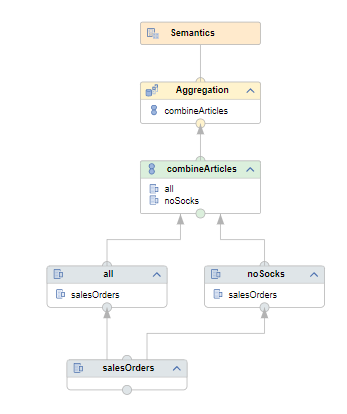
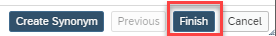
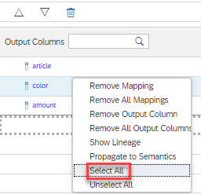
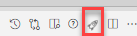
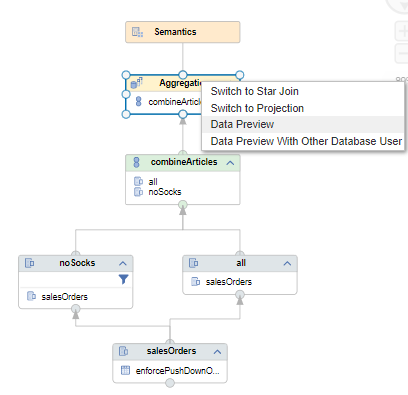
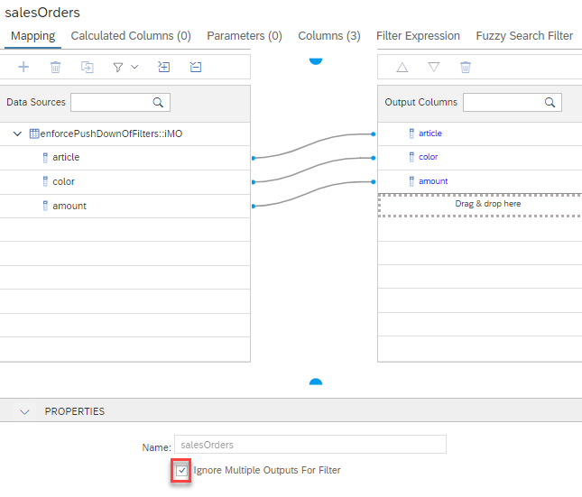

## Hands-on Ignore Multiple Outputs For Filter

A multiple consumer scenario exists if a node feeds into more than one node. If one of the consuming nodes contains a filter pushing down the filter would mean that also the other consuming node operates only on filtered values. Therefore, per default in multiple consumer scenarios filter pushdown does not happen per default. In the hands-on below a multiple consumer scenario will be created and the effect of an enforced filter pushdown illustrated.

### Used Objects
- table "enforcePushDownOfFilters::iMO"

### Steps

1. Create calculation view "multipleConsumerScenario"

    a) right-click on folder "ignoreMultipleOutputsForFilter" and select "New File...":
    
     

    b) enter "multipleConsumerScenario.hdbcalculationview" as name of the file. The extension ".hdbcalculationview" determines that the calculation view editor will open the file

    c) Keep the default settings and press "Create":

    

    *The calculation view editor will open*

2. Add three Projection nodes and one Union node to the modeling area

    a) add a projection node to the modeling area by clicking on the Projection node icon followed by a click on an empty area

    

    > You can expand the nodes section by clicking on the arrow to display the node descriptions

    b) repeat step a) twice so that 3 projection nodes are added in total

    c) add a Union node by selecting the Union node icon and clicking on an empty space. The modeling area should now look similar to below:

    

    If not re-arrange the nodes by dragging and dropping so it matches the screenshot above

3. Rename the nodes

    a) rename node Projection_1 to "salesOrders":
    
    a1) right-click on node Projection_1 and choose "Rename":

    

    a2) enter "salesOrders" and confirm with Enter

    b) follow analogous steps to rename node Projection_2 to "noSocks"

    c) rename node Projection_3 to "all"

    d) rename node Union_1 to "combineArticles"

    The modeling area should now look similar to below:

    

4. Connect the nodes

    a) click on node "salesOrders" so that the arrow appears and drag and drop the arrow to node "noSocks"

    

    *Node "salesOrders" is now connected to node "noSocks". This means that the output of "salesOrders" will feed into noSocks*

    b) similarly, connect node "salesOrders" to node "all"

    c) connect node "noSocks" to node "combineArticles"

    d) connect node "all" to node "combineArticles"

    e) connect node "combineArticles" to node "Aggregation"

    The model should now look similar to below:

    

5. Add a data source to node "salesOrders"

    a) click at node "salesOrders" so that the + icon appears

    b) click on the + icon to open the Add Data Source dialog

    

    c) search for table "enforcePushDownOfFilters::iMO" and select it:

    

    d) Given that the selected table is defined within the same HDI container no synonym is required: press "Finish":

    

6. Map columns to output

    a) double-click on node "salesOrders" to open the details and choose tab "Mapping"

    b) click on the data source and choose option Add to Output:

    

    d) select all output columns by right-clicking on one output column and choosing "Select All":

    

    c) propagate all columns up to the node Semantics by right-clicking on the selection and choosing "Propagate to Semantics":

    

7. Add calculated column "origin" to node "noSocks"

    a) double-click on node "noSocks" to open the Details

    b) click on tab "Calculated Columns"

    c) select the + icon to add a calculated column and click on the created calculated column:

    

    *By clicking on the calculated column the details view of the calculated column is opened*

    d) change the Name to "origin" and extend Length to 20

    e) open the Expression and enter 'I am from noSocks':

      

 8. Add calculated column "origin" to node "all"

    a) double-click on node "all" to open the Details

    b) click on tab "Calculated Columns"

    c) select the + icon to add a calculated column and click on the created calculated column:

    

    d) change the Name to "origin" and extend Length to 20

    e) open the Expression and enter 'I am from all':

       

9. Combine columns in union node based on their names

    a) double-click on node "combineArticles" and choose tab "Mapping"

    b) click on icon "Auto Map by Name"

    

    *columns with the same names from both sources are now mapped to the same output columns*

10. Map new column "origin" to the output

    a) double-click on node "Aggregation" and select tab "Mapping"

    b) double-click on column origin to map it to the output:

    

11. Add filter to node "noSocks"

    a) double click on node "noSocks" and choose tab "Filter Expression"

    b) open the Columns display under "Elements" and click on "article" to transfer the column name into the expression editor

    c) change the expression to "article"!='socks':

    

    d) press button "Apply Changes"

12. Deploy the model

    *The model is now consistently defined and the corresponding database objects can be generated*

    Deploying the model can be achieved in different ways:

    i) press the Deploy button of the calculation view:

    

    ii) use the default keyboard shortcut CTRL+d

    iii) use the deploy button under SAP HANA PROJECTS:

    

    > under SAP HANA Projects you can also deploy at a higher level, e.g., a folder that contains the calculation view

13. Run a data preview with no filter push-down (default behavior)

    a) right-click on node Aggregation and choose Data Preview:

    

    b) click on "Analysis"

    c) drag and drop all Attributes to the Label Axis

    d) drag and drop Measure "amount" to the Value Axis

    

    *as can be seen from column "origin" data for socks arrive via node "all"*

14. Change the default behavior and enforce filter pushdown

    a) in the modeling editor: double-click on node "salesOrders" and select tab "Mapping"

    b) make sure that no source is selected so that option "Ignore Multiple Outputs For Filter" becomes available under Properties

    c) check option "Ignore Multiple OUtputs For Filter":

    

15. Deploy the calculation view using the rocket icon (or pressing CTRL-d)

16. Switch back to your Data Preview window and refresh the data display

    - in your data preview window click on the Execute button to refresh the data display. If you have closed your previous data preview window, restart a data preview:

    

    *When the filter of Step 11 is pushed-down to node "salesOrders" socks are filtered out and are also not delivered via node "all"*

