# Filter Mapping

The main purpose of filter mapping is to improve performance by applying filters as early as possible to both partners of a join. In certain situations, it can also help to ensure data consistency. If filter mapping is used, filters that are applied to one join partner are also applied additionally to mapped columns of the other join partner. Filter mapping can be defined in each join or star join node of the calculation view. The way in which filter mapping can benefit performance is illustrated by the hands on below.

The hands on demonstrates how filter mapping can help to filter out records at an early stage of processing. In the join node of the example calculation view "filterMappingExample", filters for the column "product" of the left join partner are mapped to the column "product_name" of the right join partner.

Queries that filter on the column "product" therefore also automatically filter on the column "product_name". This reduces the number of records from the right join partner that are processed in the join node. The reduction in the size of the intermediate data set is shown using Explain Plans for a query with and without filter mapping.

## Hands on

### Used Objects
- table filterMapping::fML
- table filterMapping::fMR

### Steps

1. Create calculation view "filterMappingExample"

    a) right-click on folder "filterMapping" and select "New File...":
    
    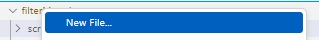 

    b) enter "filterMappingExample.hdbcalculationview" as name of the file. The extension ".hdbcalculationview" determines that the calculation view editor will open the file

    c) Keep the default settings and press "Create":

    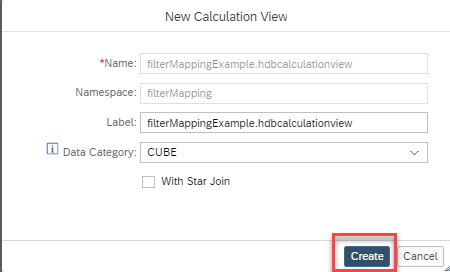

    *The calculation view editor will open*

2. Add two projection nodes and one join node

    a) add a projection node to the modeling area by clicking on the projection node icon followed by a click on an empty area
    
    b) repeat the last step to add a second projection node

    c) add a join node to the modeling area by clicking first on the join node icon and then on an empty area:

    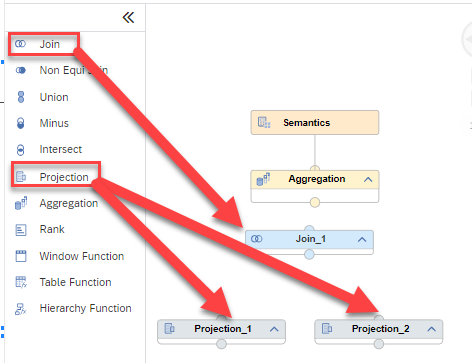

3. Add tables "filterMapping::fML" to node Projection_1 and "filterMapping::fMR" to node Projection_2:

    a) click on node "Projection_1" so that the +-sign appears

    b) click on the +-sign to add a Data Source:

    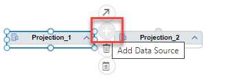
   
    c) search for table "filterMapping::fML" and select it:

    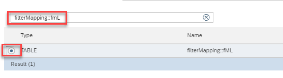
    
    d) click on "Finish":

    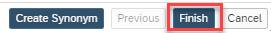

    e) click on node "Projection_2" so that the +-sign appears

    f) click on the +-sign to add a Data Source
   
    g) search for table "filterMapping::fMR" and select it:

    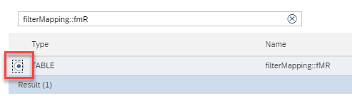

    h) click on "Finish"

4. connect the projection nodes to the join node:

    a) click on node "Projection_1" so that the arrow appears and drag and drop the arrow to the Join node

    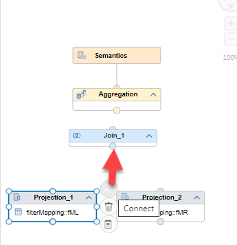

    *The projection node is now connected to the join node. This means that the output of Projection_1 will feed into Join_1*

    b) click on "Projection_2" so that the arrow appears and drag and drop the arrow to the Join node

    c) connect node "Join_1" to node "Aggregation":

    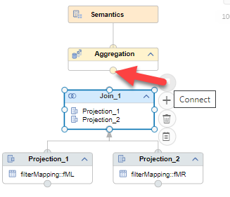


5. Map columns to output

    a) double-click on node "Projection_1" to open the details and choose tab "Mapping"

    b) click on the data source to select it and choose option "Add to Output":

    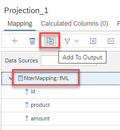

    c) select all output columns by right-clicking on one output column and choosing "Select All":

    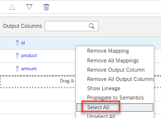

    d) propagate all columns up to the node Semantics by right-clicking on the selection and choosing "Propagate to Semantics":

    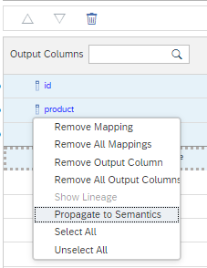

    e) repeat steps a)-d) for Projection_2 so that all columns are propagated to the Semantics


6. Define join properties

    a) double-click on node "Join_1" to open the details

    b) select tab "Join Definition"

    c) drag and drop a connection between the two "id" columns:

    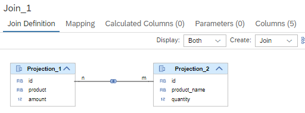

    d) click on the line connecting the two columns to display the join properties

    e) Set "1..1" as cardinality 
    >setting the join cardinality is not required for filter mapping to work but good practice

    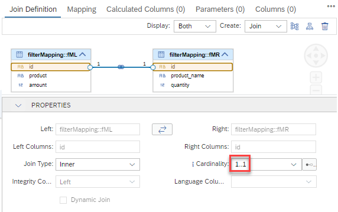


7. Define Filter mapping

    a) In the "Create" drop-down: change "Join" to "Filter"

    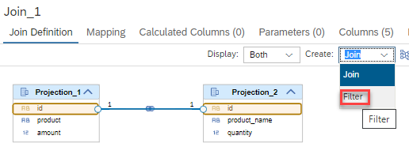

    b) drag and drop a connection between column "product" and column "product_name":

    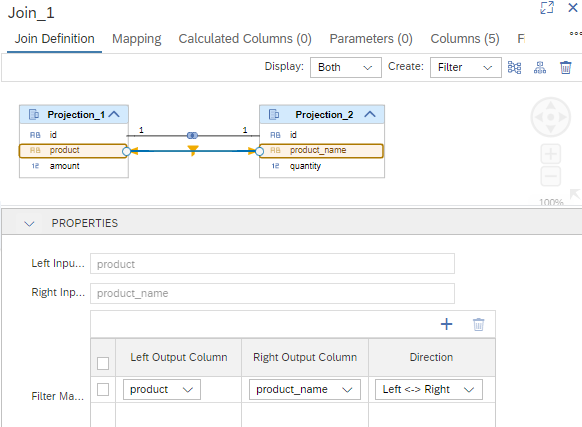

    *The model is now consistently defined and the corresponding database objects can be generated*

8. Deploy the model

    Deploying the model can be achieved in different ways:

    i) press the Deploy button of the calculation view:

    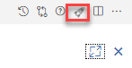

    ii) use the default keyboard shortcut CTRL+d

    iii) use the deploy button under SAP HANA PROJECTS:

    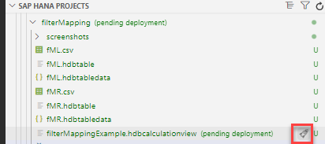

    > under SAP HANA PROJECTS you can also deploy at a higher level, e.g., a folder that contains the calculation view


### Check the effect of filter mapping

To demonstrate the effect of filter mapping a filter will be placed on either column "product" or "product_name". An Explain Plan will show that still the filter is applied to both columns due to the filter mapping.

1. Run Explain Plan for query with filter only on column "product"

    a) right-click on node "Aggregation" and choose "Data Preview"

    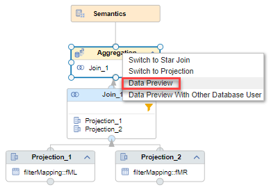

    b) click on "Raw Data" and choose "Edit SQL Statement in SQL Console":

    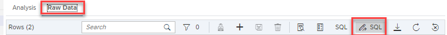

    c) add a filter on column "product" to the query:

    ```SQL
    SELECT TOP 1000
        "id",
        "product",
        "product_name",
        SUM("amount") AS "amount",
        SUM("quantity") AS "quantity"
    FROM "filterMapping::filterMappingExample"
    -- filter on "product":
    WHERE "product"='orange'
    GROUP BY "id", "product", "product_name"
    ```

    d) choose "Analyze" and "Explain Plan":

    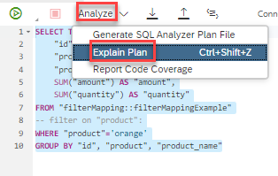

    *The Explain Plan shows that even though the filter for "orange" is only defined on "product" it is automatically applied to "product_name" as well:*

    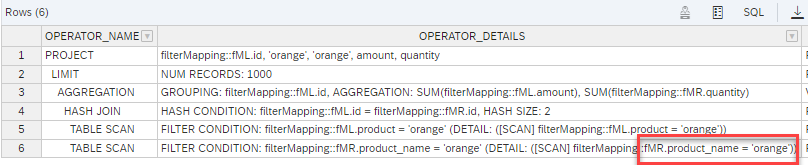

    e) change the WHERE clause to filter only on column "product_name":

    ```SQL
    SELECT TOP 1000
        "id",
        "product",
        "product_name",
        SUM("amount") AS "amount",
        SUM("quantity") AS "quantity"
    FROM "filterMapping::filterMappingExample"
    -- filter on "product_name":
    WHERE "product_name"='orange'
    GROUP BY "id", "product", "product_name"
    ```

    *The Explain Plan shows that even though the filter for "orange" is only defined on "product_name" it is automatically applied to "product" as well because the filter mapping is defined bi-directionally:*

    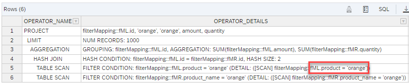

    f) turn-off filter mapping and re-run the Explain Plan:

    f1) double-click on the join node to open the details and choose tab "Join Details"

    f2) right-click on the filter mapping connection and choose "Remove":

    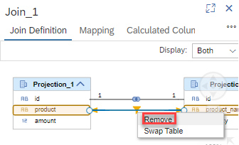

    g) deploy the model so that the changes become active by clicking on the respective rocket icon (or choose CTRL-d)

    h) go back to your SQL editor and re-run the explain plan (see step d) above)

    *When filter mapping is switched off no additional filter is applied:*

    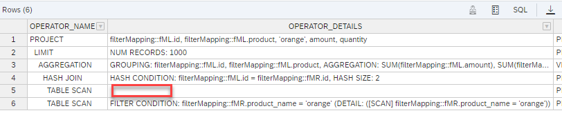