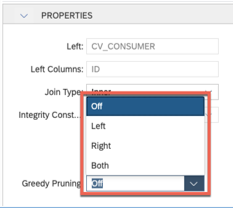
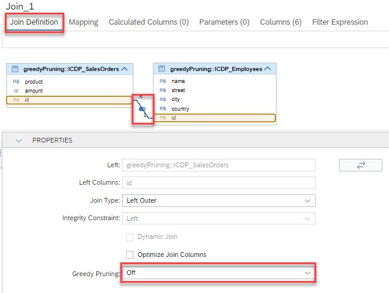

# Greedy Join Pruning

## Context
If large scenarios make use of multiple joins, performance improves if some of the joins can be pruned. Pruning in this context means that a join is not executed. Without the new option "Greedy Pruning", join pruning only occurs if pruning the join cannot have an influence on the results. This means that for pruning to occur, certain combinations of cardinality settings and join type have to be specified in the calculation view. For more details, see the respective sections in the  [developer performance guide](https://help.sap.com/docs/HANA_CLOUD_DATABASE/4466fb5b5e3f4388a00b44aad5a4bffa/ebb3cc9f142a4a8691718afa2f42af77.html). In contrast, Greedy Pruning triggers join pruning independent of the join type and cardinality setting. This can significantly speed up performance but also lead to unexpected results if the expected results depend on the execution of the join.


## Mechanism of Greedy Join Pruning
If "Greedy Pruning" is selected for an individual join, the cardinality information and join type is ignored when deciding whether a join should be pruned or not. In particular also inner joins are pruned if no columns are required from the to-be-pruned join partner. Irrespective of the Greedy Pruning setting, join pruning can only occur if no columns from the to-be-pruned join partner are required for processing the query. A column is required for processing, if for example, the column is directly requested in the user query, is used in a requested calculated column, or is used as a join column in a later join.

## Greedy Join Pruning Options
Greedy Pruning decisions can be requested for only one side of a join (Left/Right) or for both sides (Both). 



If "Both" is selected Greedy Join Pruning can happen for the right or left join partner depending on which columns are requested. 

The impact of Greedy Pruning on join pruning and on the results of the queries is illustrated in the examples below that will be used during the hands on. In the queries that are used throughout the examples, columns "product" and "amount" come from the left join partner while the other columns come from the right join partner. The requested columns in the queries determine which join partner is required for query processing.

Explain plans for the following queries are used throughout the examples to show the presence or absence of join pruning:

## Queries

### Query Left: only columns from left join partner

```SQL
SELECT 
	"product",
	SUM("amount") AS "amount"
FROM "greedyPruningExample"
GROUP BY 
    "product"
```

### Query Right: only columns from right join partner

```SQL
SELECT 
	"name",
	"street",
	"city",
	"country",
    sum(1) as "artificalMeasure"
FROM "greedyPruningExample"
GROUP BY 
    "name", 
    "street", 
    "city", 
    "country"
```

### Query Both: columns from both join partners

```SQL
SELECT 
	"product",
	"name",
	"street",
	"city",
	"country",
	SUM("amount") AS "amount"
FROM "greedyPruningExample"
GROUP BY 
    "product", 
    "name", 
    "street", 
    "city", 
    "country"
```


## Hands-on

### Used Objects
- table greedyPruning::ICDP_Employees 
- table greedyPruning::ICDP_SalesOrders

### Steps

1. Create calculation view "greedyPruningExample"

    a) right-click on folder "greedyPruning" and select "New File...":
    
     

    b) enter "greedyPruningExample.hdbcalculationview" as name of the file. The extension ".hdbcalculationview" determines that the calculation view editor will open the file

    c) Keep the default settings and press "Create":

    

    *The calculation view editor will open*

2. Add a Join node to the modeling area by clicking on the Join node icon followed by a click on an empty area:

    

3. Add tables "ICDP_SalesOrders" and "ICDP_Employees" to the Join Node:

    a) click on the Join node so that the +-sign appears

    b) click on the +-sign to add a Data Source:

    
   
    c) search for table "ICDP_SalesOrders" and select it:

    

    d) search for table "ICDP_Employees" and select it:

    

    e) Both tables are defined in the same HDI container. Therefore, no synonym is needed
    
    Click on "Finish":

    

4. connect the join node to the aggregation node:

    a) click on the Join Node so that the arrow appears and drag and drop the arrow to the Aggregation node:

    

    *The join node is now connected to the Aggregation node. This means that the output of the Join Node will feed into the aggregation node*


5. Define join properties

    a) double-click on the join node and select tab "Join Definition"

    b) drag and drop a connection between the two "id" columns:

    

    c) click on the line connecting the two columns to display the join properties

    d) choose "Left Outer" as Join Type and "n..1" as Cardinality:

    

6. Map columns to output

    a) choose tab "Mapping" and select all columns except for columns named "id" by clicking individually on the columns while holding key CTRL:

    

    b) choose icon "Add To Output" to map the selected columns to the output

    c) select all Output Columns by right-clicking on one Output Column and choosing "Select All":

    

    d) propagate all columns up to the node "Semantics" by right-clicking on the selection and choosing "Propagate to Semantics":

    

    *The model is now consistently defined and the corresponding database objects can be generated*

7. Deploy the model

    Deploying the model can be achieved in different ways:

    i) press the Deploy button of the calculation view:

    

    ii) use the default keyboard shortcut CTRL+d

    iii) use the deploy button under SAP HANA PROJECTS:

    

    > under SAP HANA PROJECTS you can also deploy at a higher level, e.g., a folder that contains the calculation view

The example calculation view has now been created. We will manipulate the Greedy Pruning setting next to illustrate its impact. The following iterative steps will be done:

1. change of Greedy Pruning setting in the Join Properties as specified in the title of the example below (e.g., set it to "off" for Example 1). You find the Greedy Pruning options in the Join properties (if you are unsure how to do so, check step 5 above):

    

2. deployment of the view (if you are unsure, check step 7 above)

3. opening of an SQL console by clicking at the icon "Open HDI Container" under SAP HANA PROJECTS (or switching to an already opened console):

    

4. copying & pasting the query from above that is named in the section of the example (e.g., Query "Left" for Examples 1-4)

5. executing an Explain Plan for the query by using the Explain Plan option of the drop-down menu "Analyze":

    

6. checking whether both tables appear in the Explain Plan or whether join pruning occurred. 

>Below you can find the screenshots of the expected results

Please follow the 6 steps for each example:

## Using Query **Left**

### Example 1: Set Greedy Pruning to **"Off"**


### Example 2: Set Greedy Pruning to **"Left"**


### Example 3: Set Greedy Pruning to **"Right"**


### Example 4: Set Greedy Pruning to **"Both"**


*The Explain Plans show that only one join partner is processed and thus join pruning occurred. In these examples join pruning occured based on join cardinality and join type. Therefore, join pruning is not influenced by the setting of Greedy Pruning.*

## Using Query **"Right"**

### Example 5: Greedy Pruning **"Off"**


*Based on the join type and cardinality no pruning should occur and the explain plan shows that indeed both join partners are processed.*
### Example 6: Greedy Pruning **"Left"**


*Based on join type and join cardinality no join pruning would occur. However, based on Greedy Pruning the left side is pruned.*

### Example 7: Greedy Pruning **"Right"**


*Greedy Pruning setting allows pruning of the right side only. However, columns from the right side are requested and therefore no join pruning occurs.*


### Example 8: Greedy Pruning **"Both"**


*Greedy Pruning option "Both" includes also Greedy Pruning "Left". Therefore, pruning occurs.*

## Using Query **"Both"**

### Example 9: Greedy Pruning **"Off"**


### Example 10: Greedy Pruning **"Left"**


### Example 11: Greedy Pruning **"Right"**


### Example 12: Greedy Pruning **"Both"**


*Given that columns are requested from both sides, no join pruning occurs*


## Comparing Results With and Without Greedy Pruning
Until now we have looked at Greedy Pruning from a performance perspective. However, Greedy Pruning can also affect the results of queries. To illustrate this

1. switch off Greedy Pruning
2. deploy the calculation view
3. run query "Right" by clicking on the green button on the top left (or using key F8):

    

You should see the following results:


The last row is returned because of the left-outer join which is executed.

When Greedy Pruning is switched on for the Left side the left-outer join is pruned and therefore the last record should not be returned. To verify this:

1. switch Greedy Pruning on for the left data source
2. deploy the calculation view
3. execute query "Right" again

You should see the following results:


*By switching on Greedy Pruning the results have changed.*

This illustrates that different results can occur whether or not Greedy Pruning is switched on. In the current example the results differ in that unmatched records from the left table are reported when Greedy Pruning is not used. The number of records in turn can influence the value of measures. In the current example the sum of "artificalMeasure" would be "3" versus "2". Whether this difference is acceptable depends on the exact use case. In the current example "2" might even be prefered. The creator of the calculation view needs to decide whether such kind of result changes are acceptable or not before choosing Greedy Pruning.

## Influence Greedy Pruning by Using Hints 
The join settings for Greedy Pruning in calculation views can be overruled by an execution hint. The execution hint influences Greedy Pruning for all calculation views that are processed in a given query. An execution hint for Greedy Pruning can be added to an SQL query like in the following example:

```SQL
SELECT <...> FROM <...> ('PLACEHOLDER' = ('ce_settings', '{"greedy_join_pruning": "<value>"}') GROUP BY <...>
```

e.g., 

```SQL
SELECT 
	"name",
	"street",
	"city",
	"country",
    sum(1) as "artificalMeasure"
FROM "greedyPruningExample" ('PLACEHOLDER'=('ce_settings', '{"greedy_join_pruning": "15"}'))
GROUP BY 
    "name", 
    "street", 
    "city", 
    "country" 
```

Alternatively, the hint can be added to the top-most calculation view of the query by using the execution hint dialog:

 


>The mapping of settings such as "Left", "Right", "Both", or "Off" to the individual numbers can be found in the execution hint dialog.

To test using the hints:

1. set the query to Greedy Pruning on both sides using the execution hint dialog

    a) click on node "Semantics"
    
    b) choose tab "View Properties"

    c) select "Advanced"
    
    d) open the execution hint dialog by using button "Add Execution Hints":

    

    e) choose option "Both sides" for Greedy Pruning and close the dialog. Remember the number "1" for turning off Greedy Pruning for later

    

2. deploy the calculation view

3. run query "Right"

    *You should see the results of the query above when Greedy Pruning was set to "Left" because option "Both" includes "Left" and "Right"*

4. Add ('PLACEHOLDER'=('ce_settings', '{"greedy_join_pruning": "1"}')) to your query after the view name to overrule the view setting and to turn off Greedy Pruning, i.e.


```SQL
SELECT 
	"name",
	"street",
	"city",
	"country",
    sum(1) as "artificalMeasure"
FROM "greedyPruningExample" ('PLACEHOLDER'=('ce_settings', '{"greedy_join_pruning": "1"}'))
GROUP BY 
    "name", 
    "street", 
    "city", 
    "country"
```

5. run the query and compare the results

*You should now see the results that were returned when running query "Right" with Greedy Pruning switched off above.*


