# Join Pruning

## Setting Join Cardinality
A specified join cardinality allows the optimizer to decide based on the columns requested in the query whether a join needs to be executed. In models in which many joins are defined, join pruning can lead to significant performance boosts and reductions in temporary memory consumption.

Imagine a defined star join involving 100 or more tables through further join chains. If no dimensional values are requested and the cardinality setting is n..1 or 1..1 with left-outer join, all joins can be omitted. As a result, the query can be reduced to one single table access to the central table, instead of involving all the potential join cascades.

However, while join pruning allows performance to be improved and resource consumption reduced, there is also a risk that it will return surprising results if the cardinality setting does not reflect the actual cardinality of the data. Also, should the data cardinality change at any stage, for example, due to data remodeling or data loading, the cardinality setting will need to be adjusted. Ideally, your data loading process should ensure that the specified cardinality is upheld.

## Join Cardinality
A cardinality setting can be applied to joins in calculation views. It specifies the maximum number of matching entries in the join partners.

Join cardinality is denoted using two numbers. The left number describes the number of matching entries for the entries in the right table, while the right number describes the number of matching entries for the entries in the left table. For example, a join cardinality of 1..n specifies that the right table has at most one matching entry in the left table. Conversely, each entry in the left table can have zero to n matching entries in the right table. The symbol "n" denotes an arbitrary positive number. For example, the entry "Alice" in the left table might have zero, one, or an arbitrary number of matches in the right table.

A join cardinality of 1..1 indicates that each entry the left table, for example, the entry "Alice", has zero or one matching entry in the right table. In the same way, the entry "Alice" in the right table also has at most one match in the left table.

## Join Pruning Prerequisites
The cardinality setting is used by the optimizer to decide, based on the columns requested in the query, whether a join needs to be executed or whether it can be omitted without violating the correctness of the data. A join can be omitted if executing the join does not add or remove any records, and provided that no fields are requested from the table that is to be omitted.

While inner joins can add records (multiple matching entries in the other table) and remove records (no matching entry, remember that ..1 includes zero), outer joins can only add records. Therefore, by using join cardinality to signal that the table to be pruned has at most one matching item, you allow join pruning to occur for outer joins. Text joins behave like left-outer joins in this respect. In the case of referential joins, pruning can only occur if the referential integrity is set for the table that is not to be pruned. Note that the referential integrity can be placed on the left table, the right table, or on both tables.

There is one exception to the rule that requires that the table to be pruned has a setting of ..1. This applies when the query only requests measures with the count distinct aggregation mode. In this case, any repeated values that could potentially exist in the tables to be pruned are made unique again by the count distinct calculation. Consequently, join execution does not change the results of the count distinct measure even if there is an n..m cardinality.

All the following prerequisites therefore need to be met for join pruning to occur:

- No fields are requested from the table to be pruned.

- The join type is either an outer join, a referential join with integrity on the table that is not to be pruned, or a text join where the table to be pruned contains the language column.

- The join cardinality is either ..1 for the table to be pruned, or the query only requests measures with count distinct aggregation or does not request any measures at all.

## Join Cardinality Proposals
If tables are directly involved in the join, cardinality proposals can be obtained from the modeling tool. These values are based on the data cardinality at the time of the proposal. These proposals are not available if the join includes further nodes (for example, the table is added through a projection node).

Irrespective of whether the cardinality setting is achieved through a proposal or manual setting, the optimizer relies on these values when making decisions about join pruning. There are no runtime checks. If the setting gives a lower cardinality than the actual cardinality of the data (for example, it is set to n..1, but in the data it is n..m), omitting the join might lead to changes in the measure values, compared to when the join is executed.


## Hands-On
In this hands-on you will create a calculation view with a join, change the cardinality information and check its impact on join pruning.

### Used Objects
- table joinPruning::employees 
- table joinPruning::salesOrder

### Steps
1. Create calculation view "joinPruningExample"

    a) right-click on folder "joinPruning" and select "New File...":
    
    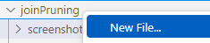 

    b) enter "joinPruningExample.hdbcalculationview" as name of the file. The extension ".hdbcalculationview" determines that the calculation view editor will open the file

    c) Keep the default settings and press "Create":

    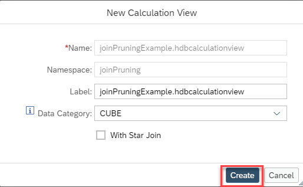

    *The calculation view editor will open*

2. Add a Join Node

    a) click on the Join Node icon followed by a click to an empty modeling area:

    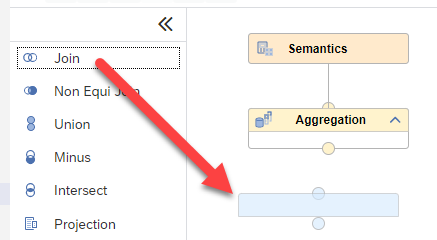

    b) right-click on the name "Join_1" of the Join Node and choose "Rename":

    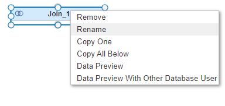

    c) name the node "JoinWithCardinalitySetting" and click outside of the name field to accept the new name

3. Add Data Sources to your Join Node

    a) click on the Join Node so that the +-sign appears

    b) select the +-sign to add a data source:

    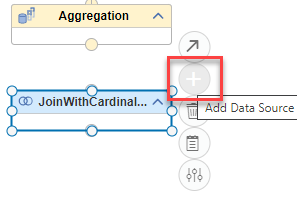

    c) search for table "salesOrder" and select it:

    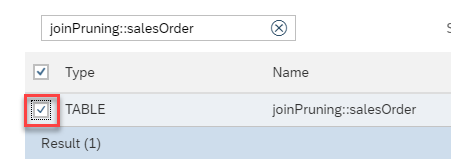

    d) search for table "employees" and select it:

    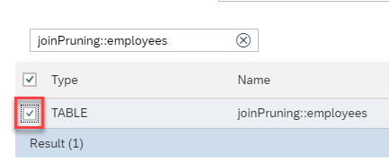

    e) The tables are both defined in the same HDI container. Therefore, no synonyms need to be created 
    
    Click on "Finish":

    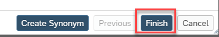

    *both tables are now added as data sources to the Join Node*

4. Connect nodes

    a) click on the Join node so that the arrow appears and drag and drop the arrow to the Aggregation node:

    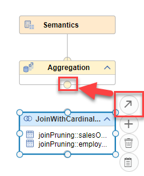

    *The join node is now connected to the node "Aggregation". This means that the output of the Join node will feed into the aggregation node*


5. Define Join Properties

    a) double click on the Join Node to open the details view

    b) select tab "Join Definition":

    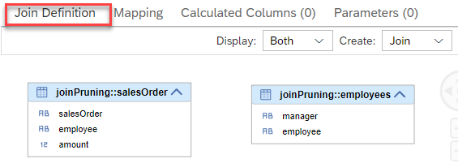

    c) define the join columns:
      - click on column "employee" of data source "salesOrder" and drag and drop the line to column "manager" of data source "employees"
      
    d) define join properties:
    - select the join line so that the properties appear
    - select "Join Type" "Referential"
    - Choose "Integrity Constraint" "Left"
    - Choose "Cardinality" 1:1

    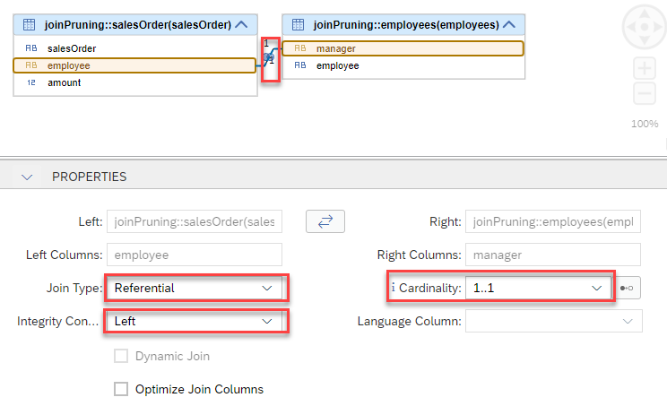
    
    > Referential Joins behave like inner joins but assume in addition that every entity for which the integrity constraint is set has a matching entity in the join partner. The cardinality 1:1 specifies that at most one matching entity is found in both directions.

6. Map all columns to output

    a) switch to tab "Mapping"

    b) double-click on the two data sources to map all columns to the output:

    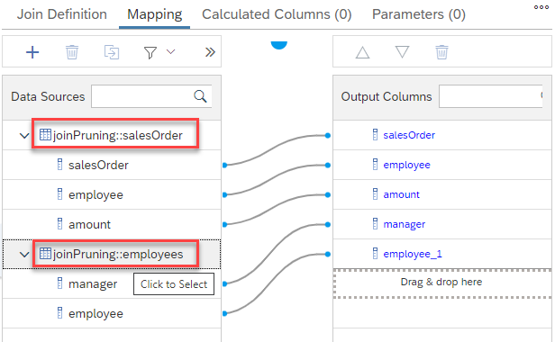

    *all columns have been mapped to the output of the join node. You could now do the same for node "Aggregation". We will take a shortcut here and propagate the columns automatically.*

    c) select all output columns

    Selecting all output columns can be done in different ways:
        
        i) click on each column individually while holding key CTRL
        ii) click on the first and last column while holding key SHIFT
        iii) use the context-menu on a column and choose option "Select All"
    
    d) when all output columns are selected, right-click on them to open the context-menu and choose "Propagate to Semantics":

    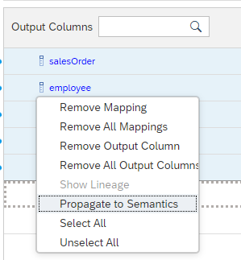

    *All selected columns are now mapped up to the "Semantics" node. You can check this by double-clicking on node "Semantics" and looking at tab "Columns".*

*The model is now consistently defined and the corresponding database objects can be generated*


7. Deploy the model

    Deploying the model can be achieved in different ways:

    i) press the Deploy button of the calculation view:

    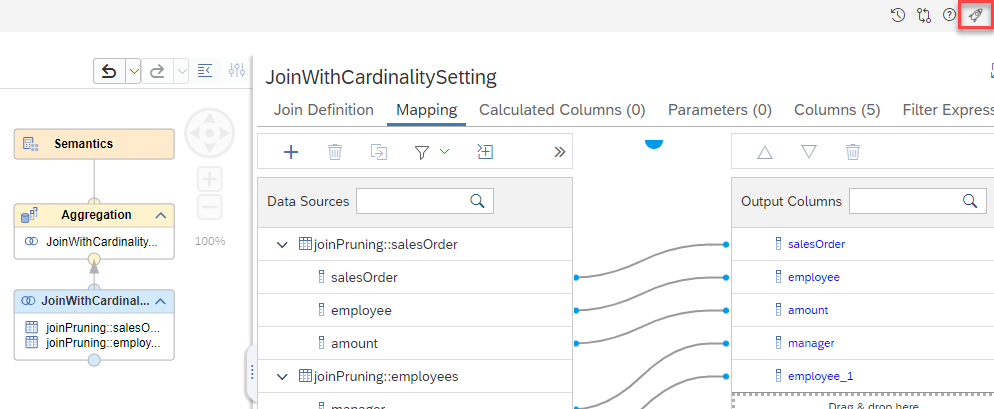

    ii) use the default keyboard shortcut CTRL+d

    iii) use the deploy button under SAP HANA Projects:

    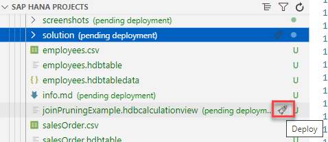

    > under SAP HANA Projects you can also deploy at a higher level, e.g., a folder that contains the calculation view


### Check impact of cardinality setting

1. Start a data preview of the calculation view

    a) right-click on the last node below node "Semantics" which is node "Aggregation"

    b) choose "Data Preview"

    c) open the statement in the SQL editor by selecting "Raw Data" and the respective button:

    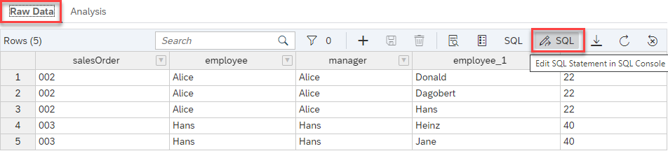


2. Check that join pruning happens if columns are only selected from table "salesOrder"

    a) change the default data preview statement so that only columns from "salesOrder" are requested

    1. comment columns "manager" and "employee_1" which come from table "employee" 
    
        >you can copy and paste the statement from below

        ```SQL
            SELECT TOP 1000
            "salesOrder",
            "employee",
            --	"manager",
            --	"employee_1",
            SUM("amount") AS "amount"
            FROM "joinPruning::joinPruningExample"
            GROUP BY "salesOrder", "employee"--, "manager", "employee_1"
        ```

    2. Execute an Explain Plan for the statement by selecting "Explain Plan" from the drop-down menu:

        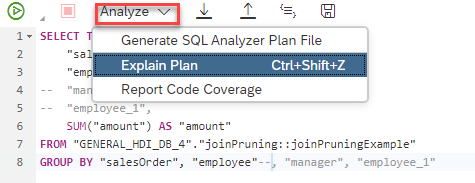

    3. check that in the Explain Plan only table "salesOrder" appears:

        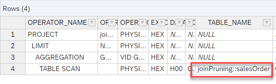

        *given that only columns from table "salesOrder" are requested and the integrity is set for the left data source (table "salesOrder") and the cardinality is set to :1 for the to be pruned table "employee" the table is not considered in the plan which can lead to large memory and performance benefits if the pruned data source is complex/large. We will check the relevance of the pre-requisits next*

3. Check that integrity constraint is relevant

    a) in the join definition, switch the integrity constraint to "Right":

    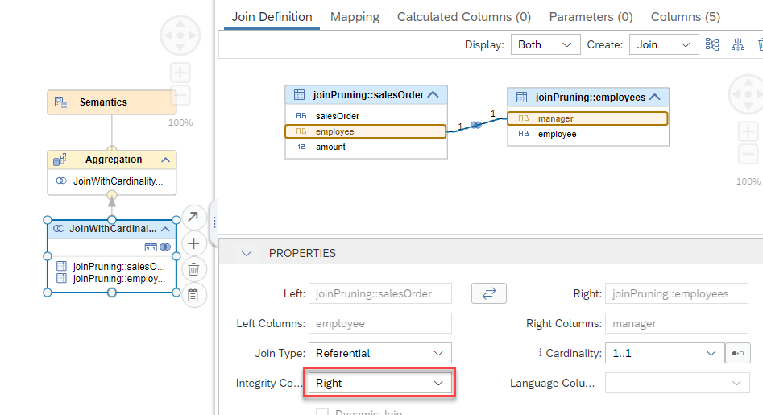

    b) deploy the model

    c) run the Explain Plan again:

    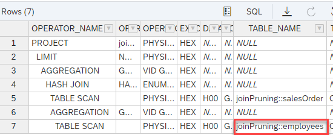

    *without the referential integrity on the left the right-side cannot be pruned and table "employee" is processed*

4. Check that cardinality is relevant

    a) in the join definition, switch the integrity constraint back to "Left" and select cardinality "1..n":

    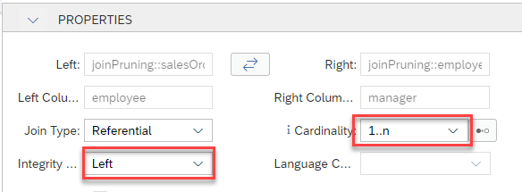

    b) deploy the model

    c) run the Explain Plan again:

     

     *again no join pruning happens because the cardinality information prevents pruning*


### Check impact of wrong cardinality setting on results

Until now we have freely changed the cardinality and integrity constraint. However, in reality these setting should reflect the true relationship in the data. In the following we will see how a wrong setting can lead to unexpected data

1. define the join as a referential join with integrity constraint on the left and join cardinality set to 1:1:

    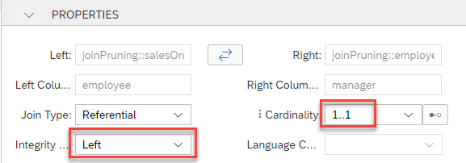

2. Check that the cardinality of 1:1 is not backed-up by the data:

    a) run a data preview on table "employees" by right-clicking on the table and choosing "Data Preview":

    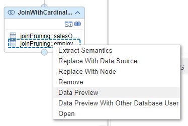


    **manager**|**employee**
    :-----:|:-----:
    NULL|Alice
    Alice|Donald
    Alice|Dagobert
    Alice|Hans
    Hans|Heinz
    Hans|Jane
    NULL|Horst

    *As can be seen from the results*

    *- "Alice" appears multiple times as manager, violating the cardinality setting 1:**1***

    *- "Donald" appears not as a manager, violating the integrety constraint on the left data source*


3. compare the results when requesting columns also from table "employees" (thus forcing the join) to when only columns from table "salesOrder" are requested (and based on the wrong join settings join pruning occurs)

    a) Run a data preview with the default query (requesting all columns) 

    1. right-click on node "Aggregation" and choose "Data Preview"

    2. choose "Raw Data" and "Edit SQL Statement in SQL console"

    3. execute the default query by pressing "Run":

        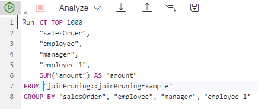

        **salesOrder**|**employee**|**manager**|**employee\_1**|**amount**
        :-----:|:-----:|:-----:|:-----:|:-----:
        002|**Alice**|Alice|Hans|**22**
        002|**Alice**|Alice|Dagobert|**22**
        003|Hans|Hans|Jane|40
        002|**Alice**|Alice|Donald|**22**
        003|Hans|Hans|Heinz|40

    b) Run a data preview with a query that only requests columns from "salesOrder"

    1. replace the default query with a query that does not request columns from "employees":

        ```SQL
            SELECT TOP 1000
            "salesOrder",
            "employee",
            --	"manager",
            --	"employee_1",
            SUM("amount") AS "amount"
            FROM "joinPruning::joinPruningExample"
            GROUP BY "salesOrder", "employee"--, "manager", "employee_1"
        ```
    2. execute the default query by pressing "Run"

        **salesOrder**|**employee**|**amount**
        :-----:|:-----:|:-----:
        001|**Donald**|20
        002|**Alice**|**22**
        003|Hans|40
        004|Horst|33

        *"Alice" appears three times in the result when the join is executed. This reflects the true data relationship. If join pruning happens based on the wrong join definition of the cardinality only information from "salesOrder" is considered and "Alice" appears only once. If you summed up "amount" for the employees the value would differ.*

        *In addition "Donald" does not appear as an employee when the join is executed. Based on the wrong information about the referential integrity join pruning occurs with the second query and "Donald" is not removed from the result set.*
