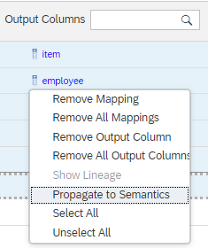
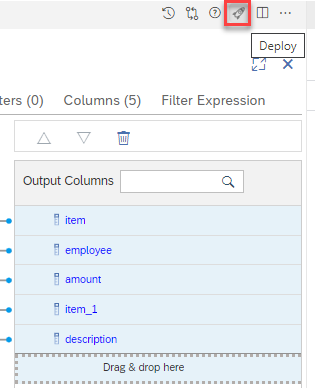

# Optimize Join Columns

In some scenarios join columns can be omitted. Consider a scenario in which a query requests columns from only one join partner, the cardinality to the other join partner (from which none of the columns are requested) is set to 1, and the join is not an inner join.
In this case, executing the join does not affect the result. Since the join does not have to be executed and the join column has not been requested by the query, it is a candidate for pruning. By default, it will not be pruned, but if the Optimize Join Columns option is set, it can be removed.

In cases where there are multiple join partners on different join columns and where queries typically only select columns from a small subset of join partners, the Optimize Join Columns option can be used to allow various join columns to be excluded early in the processing. By omitting the join column and thus omitting a column that might otherwise increase the granularity of the intermediate processing, the number of records that need to be further processed can be significantly reduced. As a result, better performance and lower memory consumption can be achieved. The extent of improvement depends on which columns the queries request and on which columns the joins are defined.

However, when using the Optimize Join Columns option, you should be aware that an incorrect cardinality setting might lead to unexpected results. When the Optimize Join Columns option is set, the optimizer excludes the join column from from early processing, if possible. If you use aggregation functions for which the aggregation granularity matters (such as finding the maximum), the results can change depending on the inclusion of the join column. This is demonstrated by the hands-on example.

## Prerequisites for Pruning Join Columns
Join column pruning can only occur if all the following conditions are met:

a) The join column is not requested by the query.

b) Only columns from one of the join partners are requested by the query.

c) The join is either an outer join, referential join, or text join.

d) The cardinality to the join partner from which none of the columns are requested is set to 1.

The reasons for these prerequisites are as follows:

a) If a join column is requested by the query, it cannot be excluded.

b) If columns are requested from both join partners, the join must be executed and therefore the join column must be requested.

c) If the join is not an outer, referential, or text join, the join might add or delete records. 

d) If the table to be pruned might deliver more than one matching partner, join pruning should not occur. Therefore, the cardinality of the table that does not deliver any columns needs to be set to 1. 

>The optimizer does not check at runtime whether more than one matching partner could occur. It is the responsibility of the modeler to ensure that a cardinality setting of 1 reflects the actual data cardinality.

## Hands-On
In this hands-on you will create a calculation view with a join and check the impact of the Optimize Join Columns option.

### Used Objects
- table optimizeJoinColumns::itemsMD 
- table optimizeJoinColumns::salesItems

### Steps

1. Create calculation view "optimizeJoinColumnExample"

    a) right-click on folder "optimizeJoinColumns" and select "New File...":
    
     

    b) enter "optimizeJoinColumnExample.hdbcalculationview" as name of the file. The extension ".hdbcalculationview" determines that the calculation view editor will open the file

    c) Keep the default settings and press "Create":

    

    *The calculation view editor will open*

2. Add an Aggregation Node to the modeling area by clicking on the Aggregation node icon followed by a click on an empty area:

    

3. Add table "salesItem" to the Aggregation Node:

    a) click on the Aggregation node "Aggregation_1" so that the +-sign appears

    b) click on the +-sign to add a Data Source:

    
   
    c) search for table "salesItems" and select it:

    

    d) The table is defined in the same HDI container. Therefore, no synonym is needed
    
    Click on "Finish":

    


4. Add a Join Node and rename it to "optimizeJoinColumns"

    a) click on the Join Node icon followed by a click to an empty modeling area:

    

    b) right-click on the name "Join_1" of the Join Node and choose "Rename":

    

    c) name the node "optimizeJoinColumns" and click outside of the name field to accept the new name

5. Connect node "Aggregation_1" to the join node
    
    a) click at node "Aggregation_1" so that the arrow appears and drag and drop the arrow to the join node:

    

    *The aggregation node is now connected to the join node. This means that the output of the aggregation node will feed into the join node*


6. Add a second Data Source to your Join Node

    a) click on the Join Node so that the +-sign appears

    b) select the +-sign to add a data source

    c) search for table "itemsMD" and select it:

    

    d) The table is defined in the same HDI container. Therefore, no synonyms need to be created 
    
    Click on "Finish":

    

    *table "itemsMD" is now added as data source to the Join Node*

7. Connect the join node to node "Aggregation"

    a) click on the Join Node so that the arrow appears and drag and drop the arrow to the Aggregation node:

    

    *The join node is now connected to the Aggregation node. This means that the output of the Join Node will feed into the aggregation node*

8. Map all columns of node "Aggregation_1" to the output

    a) double-click on node "Aggregation_1"

    b) in tab "Mapping" double-click on the data source to add all columns to the output:

    

9. Change the aggregation type of column "amount" to "MAX":

    a) select tab "Columns"

    b) use the Aggregation drop-down menu of column "amount" to select "MAX":

    


10. Define Join Properties

    a) double click on the Join Node to open the details view

    b) select tab "Join Definition":

    

    c) define the join columns:

      - drag&drop a connection between the columns "item" of both data sources
      
    d) define join properties:
        
    - select the join line so that the properties appear
    - select "Join Type" "Left Outer"
    - for "Cardinality" choose "n..1"
    - select "Optimize Join Columns"

        
    
    > Based on Join Type "Left Outer" and cardinality n:1, join pruning can occur if no columns are selected from the right data source "itemsMD". With setting "Optimize Join Columns" the join column "item" can be removed if the join is pruned and "item" is not required for query processing.

11. Map all columns to output

    a) switch to tab "Mapping"

    b) double-click on the two data sources to mapp all columns to the output:

    

    *all columns have been mapped to the output of the join node. You could now do the same for node Aggregation. We will take a shortcut here and propagate the columns automatically*

    c) select all output columns
    
    Selecting all output columns can be done in different ways:
    
    1. click on each column individually while holding key CTRL
    
    2. click on the first and last column while holding key SHIFT
    
    3. use the context-menu on a column and choose option "Select All"
    
    d) when all output columns are selected, right-click on them to open the context-menu and choose "Propagate to Semantics":

    

    *All selected columns are now mapped up to the Semantics node. You can check this by double-clicking on node Semantics and looking at the Columns tab there*


*The model is now consistently defined and the corresponding database objects can be generated*

12. Deploy the model

    Deploying the model can be achieved in different ways:

    1. press the Deploy button of the calculation view:

         

    2. use the default keyboard shortcut CTRL+d

    3. use the deploy button under SAP HANA Projects:

        

        > under SAP HANA Projects you can also deploy at a higher level, e.g., a folder that contains the calculation view


### Check influence of Optimize Join Columns

We can check in the Explain Plan of a query the effect of the Optimize Join Columns setting:

The following query only retrieves columns from the left side. 

```SQL
SELECT
	"employee",
	SUM("amount") AS "amount"
FROM "optimizeJoinColumns::optimizeJoinColumnExample"
GROUP BY 
	"employee"
```

Due to the cardinality and join type settings this means that join pruning can occur. If join pruning occurs and the join column is not requested then with the Optimize Join Columns flag the join column is excluded from early processing which can be seen in the Explain Plan of the query. To execute the Explain Plan:

1. Under SAP HANA PROJECTS, click on the icon right to your project that opens the HDI container of the respective project:


2. In Database Explorer, right-click on your project and select "Open SQL Console":


*A SQL console opens. Because you've opened the SQL console in the context of your HDI container connection the so-called runtime user will execute the statements. The runtime user has per default access to all objects in your HDI container*

Paste the query from above into the console and select the Explain Plan option:


The result will look similar to:


*The join column "item" is not included in the grouping*


Now we will remove the Optimize Join Column flag and run the Explain Plan again:

1. Switch back to the SAP Business Application Studio

2. Double-click on the Join Node of the model

3. Select tab "Join Definition"

4. Click on the join line so that the properties of the join become visible

5. Unselect "Optimize Join Columns":


6. Deploy the view (e.g., using the rocket-icon)

7. Switch back to Database Explorer

8. Run the Explain Plan again

    The result will look similar to:

    

*Because "Optimize Join Columns" is not selected the join column "item" is used in the first aggregation, even though the join is pruned.*

## Influence of Optimize Join Columns setting on Results

Up to now Optimize Join Columns was discussed as an option to improve performance and reduce resource consumption. However, the setting can also have an influence on the results if calculations such as "MAX" are used that depend on the aggregation granularity. "MAX" was used as the aggregation for measure "amount" in node "Aggregation_1".

We will now run the query once with "Optimize Join Columns" unselected and once when it is selected.

### Optimize Join Columns switched off

1. In Database Explorer Run the query by pressing the green button on the top left, or using key F8:

    

2. The results should look like:

    


## Optimize Join Columns switched on

1. switch back to SAP Business Application Studio

2. in the properties of the join, select "Optimize Join Columns":


3. deploy the view, e.g., by using the rocket icon

4. switch back to SAP Database Explorer

5. run the query again

6. notice the difference in the amount for "Donald":


## Reason for the difference in results

The difference in results is caused by the aggregation MAX that leads for Donald to different results depending on whether column "item" is included in the grouping or not. Let's have a look at the data:

1. in Database Explorer, select the category "Tables" and search for "salesItems"

2. right-click on "salesItems" to "Open Data":


3. The data will look like:

    **item**|**"employee"**|**"amount"**
    :-----:|:-----:|:-----:
    001|"Donald"|"10.00"
    002|"Donald"|"50.00"
    003|"Alice"|"40.00"
    004|"Dagobert"|"21.00"

If Optimize Join Column is selected, the join column "item" can be removed if join pruning occurs and "item" is not required by the query. In this case for items "001" and "002" the aggregation function MAX is applied to both items resulting in one single record:

**"employee"**|**"amount"**
:-----:|:-----:
Donald  | 50.00

If Optimize Join Column is not selected, then join column "item" is kept and MAX is applied on individual item level. The result of node "Aggregation_1" for the records with employee "Donald" will therefore look like:

**item**|**"employee"**|**"amount"**
:-----:|:-----:|:-----:
001| Donald| 10.00
002| Donald| 50.00

After the join, join column "item" is not required anymore and the aggregation node uses the defined aggregation function "Sum" to reduce the output to:

**"employee"**|**"amount"**
:-----:|:-----:
Donald| 60.00

This example hopefully illustrated that in certain situations using Optimize Join Columns can also have an impact on the results. It depends on the use case which results are intended. In this simple example you could have changed the aggregation function of node "Aggregation_1" to "SUM" and use "MAX" only in the final aggregation if this was the intended behavior. Therefore, it is important to understand and to work with the potential impact of the Optimize Join Columns settings.


