# Calculation View Snapshots

## Purpose
Snapshots can be used to speed up queries if queries do not need to be based on the most current data. 

## Lifecycle
During deployment of the calculation views for which snapshot queries are defined, procedures are generated that create, insert, and drop a *snapshot-table* based on the *snapshot-query*. The naming of these procedures follow the naming convention 

`<calculation view name>/<queryname>/SNAP/SNAPSHOT/CREATE|DROP|INSERT`

e.g.

`cvSnap/keyFigureGermany/SNAP/SNAPSHOT/INSERT`

The lifecycle of the procedures and tables is coupled to the respective calculation view in which the snapshot query is defined. Thus undeploying the calculation view will also delete the corresponding tables and procedures. 

## Authorizations
The invoker mode is used for the generated procedures per default. Invoker mode means that the authorizations of the caller are applied. Thus, snapshots will contain the data that are visible to the caller of the insert procedure. If the snapshot is generated during deployment of the calculation view, the object owner of the corresponding HDI container will be used for inserting. With definer mode the privileges of the object owner of the calculation view (HDI container) are applied.

Several different snapshots can be generated based on an individual calculation view using the INSERT procedure. These snapshots can be generated by different database users. In this way data reflecting different privileges can be exposed.

Users who want to run SELECT statements directly on the snapshot tables need SELECT privileges for the respective snapshot tables.


## Hands-on 

### Used Objects
- table "snapshots::snap"

### Steps

1. Create calculation view "snapshotExample"

    a) right-click on folder "snapshots" and select "New File...":
    
    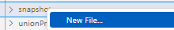 

    b) enter "snapshotExample.hdbcalculationview" as name of the file. The extension ".hdbcalculationview" determines that the calculation view editor will open the file

    c) Keep the default settings and press "Create":

    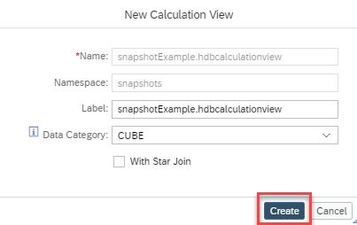

    *The calculation view editor will open*


2. Add a data source to node "Aggregation"

    a) click at node "Aggrgation" so that the + icon appears

    b) click on the + icon to open the Add Data Source dialog

    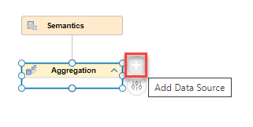

    c) search for table "snapshots::snap" and select it:

    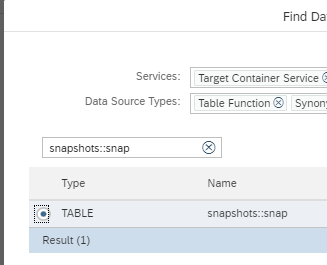

    d) Given that the selected table is defined within the same HDI container no synonym is required: press "Finish":

    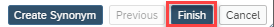


3. Map columns to output

    a) double-click on node "Aggregation" to open the details and choose tab "Mapping"

    b) double-click on the data source to add all columns to the output:

    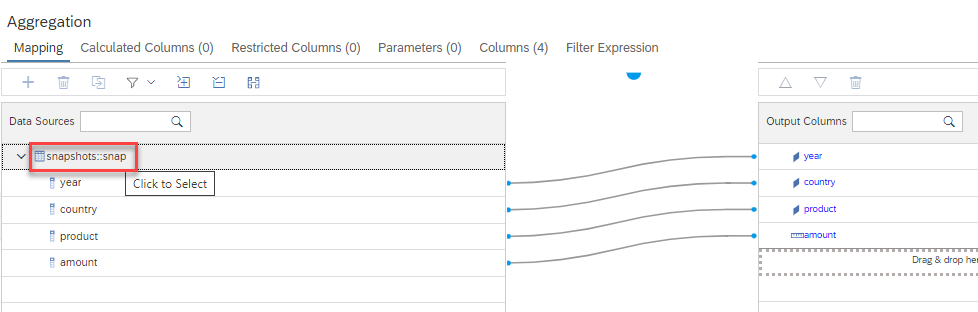

4. Create an input parameter

    a) choose tab "Parameters"

    b) use the + icon and select "Input Parameter" from the drop-down

    c) click on the newly created input parameter to open the Details view:

    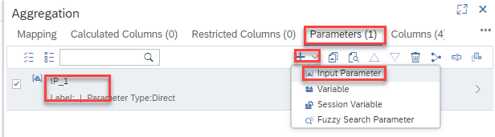

    d) enter "IP_Country" as Name

    e) expand the Default Values section

    f) use the + icon to create a new default value entry

    g) enter "Germany" as Value of the default parameter:

    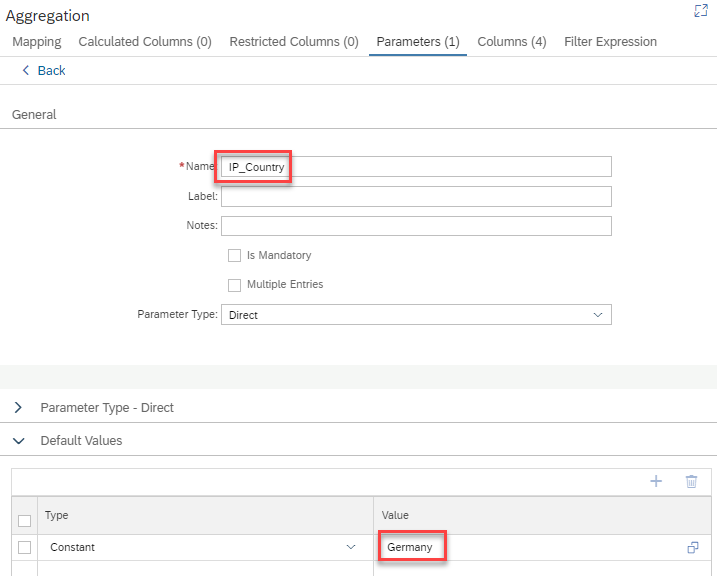


5. Create a snapshot query

    a) double-click on node "Semantics", choose "View Properties", "Snapshots", use the + icon to create a new snapshot query and click on the newly created snapshot query:

    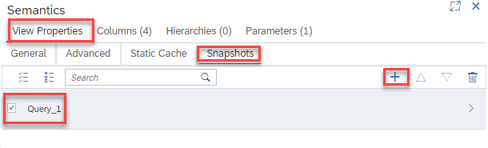

    *by clicking on the newly created snapshot query the details of the snapshot query are displayed*

    b) enter "timestampQuery" as Query Name

    c) in the proposed query, remove the schema in front of the view name so that later inserts use the schema of the deployed HDI container

    d) add a timestamp to the query by adding "now() as TIMESTAMP," at the beginning of the query. 
    
    The query should now correspond to:

    ```SQL

    SELECT now() as TIMESTAMP, "year" , "country" , "product" , SUM("amount") AS "amount"  
    FROM "snapshots::snapshotExample"
    (placeholder."$$IP_Country$$"=>'Germany') 
    GROUP BY "year" , "country" , "product" 

    ```

    Use button "Back" to close the snapshot query details:

    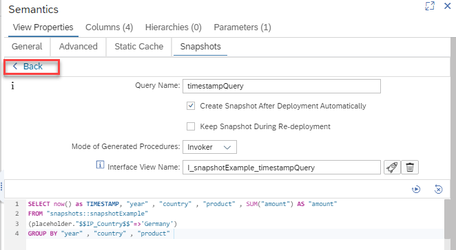

6. On the Aggregation node define a filter based on input parameter "IP_Country"

    a) Double-click the Aggregation node
    
    b) click on tab "Filter Expression"

    c) Expand section "Input Parameters" and click on input parameter "IP_Country" to add its name to the expression editor

    d) enhance the expression with an equal sign and add column "country" from the Columns section by clicking on the column

    The expression should now look like

    ```SQL
    '$$IP_Country$$'="country"
    ```

    e) click on button "Apply Changes:

    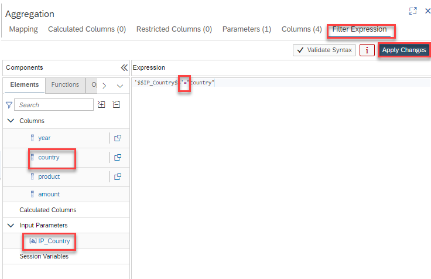


*The model is consistently defined and the corresponding database objects can be generated*

7. Deploy the model

    Deploying the model can be achieved in different ways:

    1. press the Deploy button of the calculation view:

        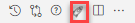

    2. use the default keyboard shortcut CTRL+d

    3. use the deploy button under SAP HANA PROJECTS:

    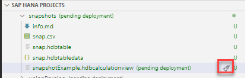

    > under SAP HANA PROJECTS you can also deploy at a higher level, e.g., a folder that contains the calculation view


8. Check the created snapshot table and procedures

    a) open the HDI container connection in Database Explorer by clicking on icon "Open HDI container" that can be found next to the Database Connections under SAP HANA PROJECTS:

    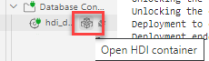

    *Database Explorer opens with the HDI container connection expanded*

    b) choose category "Tables", search for "snapshots::snapshotExample", right-click on table "snapshots::snapshotExample/timestampQuery/SNAP/SNAPSHOT" and choose "Open Data":

    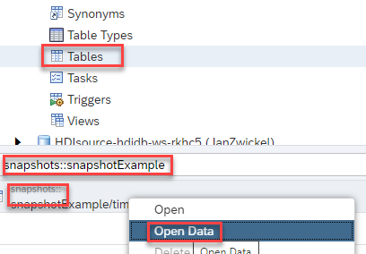

    *option "Create Snapshot After Deployment Automatically" was selected in the query snapshot definition. Therefore, the first snapshot was already inserted during model deployment*

    c) choose category "Procedures" and search for snapshotExample:

    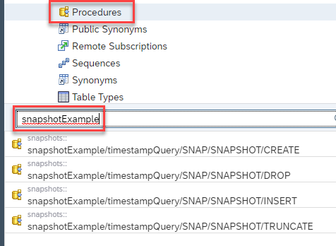

    *several procedures are displayed that help you manage your snapshot. We will use the INSERT procedure next*


9. Schedule regular updates

    a) Switch back to SAP Business Application Studio

    b) right-click on folder "snapshots" and select "New File"

    c) name the new File "scheduleUpdatesGermany.hdbschedulerjob" and press Return

    d) enter into the editor:

    ```SQL
    SCHEDULER JOB "snapshots::scheduleUpdatesGermany" CRON '* * * * * * 45' 
        ENABLE PROCEDURE "snapshots::snapshotExample/timestampQuery/SNAP/SNAPSHOT/INSERT" PARAMETERS IP_Country='Germany'
    ```
    *Based on this definition, every minute a new snapshot of the query will be inserted. The data is filtered for country "Germany" using the input parameter "IP_Country".*

    e) use the rocket icon to deploy the scheduler job

10. check the snapshot table data

    a) switch back to the Database Explorer 

    b) refresh the data by pressing the Refresh icon on the top right:

    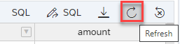

    *Periodic data inserts have happened based on the scheduled job. You might have to wait for a minute and refresh to see new data*

11. turn off the scheduler job

    To turn off the scheduler job rename the hdbschedulerjob file by adding the extension ".txt" and deploy the folder which contains the scheduler job:

    *Adding extension ".txt" to the file removes the design time artifact for a scheduler job. The next deployment will remove the catalog object that corresponds to the previous design time file. Simply deploying the .txt file will not remove the deployed catalog object. Deploying the containing folder will recognize that the design time file is removed and thus undeploy.*

    a) right-click on file "scheduleUpdatesGermany.hdbschedulerjob" and choose "Rename"
    
    b)  add the extension ".txt":

    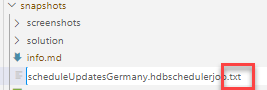

    c) In the SAP HANA PROJECTS section press the rocket icon on the level of folder "snapshots" to deploy the whole folder:

    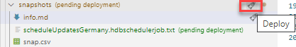

12. check that the job is not active anymore

    a) in Database Explorer, right-click on the HDI database connection and choose "Open SQL Console":

    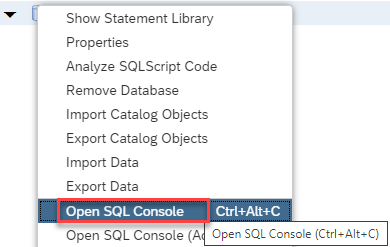

    execute the following statements by pressing the green run button on the top left:

    ```SQL 
    SELECT * FROM M_SCHEDULER_JOBS;
    SELECT * FROM SCHEDULER_JOBS;
    ```

    *You should see old scheduled runs in the first result view. The second result view should not show your scheduled job*


13. Deploy an interface view

    a) go back to the calculation view editor

    b) double-click on node "Semantics", select "View Properties" and tab "Snapshots"

    c) click on your snapshot-query to open the details

    d) click on the "Generate interface calculation view" icon:

    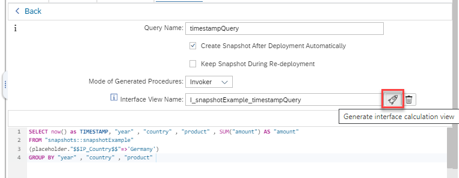

    *A new file "I_snapshotExample_timestampQuery.hdbcalculatoinview" is generated and visible in the folder structure on the left. This file combines in an union node the orignial calculation view and the snapshot table. An input parameter can be used to select between the different sources.*

14. Preview the interface view

    a) right-click on "I_snapshotExample_timestampQuery.hdbcalculatoinview" and choose "Data Preview"

    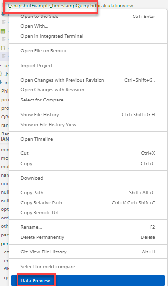

    b) when prompted, keep the default input parameter value "SNAPSHOT" and press the button "Open SQL Console":

    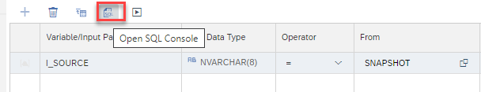

    c) run the query by pressing the Run icon:

    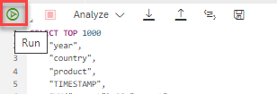

    *you will see the snapshot data*
    
    d) change the input parameter value to "BASE":

    ```SQL
    SELECT TOP 1000
	    "year",
	    "country",
	    "product",
	    "TIMESTAMP",
    	SUM("amount") AS "amount"
    FROM "snapshots::I_snapshotExample_timestampQuery"
	    (placeholder."$$I_SOURCE$$"=>'BASE')
    GROUP BY "year", "country", "product", "TIMESTAMP"
    ```

    e) run the query with the Run icon

    *data of the calculation view are shown*


    
