# Hands-on Configuration Table Based Union Pruning

In this example, you use a pruning configuration table to specify the filter conditions for pruning in the union node. When the WHERE clause of the query matches to this definition only one of the data sources is processed.

### Used Objects
- table unionPruning::current_sales
- table unionPruning::old_sales


### Creation of Calculation View

1. Create calculation view "unionPruningConfigurationExample"

    a) right-click on folder "constantPruning" and select "New File...":
    
    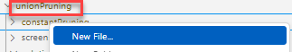 

    b) enter "unionPruningExample.hdbcalculationview" as name of the file. The extension ".hdbcalculationview" determines that the calculation view editor will open the file

    c) Keep the default settings and press "Create":

    *The calculation view editor will open*

2. Add an Union node to the modeling area by clicking on the Union node icon followed by a click on an empty area:

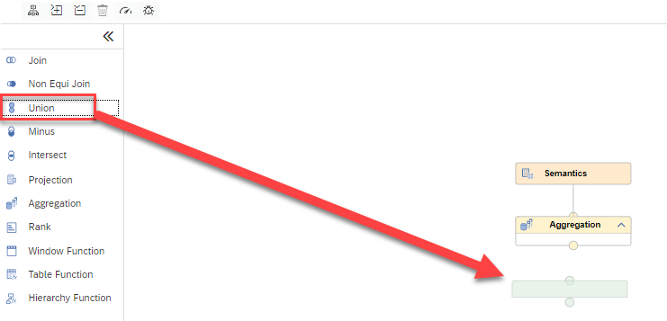

3. Add table "salesItem" to the union node:

    a) click on the Union node so that the +-sign appears

    b) click on the +-sign to add a Data Source:

    
   
    c) search for tables in namespace "unionPruning" that end with "sales" (unionPruning::%sales):

    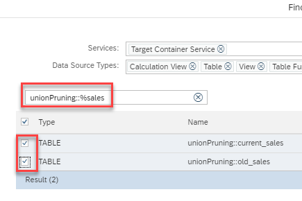

    d) select both tables 
    
    e) both table are defined in the same HDI container. Therefore, no synonym is needed and you can click on "Finish"
    
4. Connect the union node to node "Aggregation"

    a) click on the union node so that the arrow appears and drag and drop the arrow to node "Aggregation":

    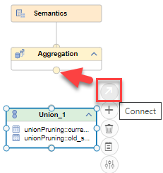

    *The union node is now connected to the aggregation node. This means that the output of the union node will feed into the aggregation node.*

5. Map the columns

    a) double-click on node "Union_1" to open the details

    b) to map all columns to the output based on their names, click on button "Auto Map by Name"

    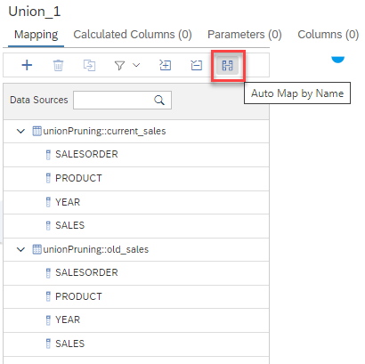

    *All columns will be mapped to the output. Columns that have the same name are mapped to the same output column:*

    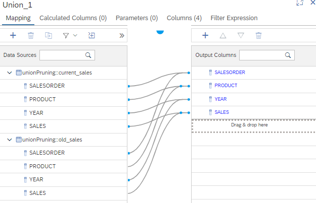


6. Create and fill the Pruning Configuration Table

    a) double-click on node "Semantics", choose "View Properties" and "Advanced"

    b) click on the + sign to create a configuration table:

    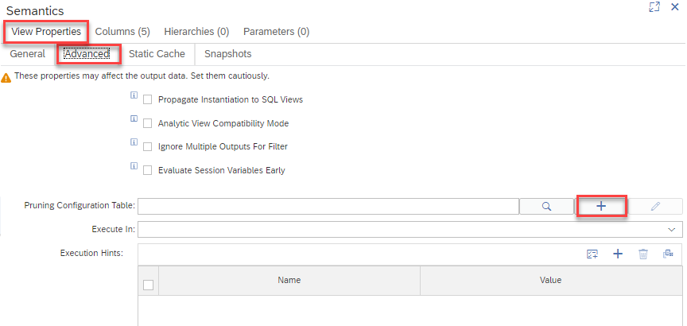

    c) name the configuration table "pruningConfigTable" and click on the + sign to add a pruning specification:
    
    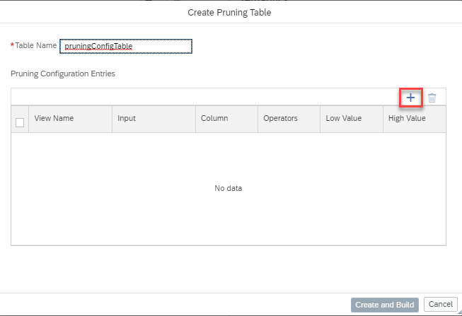

    d) use the value help (see red rectangles in screenshot below) to select 
    
    1. "unionPruning::old_sales" in column "Input"
    2. "YEAR" for column "Column"

    e) use the drop-down menu for "Operators" to select "<=" and enter the value "2019" as the "Low Value"
    
    *These entries correspond to the pruning rule that queries that filter on column YEAR for values equal or smaller than 2019 should only access data source "unionPruning:old_sales".*

    f) press the + icon to add another line

    g) fill the line with "unionPruning:current_sales" as Input, "Year" as Column, ">=" as Operators and "2020" as Low Value. The dialog should now look like:

    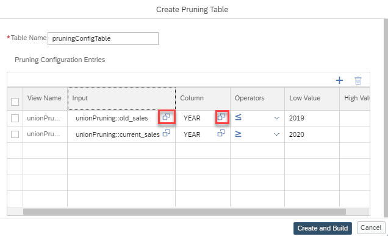

    h) close the dialog with button "Create and Build"

    *The pruning configuration table is now created and filled with the respective values. You will find the generated "pruningConfigTable" files in your folder on the left*

7. Deploy calculation view "unionPruningConfigurationExample"

    Deploying the model can be achieved in different ways:

    i) press the Deploy button of the calculation view:

    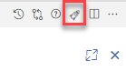

    ii) use the default keyboard shortcut CTRL+d

    iii) use the deploy button under SAP HANA PROJECTS

    > under SAP HANA PROJECTS you can also deploy at a higher level, e.g., a folder that contains the calculation view


## Test Configuration Table Union Pruning

1. Start a Data Preview

    a) right-click on node "Aggregation" and select "Data Preview"

    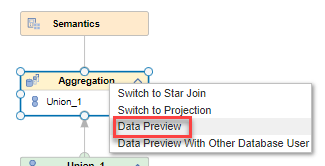

    b) click on button "Edit SQL Statement in SQL Console" on the top right to open an SQL console with the default data preview statement

    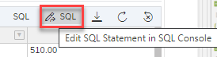

2. Test the influence of filters on column "YEAR"

    a) run an Explain Plan without any filter on the default query by choosing "Analyze" and "Explain Plan":

    ```SQL
    SELECT TOP 1000
	    "SALESORDER",
	    "PRODUCT",
	    "YEAR",
	    "SOURCE",
	    SUM("SALES") AS "SALES"
    FROM 
        "unionPruning::unionPruningConfigurationExample"
    GROUP BY 
        "SALESORDER", 
        "PRODUCT", 
        "YEAR", 
        "SOURCE"
    ```

    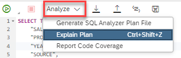

    *The Explain Plan shows that both data sources are accessed:*

    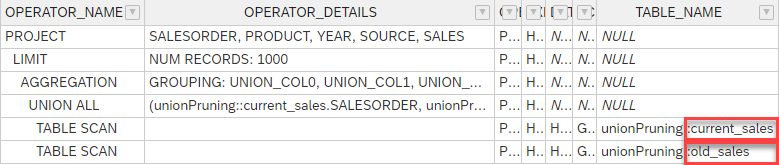

    b) add a filter to the query and validate with Explain Plan that only one source is accessed

    1. add the WHERE-clause "WHERE YEAR='2018'" to the query, i.e.

        ```SQL
        SELECT TOP 1000
            "SALESORDER",
            "PRODUCT",
            "YEAR",
            "SOURCE",
            SUM("SALES") AS "SALES"
        FROM 
            "unionPruning::unionPruningConfigurationExample"
        WHERE YEAR='2018'
        GROUP BY 
            "SALESORDER", 
            "PRODUCT", 
            "YEAR", 
            "SOURCE"
        ```

    2. execute an Explain Plan and validate that only the data source for old data is accessed:

        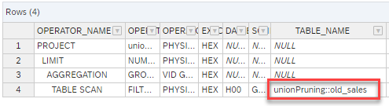

    c) modify the filter to access only new data

    1. modify the filter in the WHERE-clause to '2022', i.e.

        ```SQL
        SELECT TOP 1000
            "SALESORDER",
            "PRODUCT",
            "YEAR",
            "SOURCE",
            SUM("SALES") AS "SALES"
        FROM 
            "unionPruning::unionPruningConfigurationExample"
        WHERE YEAR='2022'
        GROUP BY 
            "SALESORDER", 
            "PRODUCT", 
            "YEAR", 
            "SOURCE"
        ```

    2. execute an Explain Plan and validate that only the data source with current data is accessed:

         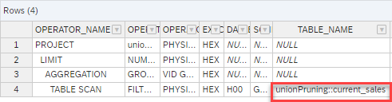


    d) modify the filter to access both data sources

    1. modify the WHERE clause to "WHERE YEAR in ('2018','2022'), i.e.:

        ```SQL
        SELECT TOP 1000
            "SALESORDER",
            "PRODUCT",
            "YEAR",
            "SOURCE",
            SUM("SALES") AS "SALES"
        FROM 
            "unionPruning::unionPruningConfigurationExample"
        WHERE YEAR in ('2018','2022')
        GROUP BY 
            "SALESORDER", 
            "PRODUCT", 
            "YEAR", 
            "SOURCE"
        ```

    2. validate with Explain Plan that both source are accessed:
    
              

