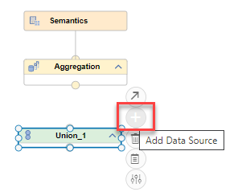
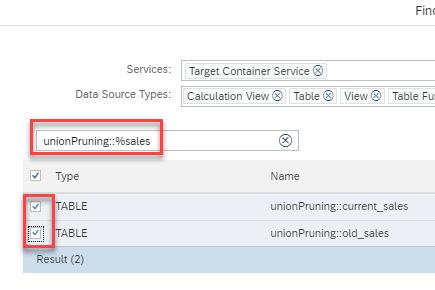
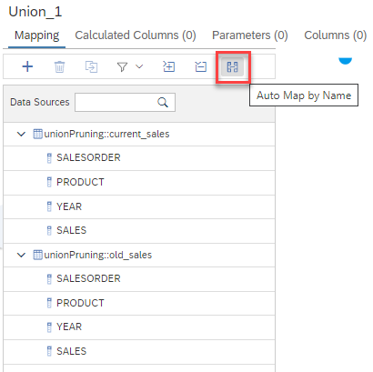
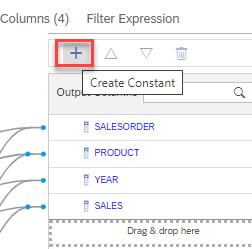
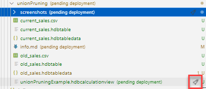
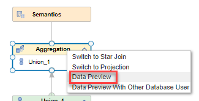
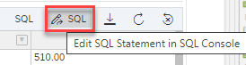
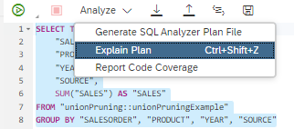

## Hands-On Constant Based Pruning

### Used Objects
- table unionPruning::current_sales
- table unionPruning::old_sales

In this example, you define the criteria for pruning based on a constant in the union node and use the constant in the WHERE clause of the query. The Union node is used to combine the two data sources current_sales and old_sales. 

### Creation of Calculation View

1. Create calculation view "unionPruningExample"

    a) right-click on folder "constantPruning" and select "New File...":
    
     

    b) enter "unionPruningExample.hdbcalculationview" as name of the file. The extension ".hdbcalculationview" determines that the calculation view editor will open the file

    c) Keep the default settings and press "Create":

    

    *The calculation view editor will open*

2. Add an Union Node to the modeling area by clicking on the Union node icon followed by a click on an empty area:


3. Add table "salesItem" to the Union Node:

    a) click on the Union node so that the +-sign appears

    b) click on the +-sign to add a Data Source:

    
   
    c) search for tables in namespace "unionPruning" that end with "sales" (unionPruning::%sales):

    

    d) select both tables. 
    
    e) both table are defined in the same HDI container. Therefore, no synonym is needed and you can click on "Finish"
    
4. Connect the union node to node "Aggregation"

    a) click on the union node so that the arrow appears and drag and drop the arrow to the Aggregation node:

    

    *The union node is now connected to the aggregation node. This means that the output of the union node will feed into the aggregation node.*

5. Map the columns

    a) double-click on node "Union_1" to open the details

    b) to map all columns to the output based on their names, click on button "Auto Map by Name"

    

    *all columns will be mapped to the output. Columns that share the same name are mapped to the same output columns:*

    

6. Add a constant that will be used for pruning later

    a) click on "Create Constant":

    

    b) enter "SOURCE" as Name, choose "NVARCHAR" of Length 7 and assign the constant "CURRENT" to the current_sales data source as well as "OLD" to the old_sales data source and close the dialog with "OK"

    

7. Map all output columns to the node "Semantics", choose one

    a) select all output columns

    selecting all output columns can be done in different ways:
        
     1. click on each column individually while holding key CTRL
        
     2. click on the first and last column while holding key SHIFT
       
     3. use the context-menu on a column and choose option "Select All"
    
    b) when all output columns are selected, right-click on them to open the context-menu and choose "Propagate to Semantics":

    

    *All selected columns are now mapped up to the Semantics node. You can check this by double-clicking on node Semantics and look at the Columns tab there*


*The model is now consistently defined and the corresponding database objects can be generated*

8. Deploy the model

    Deploying the model can be achieved in different ways, choose one:

    i) press the Deploy button of the calculation view:

    

    ii) use the default keyboard shortcut CTRL+d

    iii) use the deploy button under SAP HANA PROJECTS:

    

    > under SAP HANA PROJECTS you can also deploy at a higher level, e.g., a folder that contains the calculation view


### Testing of Constant Union Pruning

We will now check by running an Explain Plan that depending on the filter value only one or both data sources of the union node are accessed. We used the constant "SOURCE" for the constant mapping in the model. Therefore, we need to filter on this column.
Let's start with a normal data preview:

1. Start a Data Preview

    a) right-click on Node "Aggregation" and select "Data Preview"

    

    b) click on the button "Edit SQL Statement in SQL Console" on the top right to open an SQL console with the default data preview statement

    


2. Check influence of filters on the constant mapping column "SOURCE"

    a) run Explain Plan without any filter on "SOURCE":

    1) The console should be filled with the default data preview statement for your view:

        ```SQL
        SELECT TOP 1000
            "SALESORDER",
            "PRODUCT",
            "YEAR",
            "SOURCE",
            SUM("SALES") AS "SALES"
        FROM 
            "unionPruning::unionPruningExample"
        GROUP BY 
            "SALESORDER", "PRODUCT", "YEAR", "SOURCE"
        ```

    2) select from the drop-down of "Analyze" the option "Explain Plan":

        

        you should see both tables being used in the plan:

        

        *when no filter is applied both sources are processed for data*

    b) run Explain Plan with filter for old data:

    1) The following SQL statement requests only old data due to the filter:

        ```SQL
            SELECT TOP 1000
            "SALESORDER",
            "PRODUCT",
            "YEAR",
            "SOURCE",
            SUM("SALES") AS "SALES"
        FROM 
            "unionPruning::unionPruningExample"
        WHERE 
            SOURCE='OLD'
        GROUP BY 
            "SALESORDER", "PRODUCT", "YEAR", "SOURCE"
        ```
    2) run the Explain Plan for the SQL statement. You should see that only the table with old data is accessed:

        

    *The filter on the constant mapping column "SOURCE" ensures that only one data source of the union node will be processed.*

    c) run Explain Plan for the query that filters for new data:    
    ```SQL
        SELECT TOP 1000
	    "SALESORDER",
	    "PRODUCT",
	    "YEAR",
	    "SOURCE",
	    SUM("SALES") AS "SALES"
    FROM 
        "unionPruning::unionPruningExample"
    WHERE 
        SOURCE='CURRENT'
    GROUP BY 
        "SALESORDER", "PRODUCT", "YEAR", "SOURCE"
    ```

    

    *only the source for new data is accessed when filtering for "CURRENT".*

    d) run Explain Plan for the query that filters for data that is not provided by any data source of the Union Node:

    ```SQL
            SELECT TOP 1000
	    "SALESORDER",
	    "PRODUCT",
	    "YEAR",
	    "SOURCE",
	    SUM("SALES") AS "SALES"
    FROM 
        "unionPruning::unionPruningExample"
    WHERE 
        SOURCE='NonExistingData'
    GROUP BY 
        "SALESORDER", "PRODUCT", "YEAR", "SOURCE"
    ```

    

    *If the filter specifies data that is not covered by any data source of the union node, no data is returned*
