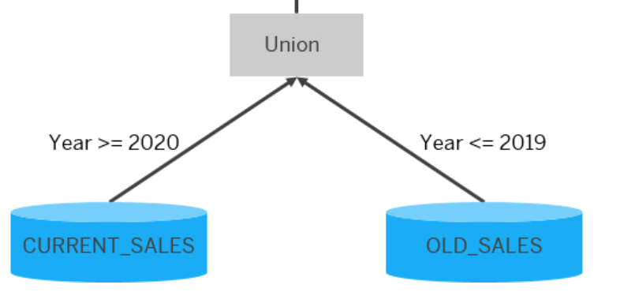

# Union Node Pruning

Union node pruning allows the data sources in union nodes to be pruned. It is based on defined criteria that at runtime exclude specific data sources from the processing. This helps reduce resource consumption and benefits performance.

To prune data sources based on some filter criteria, you need either a pruning configuration table or a constant mapping. If you opt for the configuration table approach, you use a table or view to specify data slices contained in the individual data sources. This information is matched to the query filter when the query is run and, as a result, only the required data sources are processed. With constant mapping, you define a constant with specific values for each data source and select the appropriate value in your query.

For example, you are creating a sales report for a product across the years using a calculation view. The calculation view consists of two data sources, one with the current sales data (for YEAR >= 2020) and the other with the archived sales data (YEAR <= 2019). Both are provided as input to a union node in the calculation view, as shown below:



In your scenario, you want to query the calculation view to get the results of CURRENT_SALES only. You therefore want the query to be executed on the CURRENT_SALES data source only and the operation on the archived data source to be excluded (that is, pruned). To do so, you have the following options:

- You provide a pruning definition in a pruning configuration table

- You create a constant that maps the data sources to specific constant values

In general, constant mapping improves performance more but is less flexible than using a pruning configuration table. 

Another union node pruning option is to decide on pruning based on whether some dedicated columns are mapped by a source or not. This option is described in the Column-Based Pruning session.

## Good to know
If a union node is consumed by a rank of window function node, query filters are by default not pushed down to it when the query is executed. This applies to filter expressions and variables used in a WHERE clause. However, the union node needs the filters to be able to apply pruning. Therefore, it only makes sense to use a combination of a rank or window function node and an union node with pruning if the Allow Filter Push Down option has been activated. 

If pruning is based on a configuration table and the view is unfolded (the typical case), you should ensure that the front-end tool uses a GROUP BY clause in its query because otherwise pruning will not occur

When calculation views are called from SQLScript, SQLScript variables can be passed as parameters or as literal values. The SQL optimizer determines which option is chosen. For views that are unfolded, however, union pruning only works with variables that are passed as values.
Therefore, if a variable is relevant for union pruning, it should be passed as a value. An example where a variable would be relevant for union pruning is if you use union pruning to select data sources based on this variable.
To override the decision made by the SQLScript optimizer and to ensure that a literal value is passed, you should enclose the variable with "BIND_AS_VALUE". For example:
>```SQL
>SELECT
>    "SalesOrderId",
>    "pruningConstant",
>    SUM("NetAmount") AS "NetAmount"
>FROM "UnionPruning"
>WHERE "pruningConstant"=BIND_AS_VALUE(:value)
>GROUP BY "SalesOrderId", "pruningConstant";
>```
>
>For the same reason, you should avoid passing variables that are relevant for union pruning as bind variables (for example, WHERE "pruningConstant"=?).


