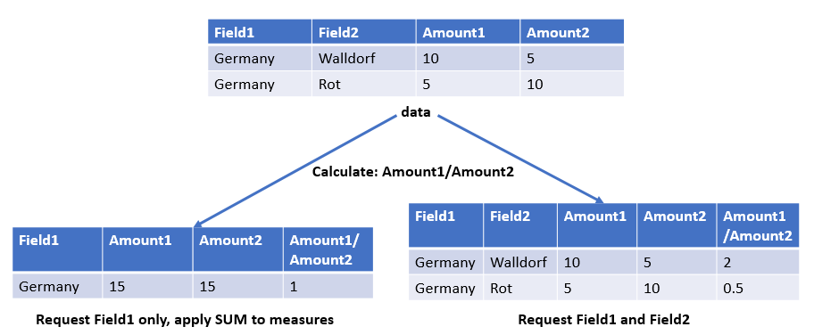
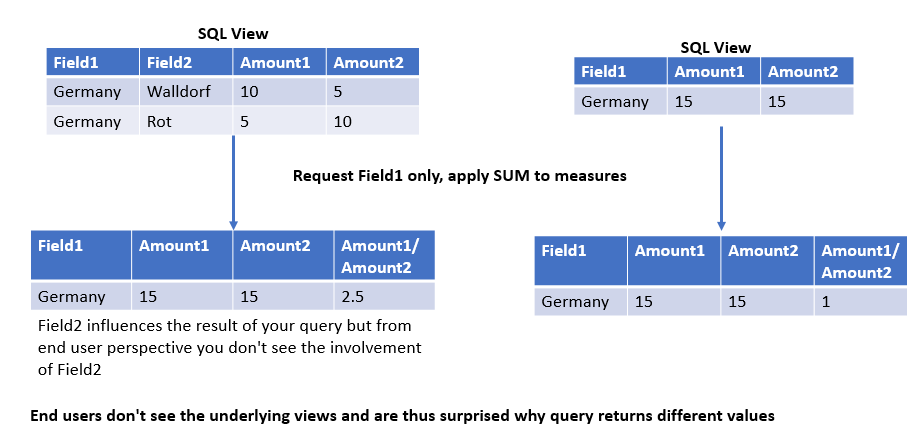
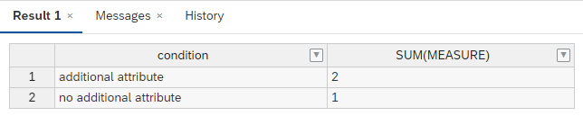

# Comparison behavior of Calculation Views and SQL views

## table functions (SQL views) behave strictly relational i.e., averaging is done exactly at the granularity that is defined in the table function (SQL view) independent of the requesting query


</br>
</br>

## Calculation Engine Instantiation



</br>
</br>

## SQL behavior


## data
`select * from "rB";`
|"year"|"month"|"day"|"amount"|
|----------|:-------------:|------:|--------:|
|2021|01|01|1
|2021|01|01|2
|2021|01|02|3
|2021|02|01|2

</br>
</br>

## table function
```SQL
FUNCTION averageAmount ()    
RETURNS TABLE ("year" NVARCHAR(20),"month" NVARCHAR(20),"day" NVARCHAR(20),"amount" Decimal(10,2))
	LANGUAGE SQLSCRIPT
	SQL SECURITY INVOKER
    AS
BEGIN
return select "year","month","day", avg("amount") "amount" from "rB" group by  "year","month","day";
END;
```

## cvRelationalBehavior
In [cvRelationalBehavior](./cvRelationalBehavior.hdbcalculationview) the keep flag is set for all attributes of the table function

## granularity of SQL query corresponds to granularity of table function definition

```SQL
select * from
(
SELECT 
'table_function' "method","year","month","day", avg("amount") FROM "AVERAGEAMOUNT"()         group by "year","month","day"
union
SELECT 'cv',              "year","month","day", avg("amount") FROM "cvNonRelationalBehavior" group by "year","month","day"
union
SELECT 'cvRel',           "year","month","day", avg("amount") FROM "cvRelationalBehavior"    group by "year","month","day"
)
order by "year","month","day","method"
```


| model type    |year   |month|day  |AVG(amount)|
|:----------    |:----- |---  |:----|:----      |
|cv             |2021   |01	  |01	|1.50       |
|cvRel          |2021   |01	  |01	|1.50       |
|table_function |2021   |01   |01   |1.50       |
|cv             |2021   |01   |02   |3.00       |
|cvRel	        |2021   |01   |02   |3.00       |
|table_function |2021   |01   |02   |3.00       |
|cv             |2021   |02   |01   |2.00       |
|cvRel          |2021   |02   |01   |2.00       |
|table_function |2021   |02   |01   |2.00       |
**==> no difference between model types**

## Granularity of SQL query is lower than granularity of table function defintion
```SQL
select * from
(
SELECT 'table_function' "method","year","month", avg("amount") FROM "AVERAGEAMOUNT"()  
group by year","month"

UNION

SELECT 'cv',                     "year","month", avg("amount") FROM "cvNonRelationalBehavior" group by "year","month"
union
SELECT 'cvRel',                  "year","month",avg("amount") FROM "cvRelationalBehavior"     group by "year","month"
)
order by "year","month","method"
``` 

| model type |year |month|AVG(amount)|
|:----------    |:------|---|:---|
|cv             |2021   |01 |2.00|
|cvRel          |2021   |01 |2.25|
|table_function |2021   |01	|2.25|
|cv             |2021   |02 |2.00|
|cvRel          |2021   |02 |2.00|
|table_function	|2021	|02	|2.00|
**==> default calculation view corresponds to result of SQL query directly on table. Result of table_function and relational calculation view model differ**

</br>
</br>

## Attribute "month" is also not requested
```language
select * from
(
SELECT 'table_function' "method","year", avg("amount") FROM "AVERAGEAMOUNT"()          group by "year"
union
SELECT 'cv',                     "year", avg("amount") FROM "cvNonRelationalBehavior"  group by "year"
union
SELECT 'cvRel',                  "year", avg("amount") FROM "cvRelationalBehavior"     group by "year"
)
order by "year","method"
``` 
| model type |year |AVG(amount)|
|:----------    |:------|:---|
|cv             |2021   |2.00|
|cvRel          |2021   |2.16|
|table_function	|2021   |2.16|
**==> default calculation view corresponds to result of SQL query directly on table. Result of table_function and relational calculation view model differ**

</br>
</br>


## No attribute requested
```SQL
select * from
(
SELECT 'table_function' "method", avg("amount") FROM "AVERAGEAMOUNT"()        
union
SELECT 'cv',                      avg("amount") FROM "cvNonRelationalBehavior"
union
SELECT 'cvRel',                   avg("amount") FROM "cvRelationalBehavior" 
)
order by "method"
``` 

| model type |AVG(amount)|
|:----------    |:---|
|cv  	        |2.00|
|cvRel	        |2.16|
|table_function	|2.16|
**==> default calculation view corresponds to result of SQL query directly on table. Result of table_function and relational calculation view model differ**


# Example of Influence of requested attribute also in SQL queries

```SQL
select 
	'no additional attribute' "condition",
	sum(TAB1.MEASURE) 
from 
	TAB1 inner join 
		(select TAB2.COLUMN1 "TAB2.COLUMN1",              sum(TAB2.MEASURE) 
		 from 
				TAB2 
		 group by 
				TAB2.COLUMN1) 
		on TAB1.COLUMN1="TAB2.COLUMN1" 
group by 
	TAB1.COLUMN1

 union

select 
	'additional attribute',
	sum(TAB1.MEASURE) 
from 
	TAB1 inner join 
		(select TAB2.COLUMN1 "TAB2.COLUMN1",TAB2.COLUMN2, sum(TAB2.MEASURE) 
		 from 
			TAB2 
		 group by 
				TAB2.COLUMN1, TAB2.COLUMN2) 
		on TAB1.COLUMN1="TAB2.COLUMN1" 
group by
	TAB1.COLUMN1
``` 



==> **Requesting COLUMN2 in the join partner leads to higher granularity and thus more records being joined. This inflates the measure**