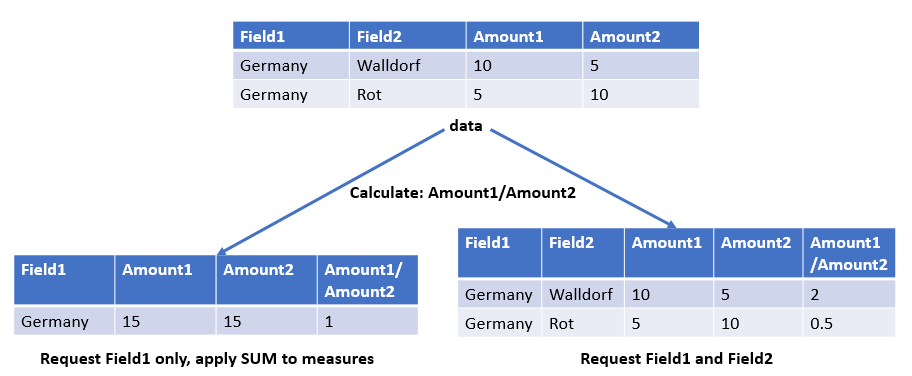
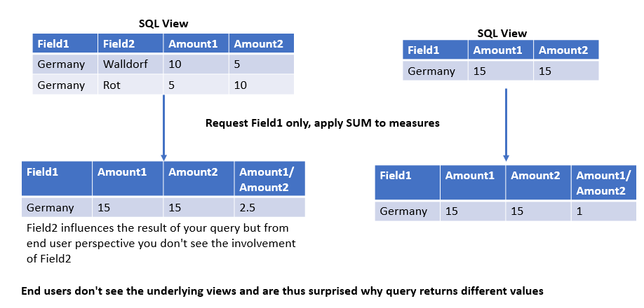
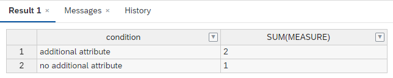

# Comparison behavior of Calculation Views and SQL views

## table functions (SQL views) behave strictly relational i.e., averaging is done exactly at the granularity that is defined in the table function (SQL view) independent of the requesting query


</br>
</br>

## Calculation Engine Instantiation



</br>
</br>

## SQL behavior


## data
`select * from "rB";`
|"year"|"month"|"day"|"amount"|
|----------|:-------------:|------:|--------:|
|2021|01|01|1
|2021|01|01|2
|2021|01|02|3
|2021|02|01|2

</br>
</br>

## table function
```SQL
FUNCTION averageAmount ()    
RETURNS TABLE ("year" NVARCHAR(20),"month" NVARCHAR(20),"day" NVARCHAR(20),"amount" Decimal(10,2))
	LANGUAGE SQLSCRIPT
	SQL SECURITY INVOKER
    AS
BEGIN
return select "year","month","day", avg("amount") "amount" from "rB" group by  "year","month","day";
END;
```

## cvRelationalBehavior
In [cvRelationalBehavior](./cvRelationalBehavior.hdbcalculationview) the keep flag is set for all attributes of the table function

## granularity of SQL query corresponds to granularity of table function definition

```SQL
select * from
(
SELECT 
'table_function' "method","year","month","day", avg("amount") FROM "AVERAGEAMOUNT"()         group by "year","month","day"
union
SELECT 'cv',              "year","month","day", avg("amount") FROM "cvNonRelationalBehavior" group by "year","month","day"
union
SELECT 'cvRel',           "year","month","day", avg("amount") FROM "cvRelationalBehavior"    group by "year","month","day"
)
order by "year","month","day","method"
```


| model type    |year   |month|day  |AVG(amount)|
|:----------    |:----- |---  |:----|:----      |
|cv             |2021   |01	  |01	|1.50       |
|cvRel          |2021   |01	  |01	|1.50       |
|table_function |2021   |01   |01   |1.50       |
|cv             |2021   |01   |02   |3.00       |
|cvRel	        |2021   |01   |02   |3.00       |
|table_function |2021   |01   |02   |3.00       |
|cv             |2021   |02   |01   |2.00       |
|cvRel          |2021   |02   |01   |2.00       |
|table_function |2021   |02   |01   |2.00       |
**==> no difference between model types**

## Granularity of SQL query is lower than granularity of table function defintion
```SQL
select * from
(
SELECT 'table_function' "method","year","month", avg("amount") FROM "AVERAGEAMOUNT"()  
group by year","month"

UNION

SELECT 'cv',                     "year","month", avg("amount") FROM "cvNonRelationalBehavior" group by "year","month"
union
SELECT 'cvRel',                  "year","month",avg("amount") FROM "cvRelationalBehavior"     group by "year","month"
)
order by "year","month","method"
``` 

| model type |year |month|AVG(amount)|
|:----------    |:------|---|:---|
|cv             |2021   |01 |2.00|
|cvRel          |2021   |01 |2.25|
|table_function |2021   |01	|2.25|
|cv             |2021   |02 |2.00|
|cvRel          |2021   |02 |2.00|
|table_function	|2021	|02	|2.00|
**==> default calculation view corresponds to result of SQL query directly on table. Result of table_function and relational calculation view model differ**

</br>
</br>

## Attribute "month" is also not requested
```language
select * from
(
SELECT 'table_function' "method","year", avg("amount") FROM "AVERAGEAMOUNT"()          group by "year"
union
SELECT 'cv',                     "year", avg("amount") FROM "cvNonRelationalBehavior"  group by "year"
union
SELECT 'cvRel',                  "year", avg("amount") FROM "cvRelationalBehavior"     group by "year"
)
order by "year","method"
``` 
| model type |year |AVG(amount)|
|:----------    |:------|:---|
|cv             |2021   |2.00|
|cvRel          |2021   |2.16|
|table_function	|2021   |2.16|
**==> default calculation view corresponds to result of SQL query directly on table. Result of table_function and relational calculation view model differ**

</br>
</br>


## No attribute requested
```SQL
select * from
(
SELECT 'table_function' "method", avg("amount") FROM "AVERAGEAMOUNT"()        
union
SELECT 'cv',                      avg("amount") FROM "cvNonRelationalBehavior"
union
SELECT 'cvRel',                   avg("amount") FROM "cvRelationalBehavior" 
)
order by "method"
``` 

| model type |AVG(amount)|
|:----------    |:---|
|cv  	        |2.00|
|cvRel	        |2.16|
|table_function	|2.16|
**==> default calculation view corresponds to result of SQL query directly on table. Result of table_function and relational calculation view model differ**


# Example of Influence of requested attribute also in SQL queries

```SQL
select 
	'no additional attribute' "condition",
	sum(TAB1.MEASURE) 
from 
	TAB1 inner join 
		(select TAB2.COLUMN1 "TAB2.COLUMN1",              sum(TAB2.MEASURE) 
		 from 
				TAB2 
		 group by 
				TAB2.COLUMN1) 
		on TAB1.COLUMN1="TAB2.COLUMN1" 
group by 
	TAB1.COLUMN1

 union

select 
	'additional attribute',
	sum(TAB1.MEASURE) 
from 
	TAB1 inner join 
		(select TAB2.COLUMN1 "TAB2.COLUMN1",TAB2.COLUMN2, sum(TAB2.MEASURE) 
		 from 
			TAB2 
		 group by 
				TAB2.COLUMN1, TAB2.COLUMN2) 
		on TAB1.COLUMN1="TAB2.COLUMN1" 
group by
	TAB1.COLUMN1
``` 



==> **Requesting COLUMN2 in the join partner leads to higher granularity and thus more records being joined. This inflates the measure**

# Example of the Impact of Filters

If filters are used on a column, then the column has to be available in the output of views. This has the consequence that the filter column is also available in the aggregations of the underlying views. If the setting *Transparent Filter* is set to *true* for a column in calculation views then the column is ignored in aggregations if the column is only requested for filtering. Calculation view [tF_cv](./transparentFilter/tF_cv.hdbcalculationview) demonstrates this behavior. Given that in the topmost aggregation node (Default node) of calculation views all columns act as if they have the transparent filter setting if the calculation view is directly accessed, an additional artificial aggregation was added to demonstrate the effect of the transparent filter setting. The default behavior on topmost aggregation nodes is demonstrated with [tF_cv_top](./transparentFilter/tF_cv_top.hdbcalculationview).

## Data

`select * from  "tF_tab"`
**year**|**month**|**day**|**amount**
:-----:|:-----:|:-----:|:-----:
2026|1|1|2.00
2026|1|1|3.00
2026|1|2|1.00
2026|1|3|1.00


## Filter on column "day" requires that column "day" is available in the output of the views

```SQL
select 
	'calculation view aggregation top node' "condition",
	"year",
	avg("amount")
from 
	"tF_cv_top"()
WHERE "day"!='2' group by "year"

union

select 
	'calculation view aggregation inner node' "condition",
	"year",
	avg("amount")
from 
	"tF_cv"()
WHERE "day"!='2' group by "year"

union

select 
	'table function' "condition",
	"year",
	avg("amount")
from 
	"tF"()
WHERE "day"!='2' group by "year"
``` 

**condition**|**year**|**AVG(amount)**
:-----|:-----:|:-----:
calculation view aggregation top node|2026|2.00
calculation view aggregation inner node|2026|2.00
table function|2026|1.75

==> The transparent filter option gives fine granular control over whether a column that is only used for filtering should be included in aggregations or not. SQL table functions and views will include the filter column in the aggregations.